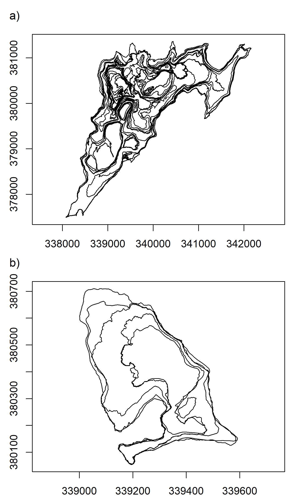

# Install packages

Run this chunk to get the necessary packages. Note that, to reproduce,
some packages require the development version fetched from GitHub.

``` r
pkgs = c(
  "dplyr","ggplot2","here","patchwork",
  "purrr","readr","stringr",
  "tidyr","units","zen4R"
)
install.packages(pkgs)
remotes::install_github("huizezhang-sherry/cubble")
remotes::install_github("eliocamp/ggnewscale")
remotes::install_github("r-spatial/sf")
remotes::install_github("r-spatial/stars")
```

# Libraries

``` r
library(cubble)
library(dplyr)
library(ggnewscale)
library(ggplot2)
library(here)
library(patchwork)
library(purrr)
library(readr)
library(sf)
library(stars)
library(stringr)
library(tidyr)
library(units)
library(zen4R)
```

# Figure 1

Created with sketchpad.io and draw.io See source file in
code/vdc-schema.drawio

# Figure 2

Code snippet with the result of the following script The script creates
a VDC for Fagradalsfjall It is in array format, using the `stars`
package

Data comes from Zenodo so the script shows demo code with steps to 1.
download to temporary directory 2. pre-process 3. coerce to a vdc

## Download

``` r
dir = tempdir()
download_zenodo(
  doi = "10.5281/zenodo.7866738",
  path = dir,
  files = list(
    "outlines_pedersen_etal2022_v12.zip"
  ),
  overwrite = FALSE,
  timeout = 600
)
```

    [zen4R][INFO] ZenodoRecord - Download in sequential mode 
    [zen4R][INFO] ZenodoRecord - Will download 1 file from record '7866738' (doi: '10.5281/zenodo.7866738') - total size: 2.3 MiB 
    [zen4R][INFO] Downloading file 'outlines_pedersen_etal2022_v12.zip' - size: 2.3 MiB
    [zen4R][INFO] File downloaded at 'C:/Users/b1066081/AppData/Local/Temp/Rtmp8CkFHf'.
    [zen4R][INFO] ZenodoRecord - Verifying file integrity... 
    [zen4R][INFO] File 'outlines_pedersen_etal2022_v12.zip': integrity verified (md5sum: fc7a74d235274b9707bc5acb296b45ea)
    [zen4R][INFO] ZenodoRecord - End of download 

``` r
# Unzip
files = list.files(here(dir), full.names = TRUE)
lapply(files, unzip, exdir = here(dir, "unzipped"))
```

    Warning in FUN(X[[i]], ...): error 1 in extracting from zip file
    Warning in FUN(X[[i]], ...): error 1 in extracting from zip file
    Warning in FUN(X[[i]], ...): error 1 in extracting from zip file

    [[1]]
    NULL

    [[2]]
    NULL

    [[3]]
    NULL

    [[4]]
     [1] "C:/Users/b1066081/AppData/Local/Temp/Rtmp8CkFHf/unzipped/outlines_pedersen_etal2022_v12/Outline_20210320_1240_A6D_Pedersen_etal2022_v12.gpkg"
     [2] "C:/Users/b1066081/AppData/Local/Temp/Rtmp8CkFHf/unzipped/outlines_pedersen_etal2022_v12/Outline_20210321_1130_HEL_Pedersen_etal2022_v12.gpkg"
     [3] "C:/Users/b1066081/AppData/Local/Temp/Rtmp8CkFHf/unzipped/outlines_pedersen_etal2022_v12/Outline_20210331_1210_A6D_Pedersen_etal2022_v12.gpkg"
     [4] "C:/Users/b1066081/AppData/Local/Temp/Rtmp8CkFHf/unzipped/outlines_pedersen_etal2022_v12/Outline_20210405_1010_A6D_Pedersen_etal2022_v12.gpkg"
     [5] "C:/Users/b1066081/AppData/Local/Temp/Rtmp8CkFHf/unzipped/outlines_pedersen_etal2022_v12/Outline_20210405_1416_A6D_Pedersen_etal2022_v12.gpkg"
     [6] "C:/Users/b1066081/AppData/Local/Temp/Rtmp8CkFHf/unzipped/outlines_pedersen_etal2022_v12/Outline_20210406_1338_A6D_Pedersen_etal2022_v12.gpkg"
     [7] "C:/Users/b1066081/AppData/Local/Temp/Rtmp8CkFHf/unzipped/outlines_pedersen_etal2022_v12/Outline_20210408_1325_A6D_Pedersen_etal2022_v12.gpkg"
     [8] "C:/Users/b1066081/AppData/Local/Temp/Rtmp8CkFHf/unzipped/outlines_pedersen_etal2022_v12/Outline_20210412_1210_A6D_Pedersen_etal2022_v12.gpkg"
     [9] "C:/Users/b1066081/AppData/Local/Temp/Rtmp8CkFHf/unzipped/outlines_pedersen_etal2022_v12/Outline_20210320_0745_HEL_Pedersen_etal2022_v12.gpkg"
    [10] "C:/Users/b1066081/AppData/Local/Temp/Rtmp8CkFHf/unzipped/outlines_pedersen_etal2022_v12/Outline_20210322_1322_PLE_Pedersen_etal2022_v12.gpkg"
    [11] "C:/Users/b1066081/AppData/Local/Temp/Rtmp8CkFHf/unzipped/outlines_pedersen_etal2022_v12/Outline_20210323_1005_A6D_Pedersen_etal2022_v12.gpkg"
    [12] "C:/Users/b1066081/AppData/Local/Temp/Rtmp8CkFHf/unzipped/outlines_pedersen_etal2022_v12/Outline_20210326_1252_PLE_Pedersen_etal2022_v12.gpkg"
    [13] "C:/Users/b1066081/AppData/Local/Temp/Rtmp8CkFHf/unzipped/outlines_pedersen_etal2022_v12/Outline_20210329_1319_PLE_Pedersen_etal2022_v12.gpkg"
    [14] "C:/Users/b1066081/AppData/Local/Temp/Rtmp8CkFHf/unzipped/outlines_pedersen_etal2022_v12/Outline_20210330_1311_PLE_Pedersen_etal2022_v12.gpkg"
    [15] "C:/Users/b1066081/AppData/Local/Temp/Rtmp8CkFHf/unzipped/outlines_pedersen_etal2022_v12/Outline_20210418_1230_A6D_Pedersen_etal2022_v12.gpkg"
    [16] "C:/Users/b1066081/AppData/Local/Temp/Rtmp8CkFHf/unzipped/outlines_pedersen_etal2022_v12/Outline_20210421_1330_A6D_Pedersen_etal2022_v12.gpkg"
    [17] "C:/Users/b1066081/AppData/Local/Temp/Rtmp8CkFHf/unzipped/outlines_pedersen_etal2022_v12/Outline_20210426_1515_A6D_Pedersen_etal2022_v12.gpkg"
    [18] "C:/Users/b1066081/AppData/Local/Temp/Rtmp8CkFHf/unzipped/outlines_pedersen_etal2022_v12/Outline_20210428_1249_PLE_Pedersen_etal2022_v12.gpkg"
    [19] "C:/Users/b1066081/AppData/Local/Temp/Rtmp8CkFHf/unzipped/outlines_pedersen_etal2022_v12/Outline_20210503_1545_A6D_Pedersen_etal2022_v12.gpkg"
    [20] "C:/Users/b1066081/AppData/Local/Temp/Rtmp8CkFHf/unzipped/outlines_pedersen_etal2022_v12/Outline_20210510_1242_A6D_Pedersen_etal2022_v12.gpkg"
    [21] "C:/Users/b1066081/AppData/Local/Temp/Rtmp8CkFHf/unzipped/outlines_pedersen_etal2022_v12/Outline_20210518_1730_A6D_Pedersen_etal2022_v12.gpkg"
    [22] "C:/Users/b1066081/AppData/Local/Temp/Rtmp8CkFHf/unzipped/outlines_pedersen_etal2022_v12/Outline_20210602_1522_A6D_Pedersen_etal2022_v12.gpkg"
    [23] "C:/Users/b1066081/AppData/Local/Temp/Rtmp8CkFHf/unzipped/outlines_pedersen_etal2022_v12/Outline_20210611_1250_A6D_Pedersen_etal2022_v12.gpkg"
    [24] "C:/Users/b1066081/AppData/Local/Temp/Rtmp8CkFHf/unzipped/outlines_pedersen_etal2022_v12/Outline_20210626_1330_A6D_Pedersen_etal2022_v12.gpkg"
    [25] "C:/Users/b1066081/AppData/Local/Temp/Rtmp8CkFHf/unzipped/outlines_pedersen_etal2022_v12/Outline_20210702_1249_PLE_Pedersen_etal2022_v12.gpkg"
    [26] "C:/Users/b1066081/AppData/Local/Temp/Rtmp8CkFHf/unzipped/outlines_pedersen_etal2022_v12/Outline_20210727_1000_A6D_Pedersen_etal2022_v12.gpkg"
    [27] "C:/Users/b1066081/AppData/Local/Temp/Rtmp8CkFHf/unzipped/outlines_pedersen_etal2022_v12/Outline_20210808_1717_A6D_Pedersen_etal2022_v12.gpkg"
    [28] "C:/Users/b1066081/AppData/Local/Temp/Rtmp8CkFHf/unzipped/outlines_pedersen_etal2022_v12/Outline_20210909_1600_A6D_Pedersen_etal2022_v12.gpkg"
    [29] "C:/Users/b1066081/AppData/Local/Temp/Rtmp8CkFHf/unzipped/outlines_pedersen_etal2022_v12/Outline_20210917_1330_A6D_Pedersen_etal2022_v12.gpkg"
    [30] "C:/Users/b1066081/AppData/Local/Temp/Rtmp8CkFHf/unzipped/outlines_pedersen_etal2022_v12/Outline_20210930_1420_A6D_Pedersen_etal2022_v12.gpkg"

``` r
# Find geopackage files
fn_gpkg = list.files(
  here(dir, "unzipped"),
  pattern = "Outline.*gpkg$",
  full.names = TRUE,
  recursive = TRUE
)
```

## Pre-process

``` r
# Create function to read in each file and to extract 
# the date from the filename
read_fun = function(x){
  read_sf(x) |> 
    mutate(
      fn_gpkg = tail(str_split(x, '/')[[1]], n=1),
      datetime = as.POSIXct(
        paste(str_split(fn_gpkg, "_")[[1]][2:3], collapse = ""),
        format = "%Y%m%d%H%M"
      )
    ) |> 
    st_set_crs(3057)
}

# Call map2 to read in the files
# and bind them into one single sf object
outlines = map(fn_gpkg, read_fun) |> bind_rows()
```

    Warning: st_crs<- : replacing crs does not reproject data; use st_transform for
    that

``` r
# Combine polygons from single date into multipolygons
# Make geometry valid
outlines = outlines |> 
  group_by(datetime) |> 
  summarise(geom = st_combine(geom)) |> 
  ungroup() |> 
  st_make_valid()
```

## VDC coercion

``` r
# Create array
a = array(
  data = outlines$geom, 
  dim = c(
    1,
    length(unique(outlines$datetime))
  ),
  dimnames = list(
    geom_sum = 1,
    datetime = unique(outlines$datetime)
  )
)

# Create dimensions object
# Summary geometry is the centroid of the union of all geometries
# The point parameter indicates if the value refers to a point (location)
# or to a pixel (area) value
dim_cent = st_dimensions(
  geom_sum = st_centroid(st_make_valid(st_union(outlines$geom))), # approach centroid
  datetime = unique(outlines$datetime),
  point = c(TRUE, FALSE)
)

# Coerce to cube
# The output of this code constitutes Figure 2
(cube_arr = st_as_stars(
  list(geometry = a), 
  dimensions = dim_cent)
)
```

    stars object with 2 dimensions and 1 attribute
    attribute(s):
             geometry  
     MULTIPOLYGON : 2  
     POLYGON      :28  
     epsg:3057    : 0  
     +proj=lcc ...: 0  
    dimension(s):
             from to               refsys point
    geom_sum    1  1 ISN93 / Lambert 1993  TRUE
    datetime    1 30              POSIXct FALSE
                                                  values
    geom_sum                       POINT (339860 380008)
    datetime 2021-03-20 07:45:00,...,2021-09-30 14:20:00

# Figure 3

Base R plot of lava flow outlines a) shows all the lava flows for the
whole time period b) shows the result of filtering the VDC between two
dates Plots are combine with the patchwork library, hence the use of
`wrap_elements()`

``` r
oldpar = par(no.readonly = TRUE)
par(mar = c(1.8,1,1.1,0.3), bg = "transparent")
wrap_elements(
  ~cube_arr |>
    # use lambda-function to extract geometries from vdc attributes
    (\(x) plot(x$geometry, axes = TRUE))(),
  clip = FALSE
) /
wrap_elements(
  ~cube_arr |>
    filter(datetime > "2021-03-18", datetime < "2021-03-25") |> 
    # use lambda-function to extract geometries from vdc attributes
    (\(x) plot(x$geometry, axes = TRUE))(),
  clip = FALSE
) +
  plot_annotation(tag_levels = "a", tag_suffix = ")")
```



``` r
par(oldpar)
```

# Figure 4

Code snippet with the result of the following script The script creates
a VDC for Butangbunasi It is in tabular format, using the `cubble`
package

Data comes from Zenodo so the script shows demo code with steps to 1.
download to temporary directory 2. pre-process 3. coerce to a vdc

## Download

``` r
# Fetch also the CSV file with addiontional info
dir = tempdir()
download_zenodo(
  doi = "10.5281/zenodo.10635102",
  path = dir,
  files = list(
    "outlines.zip",
    "Butangbunasi_OBIA_statistics.csv"
  ),
  overwrite = FALSE,
  timeout = 100
)
```

    [zen4R][INFO] ZenodoRecord - Download in sequential mode 
    [zen4R][INFO] ZenodoRecord - Will download 2 files from record '10635102' (doi: '10.5281/zenodo.10635102') - total size: 144 KiB 
    [zen4R][INFO] Downloading file 'outlines.zip' - size: 142.7 KiB
    [zen4R][INFO] Downloading file 'Butangbunasi_OBIA_statistics.csv' - size: 1.2 KiB
    [zen4R][INFO] Files downloaded at 'C:/Users/b1066081/AppData/Local/Temp/Rtmp8CkFHf'.
    [zen4R][INFO] ZenodoRecord - Verifying file integrity... 
    [zen4R][INFO] File 'outlines.zip': integrity verified (md5sum: d0034de915b5cae20d9be02899550e9a)
    [zen4R][INFO] File 'Butangbunasi_OBIA_statistics.csv': integrity verified (md5sum: 8ebe12e999df3e41f862db5dc31a57e7)
    [zen4R][INFO] ZenodoRecord - End of download 

``` r
# Unzip
files = list.files(here(dir), full.names = TRUE)
lapply(files, unzip, exdir = here(dir, "unzipped"))
```

    Warning in FUN(X[[i]], ...): error 1 in extracting from zip file
    Warning in FUN(X[[i]], ...): error 1 in extracting from zip file
    Warning in FUN(X[[i]], ...): error 1 in extracting from zip file
    Warning in FUN(X[[i]], ...): error 1 in extracting from zip file
    Warning in FUN(X[[i]], ...): error 1 in extracting from zip file
    Warning in FUN(X[[i]], ...): error 1 in extracting from zip file
    Warning in FUN(X[[i]], ...): error 1 in extracting from zip file
    Warning in FUN(X[[i]], ...): error 1 in extracting from zip file
    Warning in FUN(X[[i]], ...): error 1 in extracting from zip file

    [[1]]
    NULL

    [[2]]
    NULL

    [[3]]
    NULL

    [[4]]
    NULL

    [[5]]
    NULL

    [[6]]
    NULL

    [[7]]
    NULL

    [[8]]
    NULL

    [[9]]
     [1] "C:/Users/b1066081/AppData/Local/Temp/Rtmp8CkFHf/unzipped/outlines/Butangbunasi_1984.gpkg"      
     [2] "C:/Users/b1066081/AppData/Local/Temp/Rtmp8CkFHf/unzipped/outlines/Butangbunasi_1989.gpkg"      
     [3] "C:/Users/b1066081/AppData/Local/Temp/Rtmp8CkFHf/unzipped/outlines/Butangbunasi_1990.gpkg"      
     [4] "C:/Users/b1066081/AppData/Local/Temp/Rtmp8CkFHf/unzipped/outlines/Butangbunasi_1992.gpkg"      
     [5] "C:/Users/b1066081/AppData/Local/Temp/Rtmp8CkFHf/unzipped/outlines/Butangbunasi_1994.gpkg"      
     [6] "C:/Users/b1066081/AppData/Local/Temp/Rtmp8CkFHf/unzipped/outlines/Butangbunasi_1996.gpkg"      
     [7] "C:/Users/b1066081/AppData/Local/Temp/Rtmp8CkFHf/unzipped/outlines/Butangbunasi_1998.gpkg"      
     [8] "C:/Users/b1066081/AppData/Local/Temp/Rtmp8CkFHf/unzipped/outlines/Butangbunasi_2000.gpkg"      
     [9] "C:/Users/b1066081/AppData/Local/Temp/Rtmp8CkFHf/unzipped/outlines/Butangbunasi_2001.gpkg"      
    [10] "C:/Users/b1066081/AppData/Local/Temp/Rtmp8CkFHf/unzipped/outlines/Butangbunasi_2004.gpkg"      
    [11] "C:/Users/b1066081/AppData/Local/Temp/Rtmp8CkFHf/unzipped/outlines/Butangbunasi_2005.gpkg"      
    [12] "C:/Users/b1066081/AppData/Local/Temp/Rtmp8CkFHf/unzipped/outlines/Butangbunasi_2005_10_03.gpkg"
    [13] "C:/Users/b1066081/AppData/Local/Temp/Rtmp8CkFHf/unzipped/outlines/Butangbunasi_2008.gpkg"      
    [14] "C:/Users/b1066081/AppData/Local/Temp/Rtmp8CkFHf/unzipped/outlines/Butangbunasi_2008_03_17.gpkg"
    [15] "C:/Users/b1066081/AppData/Local/Temp/Rtmp8CkFHf/unzipped/outlines/Butangbunasi_2009.gpkg"      
    [16] "C:/Users/b1066081/AppData/Local/Temp/Rtmp8CkFHf/unzipped/outlines/Butangbunasi_2010.gpkg"      
    [17] "C:/Users/b1066081/AppData/Local/Temp/Rtmp8CkFHf/unzipped/outlines/Butangbunasi_2013.gpkg"      
    [18] "C:/Users/b1066081/AppData/Local/Temp/Rtmp8CkFHf/unzipped/outlines/Butangbunasi_2015.gpkg"      
    [19] "C:/Users/b1066081/AppData/Local/Temp/Rtmp8CkFHf/unzipped/outlines/Butangbunasi_2016.gpkg"      
    [20] "C:/Users/b1066081/AppData/Local/Temp/Rtmp8CkFHf/unzipped/outlines/Butangbunasi_2018.gpkg"      
    [21] "C:/Users/b1066081/AppData/Local/Temp/Rtmp8CkFHf/unzipped/outlines/Butangbunasi_2021.gpkg"      

    [[10]]
     [1] "C:/Users/b1066081/AppData/Local/Temp/Rtmp8CkFHf/unzipped/outlines_pedersen_etal2022_v12/Outline_20210320_1240_A6D_Pedersen_etal2022_v12.gpkg"
     [2] "C:/Users/b1066081/AppData/Local/Temp/Rtmp8CkFHf/unzipped/outlines_pedersen_etal2022_v12/Outline_20210321_1130_HEL_Pedersen_etal2022_v12.gpkg"
     [3] "C:/Users/b1066081/AppData/Local/Temp/Rtmp8CkFHf/unzipped/outlines_pedersen_etal2022_v12/Outline_20210331_1210_A6D_Pedersen_etal2022_v12.gpkg"
     [4] "C:/Users/b1066081/AppData/Local/Temp/Rtmp8CkFHf/unzipped/outlines_pedersen_etal2022_v12/Outline_20210405_1010_A6D_Pedersen_etal2022_v12.gpkg"
     [5] "C:/Users/b1066081/AppData/Local/Temp/Rtmp8CkFHf/unzipped/outlines_pedersen_etal2022_v12/Outline_20210405_1416_A6D_Pedersen_etal2022_v12.gpkg"
     [6] "C:/Users/b1066081/AppData/Local/Temp/Rtmp8CkFHf/unzipped/outlines_pedersen_etal2022_v12/Outline_20210406_1338_A6D_Pedersen_etal2022_v12.gpkg"
     [7] "C:/Users/b1066081/AppData/Local/Temp/Rtmp8CkFHf/unzipped/outlines_pedersen_etal2022_v12/Outline_20210408_1325_A6D_Pedersen_etal2022_v12.gpkg"
     [8] "C:/Users/b1066081/AppData/Local/Temp/Rtmp8CkFHf/unzipped/outlines_pedersen_etal2022_v12/Outline_20210412_1210_A6D_Pedersen_etal2022_v12.gpkg"
     [9] "C:/Users/b1066081/AppData/Local/Temp/Rtmp8CkFHf/unzipped/outlines_pedersen_etal2022_v12/Outline_20210320_0745_HEL_Pedersen_etal2022_v12.gpkg"
    [10] "C:/Users/b1066081/AppData/Local/Temp/Rtmp8CkFHf/unzipped/outlines_pedersen_etal2022_v12/Outline_20210322_1322_PLE_Pedersen_etal2022_v12.gpkg"
    [11] "C:/Users/b1066081/AppData/Local/Temp/Rtmp8CkFHf/unzipped/outlines_pedersen_etal2022_v12/Outline_20210323_1005_A6D_Pedersen_etal2022_v12.gpkg"
    [12] "C:/Users/b1066081/AppData/Local/Temp/Rtmp8CkFHf/unzipped/outlines_pedersen_etal2022_v12/Outline_20210326_1252_PLE_Pedersen_etal2022_v12.gpkg"
    [13] "C:/Users/b1066081/AppData/Local/Temp/Rtmp8CkFHf/unzipped/outlines_pedersen_etal2022_v12/Outline_20210329_1319_PLE_Pedersen_etal2022_v12.gpkg"
    [14] "C:/Users/b1066081/AppData/Local/Temp/Rtmp8CkFHf/unzipped/outlines_pedersen_etal2022_v12/Outline_20210330_1311_PLE_Pedersen_etal2022_v12.gpkg"
    [15] "C:/Users/b1066081/AppData/Local/Temp/Rtmp8CkFHf/unzipped/outlines_pedersen_etal2022_v12/Outline_20210418_1230_A6D_Pedersen_etal2022_v12.gpkg"
    [16] "C:/Users/b1066081/AppData/Local/Temp/Rtmp8CkFHf/unzipped/outlines_pedersen_etal2022_v12/Outline_20210421_1330_A6D_Pedersen_etal2022_v12.gpkg"
    [17] "C:/Users/b1066081/AppData/Local/Temp/Rtmp8CkFHf/unzipped/outlines_pedersen_etal2022_v12/Outline_20210426_1515_A6D_Pedersen_etal2022_v12.gpkg"
    [18] "C:/Users/b1066081/AppData/Local/Temp/Rtmp8CkFHf/unzipped/outlines_pedersen_etal2022_v12/Outline_20210428_1249_PLE_Pedersen_etal2022_v12.gpkg"
    [19] "C:/Users/b1066081/AppData/Local/Temp/Rtmp8CkFHf/unzipped/outlines_pedersen_etal2022_v12/Outline_20210503_1545_A6D_Pedersen_etal2022_v12.gpkg"
    [20] "C:/Users/b1066081/AppData/Local/Temp/Rtmp8CkFHf/unzipped/outlines_pedersen_etal2022_v12/Outline_20210510_1242_A6D_Pedersen_etal2022_v12.gpkg"
    [21] "C:/Users/b1066081/AppData/Local/Temp/Rtmp8CkFHf/unzipped/outlines_pedersen_etal2022_v12/Outline_20210518_1730_A6D_Pedersen_etal2022_v12.gpkg"
    [22] "C:/Users/b1066081/AppData/Local/Temp/Rtmp8CkFHf/unzipped/outlines_pedersen_etal2022_v12/Outline_20210602_1522_A6D_Pedersen_etal2022_v12.gpkg"
    [23] "C:/Users/b1066081/AppData/Local/Temp/Rtmp8CkFHf/unzipped/outlines_pedersen_etal2022_v12/Outline_20210611_1250_A6D_Pedersen_etal2022_v12.gpkg"
    [24] "C:/Users/b1066081/AppData/Local/Temp/Rtmp8CkFHf/unzipped/outlines_pedersen_etal2022_v12/Outline_20210626_1330_A6D_Pedersen_etal2022_v12.gpkg"
    [25] "C:/Users/b1066081/AppData/Local/Temp/Rtmp8CkFHf/unzipped/outlines_pedersen_etal2022_v12/Outline_20210702_1249_PLE_Pedersen_etal2022_v12.gpkg"
    [26] "C:/Users/b1066081/AppData/Local/Temp/Rtmp8CkFHf/unzipped/outlines_pedersen_etal2022_v12/Outline_20210727_1000_A6D_Pedersen_etal2022_v12.gpkg"
    [27] "C:/Users/b1066081/AppData/Local/Temp/Rtmp8CkFHf/unzipped/outlines_pedersen_etal2022_v12/Outline_20210808_1717_A6D_Pedersen_etal2022_v12.gpkg"
    [28] "C:/Users/b1066081/AppData/Local/Temp/Rtmp8CkFHf/unzipped/outlines_pedersen_etal2022_v12/Outline_20210909_1600_A6D_Pedersen_etal2022_v12.gpkg"
    [29] "C:/Users/b1066081/AppData/Local/Temp/Rtmp8CkFHf/unzipped/outlines_pedersen_etal2022_v12/Outline_20210917_1330_A6D_Pedersen_etal2022_v12.gpkg"
    [30] "C:/Users/b1066081/AppData/Local/Temp/Rtmp8CkFHf/unzipped/outlines_pedersen_etal2022_v12/Outline_20210930_1420_A6D_Pedersen_etal2022_v12.gpkg"

    [[11]]
    NULL

``` r
# Find geopackage files
mapping_ls = list.files(
  here(dir, "unzipped", "outlines"), 
  pattern = ".gpkg",
  full.names = TRUE
)

# Read in CSV file
stats = read_csv(
  here(dir, "Butangbunasi_OBIA_statistics.csv")
)
```

    Rows: 21 Columns: 5
    ── Column specification ────────────────────────────────────────────────────────
    Delimiter: ","
    chr  (2): satellite_sensor, file
    dbl  (2): landslide_area_ha, lake_area_ha
    date (1): date

    ℹ Use `spec()` to retrieve the full column specification for this data.
    ℹ Specify the column types or set `show_col_types = FALSE` to quiet this message.

``` r
# Set-up a read function that fetches filename
read_fun = function(x){
  read_sf(x) |> 
    mutate(
      fn_gpkg = tail(str_split(x, '/')[[1]], n=1),
    )
}

# Read files and combine into single sf object
# Join with CSV file
mapping = lapply(mapping_ls, read_fun) |> 
  bind_rows() |> 
  left_join(stats, by = c("fn_gpkg" = "file"))
```

## Pre-process

``` r
# All pre-processing steps are chained but have 
# documentation in each line
landslides = mapping |> 
  # Coerce date column to Date class
  mutate(date = as.Date(date)) |> 
  # Remove outline for 2018
  # this is a reference outline and does not follow a
  # Typhoon event according to Hoelbling et al., 2020
  filter(date != as.Date("2018-11-08")) |>
  # Group by date and class which in combination with summarise
  # will union all single polygons into a multipolygon
  group_by(date, Class) |> 
  # Summarise sensor and area information for landslide
  summarise(
    sensor = first(satellite_sensor),
    area_ldsl = set_units(first(landslide_area_ha), 'ha'),
    area_lake = set_units(first(lake_area_ha), 'ha')
  ) |> 
  # ungroup
  ungroup() |> 
  # set area to respective class
  mutate(
    area = case_when(
      Class == "landslide" ~ area_ldsl,
      Class == "lake" ~ area_lake
    )
  ) |> 
  # remove wide area columns
  select(-starts_with("area_")) |> 
  # complete cases for every combination of date and class
  # for geometries this is filled with an empty geometry
  complete(date, Class) |> 
  # rename the class column (lowercase)
  rename(class = Class) |> 
  # convert back to sf
  st_as_sf()
```

    `summarise()` has grouped output by 'date'. You can override using the
    `.groups` argument.

``` r
# Compute geom_sum as the centroid of the union of 
# the geometries per feature class
landslidescent = landslides |> 
  group_by(class) |> 
  mutate(geom_sum = st_centroid(st_union(geom))) |> 
  relocate(geom_sum, .after = everything()) |> 
  ungroup() |> 
  st_as_sf(sf_column_name = 'geom_sum')
```

## VDC coercion

``` r
# Call as cubble to coerce from sf to cubble
# key is the gid column while index is date
cube_tab = as_cubble(
  landslidescent, key = class, index = date
)

# The output of this code corresponds to Figure 4a
cube_tab |> 
  face_spatial()
```

    ℹ The cubble is already in the nested form

    # cubble:   key: class [2], index: date, nested form, [sf]
    # spatial:  [271664.917737363, 2567227.57526178, 274148.347513089,
    #   2568861.92906261], WGS 84 / UTM zone 51N
    # temporal: date [date], sensor [chr], area [[ha]], geom [GEOMETRY [m]]
      class           x        y           geom_sum ts               
    * <chr>       <dbl>    <dbl>        <POINT [m]> <list>           
    1 lake      274148. 2567228. (274148.3 2567228) <tibble [20 × 4]>
    2 landslide 271665. 2568862. (271664.9 2568862) <tibble [20 × 4]>

``` r
# The output of this code corresponds to Figure 4b
cube_tab |> 
  face_temporal() |> 
  arrange(date) |> 
  print(n = 4)
```

    # cubble:   key: class [2], index: date, long form
    # temporal: 1984-12-12 -- 2021-08-28 [8D], has gaps!
    # spatial:  x [dbl], y [dbl], geom_sum [POINT [m]]
      class     date       sensor    area                                       geom
      <chr>     <date>     <chr>     [ha]                             <GEOMETRY [m]>
    1 lake      1984-12-12 <NA>      NA                     GEOMETRYCOLLECTION EMPTY
    2 landslide 1984-12-12 Landsat 5 66.2 MULTIPOLYGON (((271637.5 2568620, 271637.…
    3 lake      1989-10-23 <NA>      NA                     GEOMETRYCOLLECTION EMPTY
    4 landslide 1989-10-23 Landsat 5 62.4 MULTIPOLYGON (((273712.5 2566845, 273562.…
    # ℹ 36 more rows

# Figure 5

This figure shows in a) a multi-dimensional representation of the
Butangbunasi landslide and b) a time series of the landslide area To
create a) the geometry of the original landslide data (outside of the
cube) was distorted by multiplying it by a shear matrix and adding a
shift in the y axis to stack them on top of each other

``` r
# Create shear matrix
sm = matrix(c(2.5, 1.2, 0, 1), 2, 2)

# Apply shear matrix
ldsl_shear = landslides |>
  mutate(
    geom = geom * sm,
    # sequence along date, i.e. 1 to 20 per class
    shift_y = rep(
      1:length(unique(date)),
      each = length(unique(class))
    )
  ) |> 
  # Add lost crs
  st_set_crs(st_crs(landslides)) 

ldsl_shift = ldsl_shear |> 
  rowwise() |> 
  # add a shift to stack outlines on top of each other
  mutate(
    geom = geom + c(0, shift_y * 4000),
    # Marker to place date labels
    y_label = st_coordinates(st_centroid(geom))[,'Y']
  ) |> 
  ungroup() |> 
  st_as_sf()

# Plot a)
spaceplot = ggplot(ldsl_shift) +
  # plot landslide geometries
  geom_sf(
    data = filter(ldsl_shift, class == "landslide"),
    aes(fill = date), 
    color = "black",
    show.legend = FALSE
  ) +
  # plot lake geometries
  geom_sf(
    data = filter(ldsl_shift, class == "lake"),
    color = "red", fill = "pink",
    show.legend = FALSE
  ) +
  # Add date label, the value of x is added after visual inspection
  geom_text(
    data = filter(ldsl_shift, class == "landslide"),
    aes(label = date, y = y_label),
    x = 3751500, size = 3.5
  ) +
  scale_fill_viridis_c("Date", direction = 1, trans = "date", option = "D") +
  # Limits are expanded after visual inspection
  coord_sf(xlim = c(3745000, 3767000), ylim = c(2576000, 2646000), clip = "off") +
  theme_void()+
  theme(
    text = element_text(size = 18)
  )

# Wrangle data to add in rug of area plot
rug_data = cube_tab |> 
  face_temporal() |> 
  filter(class == 'lake', !st_is_empty(geom)) |> 
  mutate(
    class = "Landslide-dammed lake",
    Area = 0.3
  )

# Plot b), directly from cubble object in temporal face
area = cube_tab |> 
  face_temporal() |> 
  rename(Area = area) |> 
  filter(class == 'landslide') |> 
  ggplot() +
  aes(
    x = date, y = Area,
    shape = sensor, 
    group = 1
  ) +
  geom_point(size = 3, aes(color = date)) + 
  geom_line(aes(color = date)) +
  scale_y_units(unit = "km2") +
  scale_color_viridis_c(
    "Date", direction = 1,
    trans = "date", option = "D",
    guide = guide_colorbar(barwidth = 20, barheight = 0.8)
  ) +
  scale_shape("Sensor") +
 ggnewscale::new_scale_color() +
  geom_rug(data = rug_data, aes(color = class), sides = "b") +
  scale_color_manual("", values = "red") +
  theme_bw() +
  theme(
    text = element_text(size = 18),
    axis.title.x = element_blank(),
    legend.box = "horizontal",
    legend.position = "bottom",
    legend.title.position = "top"
  )

# Set-up layout
layout = "
AAAABBBBBB
AAAABBBBBB
AAAABBBBBB
AAAABBBBBB
AAAABBBBBB
AAAABBBBBB
AAAABBBBBB
AAAABBBBBB
AAAABBBBBB
AAAACCCCCC
AAAACCCCCC
AAAACCCCCC
AAAACCCCCC
AAAACCCCCC
"

# Combine plots with patchwork
spaceplot + area + guide_area() + 
  plot_layout(guides = "collect", design = layout) + 
  plot_annotation(tag_levels = "a", tag_suffix = ")")
```


# R Session Info

``` r
sessioninfo::session_info()
```

    ─ Session info ───────────────────────────────────────────────────────────────
     setting  value
     version  R version 4.4.0 (2024-04-24 ucrt)
     os       Windows 10 x64 (build 19045)
     system   x86_64, mingw32
     ui       RTerm
     language ENG
     collate  English_Austria.utf8
     ctype    English_Austria.utf8
     tz       Europe/Vienna
     date     2024-05-16
     pandoc   3.1.11 @ C:/Program Files/RStudio/resources/app/bin/quarto/bin/tools/ (via rmarkdown)

    ─ Packages ───────────────────────────────────────────────────────────────────
     package      * version     date (UTC) lib source
     abind        * 1.4-5       2016-07-21 [1] CRAN (R 4.2.0)
     anytime        0.3.9       2020-08-27 [1] CRAN (R 4.2.3)
     assertthat     0.2.1       2019-03-21 [1] CRAN (R 4.2.3)
     atom4R         0.3-3       2022-11-18 [1] CRAN (R 4.3.2)
     bit            4.0.5       2022-11-15 [1] CRAN (R 4.2.3)
     bit64          4.0.5       2020-08-30 [1] CRAN (R 4.2.3)
     class          7.3-22      2023-05-03 [1] CRAN (R 4.3.1)
     classInt       0.4-10      2023-09-05 [1] CRAN (R 4.3.1)
     cli            3.6.2       2023-12-11 [1] CRAN (R 4.3.2)
     colorspace     2.1-0       2023-01-23 [1] CRAN (R 4.2.3)
     crayon         1.5.2       2022-09-29 [1] CRAN (R 4.2.3)
     cubble       * 0.3.0       2024-02-13 [1] Github (huizezhang-sherry/cubble@ffaf798)
     cubelyr        1.0.2       2022-11-07 [1] CRAN (R 4.2.3)
     curl           5.2.1       2024-03-01 [1] CRAN (R 4.4.0)
     DBI            1.2.2       2024-02-16 [1] CRAN (R 4.3.3)
     digest         0.6.35      2024-03-11 [1] CRAN (R 4.4.0)
     dplyr        * 1.1.4       2023-11-17 [1] CRAN (R 4.3.2)
     e1071          1.7-14      2023-12-06 [1] CRAN (R 4.3.2)
     ellipsis       0.3.2       2021-04-29 [1] CRAN (R 4.2.3)
     evaluate       0.23        2023-11-01 [1] CRAN (R 4.3.2)
     fansi          1.0.6       2023-12-08 [1] CRAN (R 4.3.2)
     farver         2.1.1       2022-07-06 [1] CRAN (R 4.2.3)
     fastmap        1.1.1       2023-02-24 [1] CRAN (R 4.2.3)
     generics       0.1.3       2022-07-05 [1] CRAN (R 4.2.3)
     ggnewscale   * 0.4.10      2024-02-08 [1] CRAN (R 4.3.2)
     ggplot2      * 3.5.1       2024-04-23 [1] CRAN (R 4.4.0)
     glue           1.7.0       2024-01-09 [1] CRAN (R 4.3.2)
     gridGraphics   0.5-1       2020-12-13 [1] CRAN (R 4.2.3)
     gtable         0.3.5       2024-04-22 [1] CRAN (R 4.4.0)
     here         * 1.0.1       2020-12-13 [1] CRAN (R 4.2.3)
     hms            1.1.3       2023-03-21 [1] CRAN (R 4.3.1)
     htmltools      0.5.8.1     2024-04-04 [1] CRAN (R 4.4.0)
     httr           1.4.7       2023-08-15 [1] CRAN (R 4.3.1)
     jsonlite       1.8.8       2023-12-04 [1] CRAN (R 4.3.2)
     KernSmooth     2.23-22     2023-07-10 [1] CRAN (R 4.3.1)
     keyring        1.3.2       2023-12-11 [1] CRAN (R 4.4.0)
     knitr          1.46        2024-04-06 [1] CRAN (R 4.4.0)
     labeling       0.4.3       2023-08-29 [1] CRAN (R 4.3.1)
     lifecycle      1.0.4       2023-11-07 [1] CRAN (R 4.3.2)
     lubridate      1.9.3       2023-09-27 [1] CRAN (R 4.3.2)
     magrittr       2.0.3       2022-03-30 [1] CRAN (R 4.1.3)
     munsell        0.5.1       2024-04-01 [1] CRAN (R 4.4.0)
     ncdf4          1.22        2023-11-28 [1] CRAN (R 4.3.2)
     patchwork    * 1.2.0       2024-01-08 [1] CRAN (R 4.3.2)
     pillar         1.9.0       2023-03-22 [1] CRAN (R 4.3.1)
     pkgconfig      2.0.3       2019-09-22 [1] CRAN (R 4.2.3)
     proxy          0.4-27      2022-06-09 [1] CRAN (R 4.2.3)
     purrr        * 1.0.2       2023-08-10 [1] CRAN (R 4.3.1)
     R6             2.5.1       2021-08-19 [1] CRAN (R 4.2.3)
     ragg           1.3.1       2024-05-06 [1] CRAN (R 4.4.0)
     Rcpp           1.0.12      2024-01-09 [1] CRAN (R 4.4.0)
     rdflib         0.2.8       2023-12-19 [1] CRAN (R 4.3.2)
     readr        * 2.1.5       2024-01-10 [1] CRAN (R 4.4.0)
     redland        1.0.17-18   2024-02-24 [1] CRAN (R 4.4.0)
     rlang          1.1.3       2024-01-10 [1] CRAN (R 4.3.2)
     rmarkdown      2.26        2024-03-05 [1] CRAN (R 4.3.1)
     roxygen2       7.3.1       2024-01-22 [1] CRAN (R 4.3.3)
     rprojroot      2.0.4       2023-11-05 [1] CRAN (R 4.4.0)
     rstudioapi     0.16.0      2024-03-24 [1] CRAN (R 4.4.0)
     scales         1.3.0       2023-11-28 [1] CRAN (R 4.3.2)
     sessioninfo    1.2.2       2021-12-06 [1] CRAN (R 4.4.0)
     sf           * 1.0-17      2024-05-16 [1] Github (loreabad6/sf@8cef41b)
     stars        * 0.6-6       2024-05-16 [1] Github (loreabad6/stars@8636c20)
     stringi        1.8.4       2024-05-06 [1] CRAN (R 4.4.0)
     stringr      * 1.5.1       2023-11-14 [1] CRAN (R 4.3.2)
     systemfonts    1.0.6       2024-03-07 [1] CRAN (R 4.4.0)
     textshaping    0.3.7       2023-10-09 [1] CRAN (R 4.4.0)
     tibble         3.2.1       2023-03-20 [1] CRAN (R 4.3.1)
     tidyr        * 1.3.1       2024-01-24 [1] CRAN (R 4.3.2)
     tidyselect     1.2.1       2024-03-11 [1] CRAN (R 4.4.0)
     timechange     0.3.0       2024-01-18 [1] CRAN (R 4.3.2)
     tsibble        1.1.4       2024-01-29 [1] CRAN (R 4.3.2)
     tzdb           0.4.0       2023-05-12 [1] CRAN (R 4.3.1)
     units        * 0.8-5.3     2024-01-31 [1] local
     utf8           1.2.4       2023-10-22 [1] CRAN (R 4.3.2)
     vctrs          0.6.5       2023-12-01 [1] CRAN (R 4.3.2)
     viridisLite    0.4.2       2023-05-02 [1] CRAN (R 4.3.1)
     vroom          1.6.5       2023-12-05 [1] CRAN (R 4.4.0)
     withr          3.0.0       2024-01-16 [1] CRAN (R 4.3.2)
     xfun           0.43        2024-03-25 [1] CRAN (R 4.4.0)
     XML            3.99-0.16.1 2024-01-22 [1] CRAN (R 4.3.2)
     xml2           1.3.6       2023-12-04 [1] CRAN (R 4.4.0)
     yaml           2.3.8       2023-12-11 [1] CRAN (R 4.3.2)
     zen4R        * 0.9         2023-09-20 [1] CRAN (R 4.3.2)
     zip            2.3.1       2024-01-27 [1] CRAN (R 4.4.0)

     [1] C:/Users/b1066081/AppData/Local/R/win-library/4.4
     [2] C:/Program Files/R/R-4.4.0/library

    ──────────────────────────────────────────────────────────────────────────────
