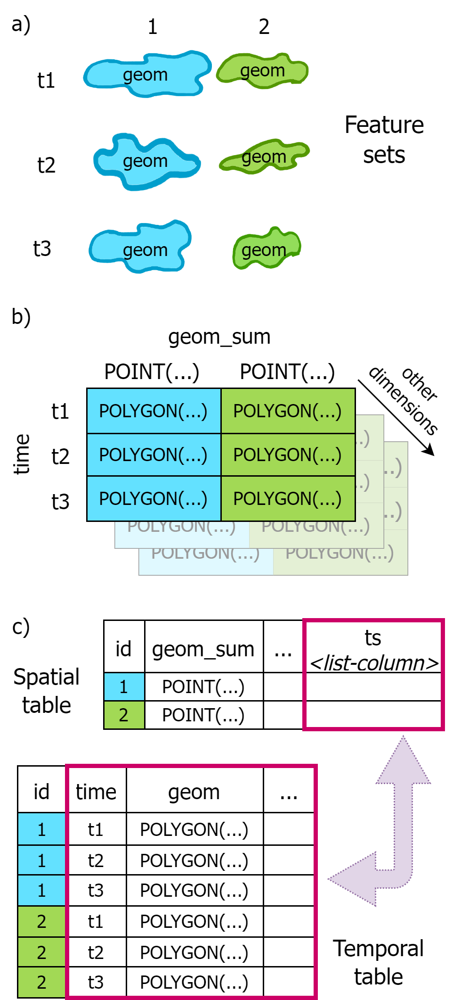
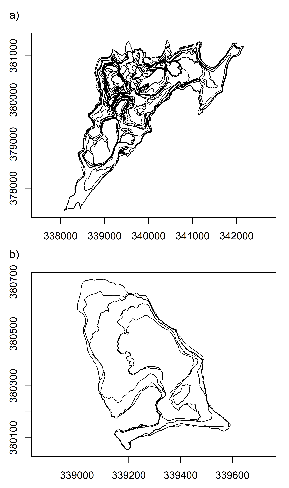
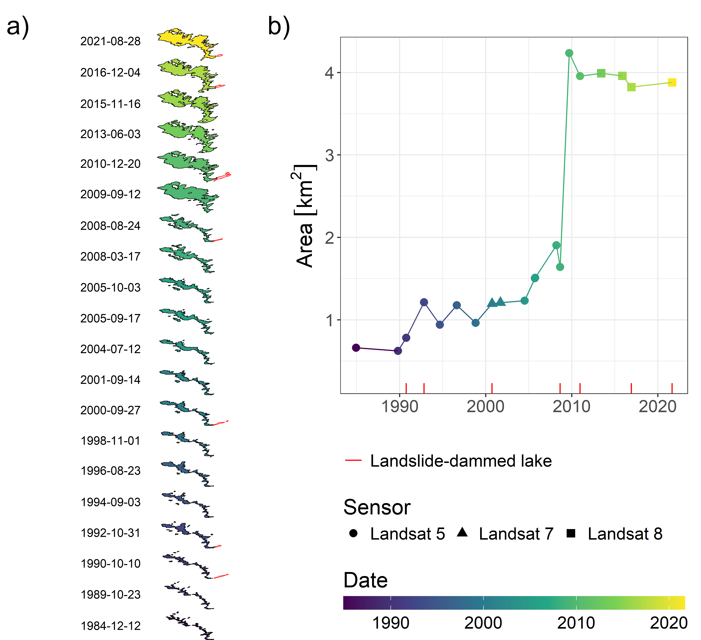

# Vector data cubes for features evolving in space and time
Lorena Abad, Martin Sudmanns, Daniel Hölbling
29.05.2024

<!-- - 2000 to 3000-word manuscripts -->

# Introduction

To represent and analyse geographical features in a geographic
information system (GIS), polygon outlines are commonly created based on
field measurements (e.g., GPS surveys), aerial photography or Earth
observation (EO) satellite imagery. The delineation can be the product
of manual interpretation or of (semi-)automated image segmentation and
classification techniques. Examples of the latter are object-based image
analysis (OBIA) (Blaschke et al. 2014) and deep learning techniques such
as convolutional neural networks (CNN) (Hoeser, Bachofer, and Kuenzer
2020) or segment anything models (SAM) (Kirillov et al. 2023).
Consequently, a series of objects in vector formats representing
geographical features can be created for different points in time. Such
geospatial objects intrinsically deal with geometries changing over time
and can be seen as regions that grow or shrink, i.e., change their shape
over time (Erwig et al. 1999).

The ability to analyse EO data time series with EO data cubes (EODC) can
prove promising when combined with segmentation techniques. EODCs
facilitate the querying of dynamic information at high temporal
intervals, allowing a more comprehensive understanding of landscape
dynamics. Although segmentation approaches for satellite image time
series analysis have not been fully implemented within EODCs (Lang et
al. 2019), advances in deep learning techniques can quickly develop
towards this end (Belgiu and Csillik 2018; Abidi et al. 2021; Simoes et
al. 2021). Hence, ways to adequately represent and analyse the objects
resulting from segmentation approaches, considering their changes in
space and time, are needed.

In this study, we explore the use of vector data cubes for the
structuring and analysis of features or objects that evolve in space and
time, i.e., shape-evolving features. In particular, we focus on polygon
features that do not change their location (in contrast to trajectory
data) but rather change their extent and shape at different points in
time. We have selected geomorphological features as an exemplary case
because of their high spatio-temporal variability. Nevertheless, vector
data cube approaches can be extended to any other geospatial feature
like urban area expansion, vegetation patches, or wetlands, to name a
few examples.
<!-- (see example here: https://e-sensing.github.io/sitsbook/object-based-time-series-image-analysis.html) -->

# Vector data cubes

Geospatial data cubes are defined as multi-dimensional data structures
based on regular or irregular grids (represented as arrays), often
containing spatio-temporal data with n-dimensions (Strobl et al. 2017;
Baumann et al. 2018). The structured manner of representing
spatio-temporal data has become an intuitive way to organise big EO
data, usually in raster or gridded formats, with minimum two spatial
dimensions, i.e., x / y or latitude / longitude. However, vector data
can also be organised within data cubes, where the minimum spatial
dimension required is a geometry. When talking about spatio-temporal
data cubes, be them raster or vector, an additional dimension, i.e.,
time, is often included.

The typical example of the use of vector data cubes is locations that
contain multi-temporal data such as in-situ sensor station datasets,
aggregation of raster information over specific areas, or the results of
raster data sampling at point locations (Pebesma 2021). In these cases,
the geometry of these locations does not change over time, but their
associated parameters do. Representing multi-temporal data with unique
locations in vector data cubes in comparison to traditional data
structures in GIS, such as long or wide table formats, has several
advantages. For instance, data replication in the form of duplicated
rows or an excessive amount of columns for table formats is avoided.
Further, an array-like representation of vector data allows indexing for
fast lookup tasks and the use of several operations popular for raster
data cubes such as filtering, aggregation, reduction and resampling.

Another way of representing spatio-temporal data in tabular formats has
been implemented by Zhang et al. (2022) in their R package {cubble}. The
concept behind {cubble} relies on the tidy data framework (Wickham 2014)
by structuring the relational temporal and spatial data in two
different, yet interlinked tables or data frames. These are referred as
spatial and temporal tables or faces of a spatio-temporal cube. {cubble}
combines the power of the {sf} package for spatial vector data analysis
(Pebesma 2018) and the {tsibble} package for time series analysis (Wang,
Cook, and Hyndman 2020). In this manner, data replication is minimised
and a flexibility between analysing the spatial or temporal component of
the data is introduced.

In this study, we have explored array and tabular formats for
spatio-temporal data, considering that both represent ways of
structuring data as vector data cubes. This is because even if the
approach by Zhang et al. (2022) is mostly tabular, it can be directly
coerced (i.e., translated) into and from array formats, namely the ones
supported by the R package {stars} (Pebesma and Bivand 2023). Therefore,
for the purpose of this paper, we refer to vector data cubes in 1) array
and 2) tabular formats.

# Extending the cube design

The organisation of geospatial data in the domains of space, time, and
theme is a known concept (Sinton 1978; Yuan 1999), as these domains are
inherent to geospatial phenomena. Subsequently, different approaches
with varying focus have been implemented (e.g., online analytical
processing (OLAP) data cubes, temporal GIS, raster data cubes, and array
databases). What is common is that access of the values (often called
measures) is facilitated through coordinate values or indices along
dimensions that represent the domains (e.g., latitude / longitude for
space). For instance, organising weather station data into a data cube
would at least involve the *geometry* dimension with the unchanging
locations of the stations, and the *time* dimension with the data
timestamps.

In the case of shape-evolving features such as geomorphological
landforms, one of the parameters that changes, or in other words, the
measure, is the geometry itself. Therefore, we have assigned the
changing geometries to the cell values. This approach leaves only the
*time* as a dimension of the data cube. A unique group identifier for
each feature set could become a second dimension, which is used to index
the feature set. However, a spatial dimension is required to perform any
spatial analysis. To handle this, we have come up with the concept of
*summary geometry*, which, as its name implies, is a geometry that
represents all the changing geometries for a feature. The *summary
geometry* (symbolised as `geom_sum`) can be defined depending on the use
case and the way we want to analyse the data. We have identified the
following cases, where `geom_sum` could be:

1)  the union and dissolve operation of all polygons over time
    corresponding to the same feature,
2)  the centroid of a),
3)  the bounding box of a), or
4)  a representative point of the temporal feature set

Representative points in d) for geomorphological features could be, for
example, the location of the crater from which lava erupts, or the
location of the landslide dam that blocked a river and generated a
landslide-dammed lake.

For data cubes in tabular format, Wang, Cook, and Hyndman (2020) define
two contextual semantics: *index*, which is a variable ordered from past
to present, and *key*, a set of variables that define observational
units over time. Each observation is identified by an index and key.
Hence, for the tabular format, the `geom_sum` dimension becomes the key
for the spatial table. The `time` dimension becomes the index column for
the temporal table.

The resulting spatial table contains one row per feature set, with the
`geom_sum` and a list-column `ts`, which stands for time series. The
`ts` list-column stores the time series data in a nested format. For
shape-evolving features, the `ts` list-column contains the `time` as the
index, along with the changing geometries and other attributes that
change over time. This information is then stored in the temporal table.

In practice, the tabular format requires an identifier other than a
geometry column, and hence an `id` column or another type of identifier
is recommended for a seamless interaction between the spatial and
temporal tables.

<a href="#fig-schema" class="quarto-xref">Figure 1</a> demonstrates how
the shape-evolving features are represented in both an array and tabular
vector data cube.



## Geomorphology applications

Geomorphological features are often highly dynamic in space and time.
Assessing the evolution of landforms such as glaciers, proglacial lakes,
lava flows, landslides or gully erosion allow the understanding of
landscape patterns and interrelations. Moreover, some of these features
are related to natural hazards, where monitoring their evolution becomes
relevant for disaster risk reduction (DRR) and mitigation. Depending on
the activity level of the landform, changes in their shape or surface
area over time are expected. Extracting the outlines of these dynamic
landforms allows spatio-temporal analysis, for example, to compute
changes in area or volume, or to aggregate information from gridded
datasets to represent zonal statistics for the landform. Therefore, we
have considered geomorphological landforms as exemplary features to test
vector data cubes.

## Vector data cube implementation

Geomorphological analyses often focus on the evolution of a limited
number of landforms over time. Therefore, to showcase the use of vector
data cubes for shape-evolving features we have selected two examples of
such studies. The first study by Hölbling et al. (2020) analysed the
evolution of the Butangbunasi landslide in Taiwan from 1984 to 2018 and
related the changes in area to typhoon events, correlating heavy
rainfall with the landslide size expansion, but also quantifying the
natural re-vegetation effect. The authors used an OBIA approach to
segment and classify the landslide area along with landslide-dammed
lakes occurring for a couple of time steps. For the second study,
Pedersen et al. (2022) performed a near real-time photogrammetric
surveying of the 2021 Fagradalsfjall eruption on the Reykjanes
Peninsula, Iceland. The main focus was the lava flow monitoring, where
area, volume and thickness change maps were computed. The lava outlines
were digitised manually from orthomosaic imagery collected during the
surveys.

We performed the experiments in R software v. 4.3.2 (R Core Team 2023).
With the delineations from both studies, we proceeded to organise and
wrangle the data to combine the different files into a single {sf} data
frame. It was important to guarantee that each observation belonged to
the same geomorphological landform, that the timestamps were consistent
and clearly identified, and that the geometries were valid. Moreover, we
worked with a single geometry per time step, meaning that we combined
individual polygons into multi-polygons when mapped for the same time
step, and ordered them chronologically. Then, we computed `geom_sum`, in
this case, the centroid of the union and dissolve of all geometries
corresponding to the feature set. The `geom_sum` was repeated for every
row corresponding to the same feature set. Once the data were
pre-processed, we could coerce the spatial data frames into the vector
data cube formats.

### Array format

For the array format, we used the {stars} package. We created an `array`
object including the data that would populate the array cells (the
changing geometries of the feature set), the dimensions and their names
(`geom_sum` and `time`). Next, we created a `dimensions` object with the
function `stars::st_dimensions()`, containing the values for the
dimensions of the cube. Finally, we combined these objects in a `stars`
object. The way the vector data cube is structured is illustrated with
the example of the lava flow outlines.

    stars object with 2 dimensions and 1 attribute
    attribute(s):
             geometry  
     MULTIPOLYGON : 2  
     POLYGON      :28  
     epsg:3057    : 0  
     +proj=lcc ...: 0  
    dimension(s):
             from to               refsys point
    geom_sum    1  1 ISN93 / Lambert 1993  TRUE
    datetime    1 30              POSIXct FALSE
                                                  values
    geom_sum                       POINT (339860 380008)
    datetime 2021-03-20 08:45:00,...,2021-09-30 16:20:00

Once the data cube is created, we can perform different spatial
analyses, for example, computing the area of the changing geometries or
filtering the data in the cube within specific dates
(<a href="#fig-timefilter" class="quarto-xref">Figure 2</a>). Examples
of these computations are presented in the computational notebook in the
GitHub repository (see
<a href="#sec-data" class="quarto-xref">Section 3.3</a>).



### Tabular format

For the tabular format we used {cubble}. Here we exemplify the approach
with the Butangbunasi landslide and lake outlines in Taiwan. For this
vector data cube format we defined the key as the feature type (i.e.,
`class`) and the index as the time dimension, in this case called
`date`. {cubble} presents the spatial and temporal tables separately. To
get each of them one would call `cubble::face_spatial()` or
`cubble::face_temporal()`, respectively. When creating the cube, the
default table face is spatial, i.e., a nested form. The nested
list-column corresponds to the time series, which is stored row-wise per
feature set. The temporal face is structured as a long format table.

``` r
cube_tab |>
  face_spatial()
```

    # cubble:   key: class [2], index: date, nested form, [sf]
    # spatial:  [271664.917737363, 2567227.57526178, 274148.347513089,
    #   2568861.92906261], WGS 84 / UTM zone 51N
    # temporal: date [date], sensor [chr], area [[ha]], geom [GEOMETRY [m]]
      class           x        y           geom_sum ts               
    * <chr>       <dbl>    <dbl>        <POINT [m]> <list>           
    1 lake      274148. 2567228. (274148.3 2567228) <tibble [20 × 4]>
    2 landslide 271665. 2568862. (271664.9 2568862) <tibble [20 × 4]>

``` r
cube_tab |>
  face_temporal() |> 
  arrange(date)
```

    # cubble:   key: class [2], index: date, long form
    # temporal: 1984-12-12 -- 2021-08-28 [8D], has gaps!
    # spatial:  x [dbl], y [dbl], geom_sum [POINT [m]]
       class     date       sensor      area                                    geom
       <chr>     <date>     <chr>       [ha]                          <GEOMETRY [m]>
     1 lake      1984-12-12 <NA>       NA                   GEOMETRYCOLLECTION EMPTY
     2 landslide 1984-12-12 Landsat 5  66.2  MULTIPOLYGON (((271637.5 2568620, 2716…
     3 lake      1989-10-23 <NA>       NA                   GEOMETRYCOLLECTION EMPTY
     4 landslide 1989-10-23 Landsat 5  62.4  MULTIPOLYGON (((273712.5 2566845, 2735…
     5 lake      1990-10-10 Landsat 5   5.31 MULTIPOLYGON (((273887.5 2566870, 2738…
     6 landslide 1990-10-10 Landsat 5  78.2  MULTIPOLYGON (((273737.5 2566845, 2737…
     7 lake      1992-10-31 Landsat 5   3.33 POLYGON ((273950 2566870, 273925 25668…
     8 landslide 1992-10-31 Landsat 5 121.   MULTIPOLYGON (((273462.5 2566820, 2734…
     9 lake      1994-09-03 <NA>       NA                   GEOMETRYCOLLECTION EMPTY
    10 landslide 1994-09-03 Landsat 5  94.1  MULTIPOLYGON (((273500 2566820, 273462…
    # ℹ 30 more rows

This dataset contains further information on the individual geometries,
such as the satellite sensor used to map the data and the area of the
objects. With these attributes we can do time series plots to visualise
the variations in time, as shown in
<a href="#fig-ts" class="quarto-xref">Figure 3</a>.



## Data and Software Availability

The Butangbunasi landslide outlines can be obtained from Hölbling et al.
(2024). The lava flow outlines for the Fagradalsfjall eruption can be
obtained from Pedersen et al. (2023), along with derived digital
elevation models (DEMs) and orthomosaics.

A GitHub repository with an example notebook containing the code to
download and wrangle the data, create vector data cubes, perform spatial
analysis and generate the figures in
<a href="#sec-implement" class="quarto-xref">Section 3.2</a> can be
accessed here: https://github.com/loreabad6/vdc-space-time-feats. The
repository also contains the system set-up and software versions used.

# Discussion

## Implementation design

We have exemplified the use of vector data cubes for a single
geomorphological feature evolving over time, that is the lava flow in
Fagradalsfjall; and also with two feature sets that evolve over time,
i.e., the Butangbunasi landslide and the associated landslide-dammed
lake. However, feature extraction workflows can result in several
shape-evolving features, be them of the same type (e.g., a landslide
spatio-temporal databases) or different (e.g., a spatio-temporal
database with several landslides and lakes).

In these situations, we might face different issues, mainly with the
amount of geometries to be handled and the scalability of the approach.
As we have seen with the Butangbunasi case, we encounter situations
where a geometry is present at a specific point in time for the
landslide class, while at the same time the geometry for the lake is
absent since there was no lake occurrence for that timestamp. For the
array implementation, this means the inclusion of empty geometries
within the array cells. Even if we can include such lack of data, the
advantages of using the array approach in terms of performance and
scalability might become limited. In these cases, working with tabular
formats could result in a more efficient approach. However, the array
format allows the addition of further dimensions, which is not the case
for the tabular format as it is tailored for handling space-time data
specifically. The addition of a dimension referring to the
geomorphological feature type (c.f., Fig. **code output as figure 4**,
the dimension `class`) could become useful when the analysis focuses on
different geomorphological feature types in an area. Further exploration
towards scaling these approaches will be tested in future work.

Similarly to what is presented by Hamdani, Thibaud, and Claramunt (2020)
and Hamdani et al. (2023), we expect that structuring the data in vector
data cubes will allow a seamless integration with gridded data
structured in raster data cubes. Issues regarding computational
performance for such integration still need to be tested in future work.

Even though we have introduced the vector data cube format using the R
ecosystem, Python packages could also support similar data structures,
for example with the package {xvec}, currently under development
(Fleischmann and Bovy 2022). {xvec} follows the concepts and
implementation of {stars} and supports the handling of data with
{xarray} (Hoyer and Hamman 2017), a package often used for raster data
cube analysis. For the tabular format, possible implementations,
including approaches that involve {geopandas} (Jordahl et al. 2020)
could be further explored.

Finally, the concept of *summary geometry* could be extended to line and
point geometries, although the assumptions to conceptualise how to
represent the summarising geometry would need to be revised.

## Potential for geomorphology

Focusing on a small number of geomorphological feature brings the
advantage of guaranteeing that the analyst can match the delineations to
the same feature, making it possible to assign a unique identifier to
the feature set.

However, geomorphological analyses could require the combination of data
from distinct sources that have performed mapping of a feature over
time, or could focus on multiple features mapped in an area that evolve
over time, e.g., landslide-dammed lakes originating from the Kaikoura
earthquake in 2016 in New Zealand (Abad et al. 2022). Here, assigning a
unique identifier to individual features could prove useful to track the
evolution of single objects over time. Techniques on how to perform such
spatio-temporal grouping of feature sets still have to be further
investigated.

Moreover, transitioning from a pixel-based analysis of geomorphological
features to an object-based representation can enhance the
spatio-temporal analysis of regional landscape changes. For instance,
instead of reporting overall statistics of water pixels detected for the
Kaikoura region, one could calculate statistics on the number of
landslide-dammed lake features detected in the area, as well as being
able to analyse the evolution of the lakes at the object level. We
believe that this study is an initial point towards such analyses, where
vector data cube representations could be a way to structure data coming
from EODC analyses.

With the rapidly increasing amount of geospatial data, it is essential
to develop ways to store, manage, and analyse them efficiently.
Enhancing the analysis and representation capabilities of shape-evolving
features, particularly geomorphological features, is important in
several respects. Vector data cubes can facilitate the generation of
pertinent information on the spatio-temporal dynamics of features such
as landslides or lava flows, which can contribute to better
understanding landscape evolution, be used as input for natural hazard
modelling, and support hazard mitigation and DRR efforts.

# Conclusion

Several ways to structure and analyse spatio-temporal vector data have
been proposed within GIScience. Vector data cubes as outlined in this
paper build on top of these concepts. In this study, we presented a
proof-of-concept of the use of vector data cubes for features that
evolve in space and time. We showcased this with examples of
geomorphological features, where established methods for analysing time
series at the object level are currently lacking. We expect that the
extended use of vector data cubes outlined in this paper can improve the
insights derived from EO data.

# Acknowledgements

LA would like to thank Sherry Zhang and Edzer Pebesma for the exchange
on vector data cubes and the opportunity to contribute to their
respective open-source software.

# Author contribution

LA: Conceptualisation, Methodology, Formal Analysis, Data curation,
Software, Validation, Visualisation, Writing - original draft, Writing -
review and editing. MS: Conceptualisation, Writing - review and editing.
DH: Data curation, Writing - review and editing.

# Competing interests

The authors declare that they have no conflict of interest.

# References

<div id="refs" class="references csl-bib-body hanging-indent"
entry-spacing="0">

<div id="ref-Abad_2022" class="csl-entry">

Abad, Lorena, Daniel Hölbling, Raphael Spiekermann, Günther Prasicek,
Zahra Dabiri, and Anne-Laure Argentin. 2022. “Detecting Landslide-Dammed
Lakes on Sentinel-2 Imagery and Monitoring Their Spatio-Temporal
Evolution Following the
<span class="nocase">Kaik<span class="nocase">ō</span>ura</span>
Earthquake in New Zealand.” *Science of The Total Environment* 820
(May): 153335. <https://doi.org/10.1016/j.scitotenv.2022.153335>.

</div>

<div id="ref-Abidi_2021" class="csl-entry">

Abidi, A., A. Ben Abbes, Y. J. E. Gbodjo, D. Ienco, and I. R. Farah.
2021. “Combining Pixel- and Object-Level Information for Land-Cover
Mapping Using Time-Series of Sentinel-2 Satellite Data.” *Remote Sensing
Letters* 13 (2): 162–72.
<https://doi.org/10.1080/2150704x.2021.2001071>.

</div>

<div id="ref-Baumann_2018" class="csl-entry">

Baumann, Peter, Dimitar Misev, Vlad Merticariu, and Bang Pham Huu. 2018.
“Datacubes: Towards Space/Time Analysis-Ready Data.” In
*Service-Oriented Mapping*, 269–99. Springer International Publishing.
<https://doi.org/10.1007/978-3-319-72434-8_14>.

</div>

<div id="ref-Belgiu_2018" class="csl-entry">

Belgiu, Mariana, and Ovidiu Csillik. 2018. “Sentinel-2 Cropland Mapping
Using Pixel-Based and Object-Based Time-Weighted Dynamic Time Warping
Analysis.” *Remote Sensing of Environment* 204 (January): 509–23.
<https://doi.org/10.1016/j.rse.2017.10.005>.

</div>

<div id="ref-blaschke2014geographic" class="csl-entry">

Blaschke, Thomas, Geoffrey J. Hay, Maggi Kelly, Stefan Lang, Peter
Hofmann, Elisabeth A. Addink, Raul Queiroz Feitosa, et al. 2014.
“Geographic Object-Based Image Analysis – Towards a New Paradigm.”
*ISPRS Journal of Photogrammetry and Remote Sensing* 87 (January):
180–91. <https://doi.org/10.1016/J.ISPRSJPRS.2013.09.014>.

</div>

<div id="ref-Erwig_1999" class="csl-entry">

Erwig, Martin, Ralf Hartmut Güting, Markus Schneider, and Michalis
Vazirgiannis. 1999. “Spatio-Temporal Data Types: An Approach to Modeling
and Querying Moving Objects in Databases.” *GeoInformatica* 3 (3):
269–96. <https://doi.org/10.1023/a:1009805532638>.

</div>

<div id="ref-Fleischmann_2022" class="csl-entry">

Fleischmann, Martin, and Benoît Bovy. 2022. “Vector Data Cubes for
Xarray — Xvec Documentation.” <https://xvec.readthedocs.io/en/stable/>.

</div>

<div id="ref-Hamdani_2020" class="csl-entry">

Hamdani, Younes, Rémy Thibaud, and Christophe Claramunt. 2020. “A Hybrid
Data Model for Dynamic GIS: Application to Marine Geomorphological
Dynamics.” *International Journal of Geographical Information Science*
35 (8): 1475–99. <https://doi.org/10.1080/13658816.2020.1829628>.

</div>

<div id="ref-Hamdani_2023" class="csl-entry">

Hamdani, Younes, Guohui Xiao, Linfang Ding, and Diego Calvanese. 2023.
“An Ontology-Based Framework for Geospatial Integration and Querying of
Raster Data Cube Using Virtual Knowledge Graphs.” *ISPRS International
Journal of Geo-Information* 12 (9): 375.
<https://doi.org/10.3390/ijgi12090375>.

</div>

<div id="ref-Hoeser_2020" class="csl-entry">

Hoeser, Thorsten, Felix Bachofer, and Claudia Kuenzer. 2020. “Object
Detection and Image Segmentation with Deep Learning on Earth Observation
Data: A Review—Part II: Applications.” *Remote Sensing* 12 (18): 3053.
<https://doi.org/10.3390/rs12183053>.

</div>

<div id="ref-Holbling2020" class="csl-entry">

Hölbling, Daniel, Lorena Abad, Zahra Dabiri, Günther Prasicek,
Tsai-Tsung Tsai, and Anne-Laure Argentin. 2020. “Mapping and Analyzing
the Evolution of the Butangbunasi Landslide Using Landsat Time Series
with Respect to Heavy Rainfall Events During Typhoons.” *Applied
Sciences* 10 (January): 630. <https://doi.org/10.3390/app10020630>.

</div>

<div id="ref-Hoelbling_2024_Butangbunasidata" class="csl-entry">

Hölbling, Daniel, Lorena Abad, Zahra Dabiri, Prasicek, and Anne-Laure
Argentin. 2024. “Butangbunasi Landslide and Landslide-Dammed Lake
Outlines Based on Landsat Time Series with Respect to Typhoons.” Zenodo.
<https://doi.org/10.5281/zenodo.10635102>.

</div>

<div id="ref-Hoyer_2017" class="csl-entry">

Hoyer, Stephan, and Joseph Hamman. 2017. “Xarray: N-d Labeled Arrays and
Datasets in Python.” *Journal of Open Research Software* 5 (1).
<https://doi.org/10.5334/jors.148>.

</div>

<div id="ref-jordahl_2020" class="csl-entry">

Jordahl, Kelsey, Joris Van den Bossche, Martin Fleischmann, Jacob
Wasserman, James McBride, Jeffrey Gerard, Jeff Tratner, et al. 2020.
“Geopandas/Geopandas: V0.8.1.” Zenodo.
<https://doi.org/10.5281/zenodo.3946761>.

</div>

<div id="ref-Kirillov_2023" class="csl-entry">

Kirillov, Alexander, Eric Mintun, Nikhila Ravi, and OTHERS. 2023.
“Segment Anything.” <http://arxiv.org/pdf/2304.02643.pdf>.

</div>

<div id="ref-Lang2019a" class="csl-entry">

Lang, Stefan, Geoffrey J. Hay, Andrea Baraldi, Dirk Tiede, and Thomas
Blaschke. 2019. “Geobia Achievements and Spatial Opportunities in the
Era of Big Earth Observation Data.” *ISPRS International Journal of
Geo-Information* 8 (October): 474.
<https://doi.org/10.3390/ijgi8110474>.

</div>

<div id="ref-Pebesma_2018" class="csl-entry">

Pebesma, Edzer. 2018. “Simple Features for r: Standardized Support for
Spatial Vector Data.” *The R Journal* 10 (1): 439–46.
<https://doi.org/10.32614/RJ-2018-009>.

</div>

<div id="ref-Pebesma_2021" class="csl-entry">

———. 2021. “Vector Data Cubes.”
<https://r-spatial.org/r/2022/09/12/vdc.html>.

</div>

<div id="ref-Pebesma_2023" class="csl-entry">

Pebesma, Edzer, and Roger Bivand. 2023. *Spatial Data Science with
Applications in R*. *Geographical Analysis*. 1st ed. Chapman & Hall.
<https://r-spatial.org/book/>.

</div>

<div id="ref-Pedersen_2022" class="csl-entry">

Pedersen, Gro B. M., Joaquin M. C. Belart, Birgir Vilhelm Óskarsson,
Magnús Tumi Gudmundsson, Nils Gies, Thórdís Högnadóttir, Ásta Rut
Hjartardóttir, et al. 2022. “Volume, Effusion Rate, and Lava Transport
During the 2021 Fagradalsfjall Eruption: Results from Near Real‐time
Photogrammetric Monitoring.” *Geophysical Research Letters*.
<https://doi.org/10.1029/2021gl097125>.

</div>

<div id="ref-pedersen_2023_7866738" class="csl-entry">

———, et al. 2023. “Digital Elevation Models, Orthoimages and Lava
Outlines of the 2021 Fagradalsfjall Eruption: Results from Near
Real-Time Photogrammetric Monitoring.” Zenodo.
[https://doi.org/10.5281/zenodo.7866738
](https://doi.org/10.5281/zenodo.7866738 ).

</div>

<div id="ref-Rstats23" class="csl-entry">

R Core Team. 2023. *R: A Language and Environment for Statistical
Computing*. Vienna, Austria: R Foundation for Statistical Computing.
<https://www.R-project.org/>.

</div>

<div id="ref-Simoes_2021" class="csl-entry">

Simoes, Rolf, Gilberto Camara, Gilberto Queiroz, Felipe Souza, Pedro R.
Andrade, Lorena Santos, Alexandre Carvalho, and Karine Ferreira. 2021.
“Satellite Image Time Series Analysis for Big Earth Observation Data.”
*Remote Sensing* 13 (13): 2428. <https://doi.org/10.3390/rs13132428>.

</div>

<div id="ref-Sinton_1978" class="csl-entry">

Sinton, David. 1978. “The Inherent Structure of Information as a
Constraint to Analysis: Mapped Thematic Data as a Case Study.” *Harvard
Papers on Geographic Information Systems*.

</div>

<div id="ref-Strobl_2017" class="csl-entry">

Strobl, Peter, Peter Baumann, Adam Lewis, Zoltan Szantoi, Brian
Killough, Matthew Purss, Max Craglia, Stefano Nativi, Alex Held, and
Trevor Dhu. 2017. “The Six Faces of the Data Cube.” In *Big Data from
Space (BiDS’17)*, 32–35. <https://doi.org/10.2760/383579>.

</div>

<div id="ref-Wang_2020" class="csl-entry">

Wang, Earo, Dianne Cook, and Rob J. Hyndman. 2020. “A New Tidy Data
Structure to Support Exploration and Modeling of Temporal Data.”
*Journal of Computational and Graphical Statistics* 29 (3): 466–78.
<https://doi.org/10.1080/10618600.2019.1695624>.

</div>

<div id="ref-Wickham_2014" class="csl-entry">

Wickham, Hadley. 2014. “Tidy Data.” *Journal of Statistical Software* 59
(10). <https://doi.org/10.18637/jss.v059.i10>.

</div>

<div id="ref-Yuan_1999" class="csl-entry">

Yuan, May. 1999. “Use of a Three‐domain Repesentation to Enhance GIS
Support for Complex Spatiotemporal Queries.” *Transactions in GIS* 3
(2): 137–59. <https://doi.org/10.1111/1467-9671.00012>.

</div>

<div id="ref-Zhang_2022" class="csl-entry">

Zhang, H. Sherry, Dianne Cook, Ursula Laa, Nicolas Langrené, and
Patricia Menéndez. 2022. “Cubble: An R Package for Organizing and
Wrangling Multivariate Spatio-Temporal Data.”
<http://arxiv.org/pdf/2205.00259.pdf>.

</div>

</div>
