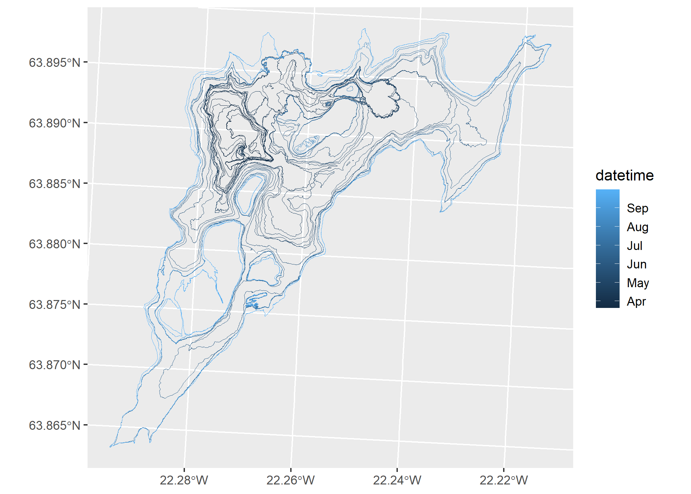
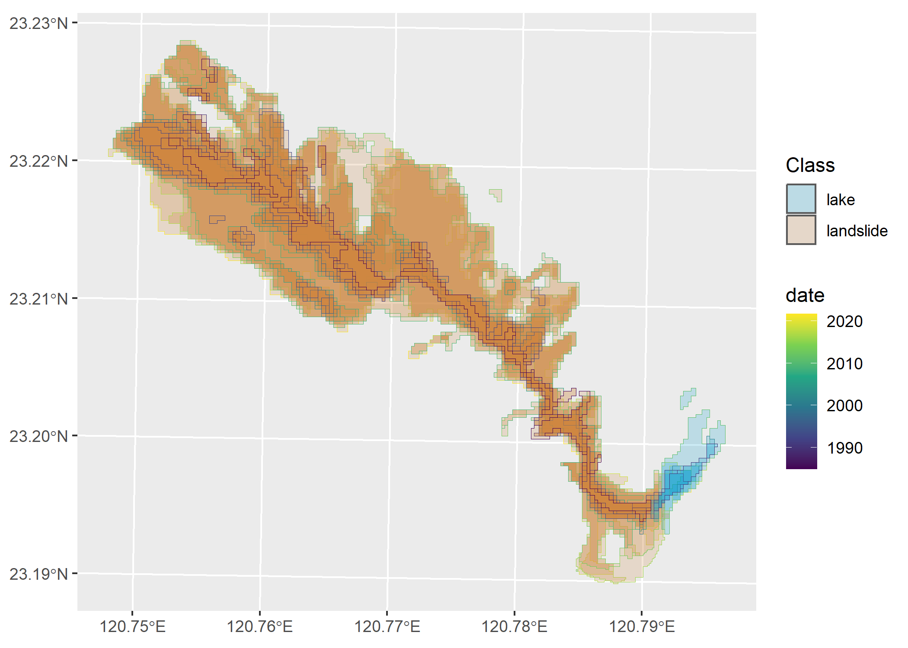

# Computational notebook


- [<span class="toc-section-number">1</span> Context](#context)
- [<span class="toc-section-number">2</span> Libraries](#libraries)
- [<span class="toc-section-number">3</span> Data and
  pre-processing](#data-and-pre-processing)
  - [<span class="toc-section-number">3.1</span> Lava flows in
    Fagradalsfjall, Iceland](#lava-flows-in-fagradalsfjall-iceland)
    - [<span class="toc-section-number">3.1.1</span> Repository
      description](#repository-description)
    - [<span class="toc-section-number">3.1.2</span> Files](#files)
    - [<span class="toc-section-number">3.1.3</span> Download and
      read](#download-and-read)
    - [<span class="toc-section-number">3.1.4</span> Explore](#explore)
    - [<span class="toc-section-number">3.1.5</span> Prepare for
      VDC](#prepare-for-vdc)
  - [<span class="toc-section-number">3.2</span> Landslide in
    Butangbunasi, Taiwan](#landslide-in-butangbunasi-taiwan)
    - [<span class="toc-section-number">3.2.1</span> Repository
      description](#repository-description-1)
    - [<span class="toc-section-number">3.2.2</span> Files](#files-1)
    - [<span class="toc-section-number">3.2.3</span> Download and
      read](#download-and-read-1)
    - [<span class="toc-section-number">3.2.4</span>
      Explore](#explore-1)
    - [<span class="toc-section-number">3.2.5</span> Prepare for
      VDC](#prepare-for-vdc-1)
- [<span class="toc-section-number">4</span> VDC
  creation](#vdc-creation)
  - [<span class="toc-section-number">4.1</span> Array
    format](#array-format)
  - [<span class="toc-section-number">4.2</span> Tabular
    format](#tabular-format)
- [<span class="toc-section-number">5</span> Showcase](#showcase)
  - [<span class="toc-section-number">5.1</span> Cube
    operations](#cube-operations)
  - [<span class="toc-section-number">5.2</span>
    Visualisation](#visualisation)
- [<span class="toc-section-number">6</span> References](#references)
- [<span class="toc-section-number">7</span> R Session
  Info](#sec-session)

# Context

This is a computational notebook to accompany the short paper manuscript
“Vector data cubes for features evolving in space and time” submitted to
AGILE 2024.

In this notebook, the expanded code on how to create vector data cubes
(VDC) for shape-shifting features as described in section 3.2 (Vector
data cube implementation) is included.

Note that the stand-alone code to recreate the figures of the manuscript
can be browsed here
([manuscript-figures.qmd](code/manuscript-figures.qmd)).

These experiments are performed in R v. 4.3.2 and further details on
library versions are included at the end of the notebook
(<a href="#sec-session" class="quarto-xref">Section 7</a>).

# Libraries

The libraries needed to reproduce this notebook are listed below.

``` r
library(cubble) # tabular VDCs
library(dplyr) # data wrangling
library(ggplot2) # visualisation
library(here) # manage current directory
library(patchwork) # plot composer
library(purrr) # functional programming 
library(readr) # read CSV files
library(stars) # array VDCs
library(stringr) # handle strings
library(tidyr) # create tidy data
library(units) # set units
library(zen4R) # download data from zenodo
```

# Data and pre-processing

Both data sets are shared through Zenodo, therefore we will directly
fetch the necessary data from this repository using `zen4R`.

## Lava flows in Fagradalsfjall, Iceland

The lava flow outlines for the Fagradalsfjall eruption can be obtained
from Pedersen et al. (2023).

### Repository description

This is the description attached to the repository.

``` r
zenodo = get_zenodo(
  doi = "10.5281/zenodo.7866738"
)
zenodo$metadata$description
```

\[1\] “
<p>
This repository contains the data behind the work described in Pedersen
et al (in review), specifically the Digital Elevation Models (DEMs),
orthoimages and lava outlines created as part of the near-real time
monitoring of the Fagradalsfjall 2021 eruption (SW-Iceland).
</p>
<p>
The processing of the data is explained in detail in the Supplement S2
of Pedersen et al (2022).
</p>
<p>
The data derived from Pléiades surveys includes only the DEMs and the
lava outlines. The Pléiades-based orthoimages are subject to license.
Please contact the authors for further information about this.
</p>
<p>
<strong>Convention for file naming:</strong>
</p>
<p>
Data: DEM, Ortho, Outline
</p>
<p>
YYYYMMDD_HHMM: Date of acquisition
</p>
<p>
Platform used: Helicopter (HEL), Pléiades (PLE), Hasselblad A6D (A6D)
</p>
<p>
Origin of elevations in DEMs: meters above ellipsoid (zmae)
</p>
<p>
Ground Sampling Distance: 2x2m (DEM) and 30x30cm (Ortho)
</p>
<p>
Cartographic projection: isn93 (see cartographic specifications for
further details)
</p>
<p>
 
</p>
<p>
<strong>Cartographic specifications:</strong>
</p>
<p>
Cartographic projection: ISN93/Lambert 1993 (EPSG: 3057,
https://epsg.io/3057)
</p>
<p>
Horizontal and vertical reference frame: The surveys after 18 April 2021
are in ISN2016/ISH2004, updated locally around the study area in April
2021 (after pre-eruptive deformations occurred). The rest of the surveys
of late March and early April were created using several floating
reference systems (see Supplement S3 for details), since no ground
surveys were available during the first weeks of the data collection.
The surveys of 23 March 2021, 31 March 2021 were re-procesed in Gouhier
et al., 2022, using the survey done on 18 May 2021 as reference.
</p>
<p>
Origin of elevations: Ellipsoid WGS84
</p>
<p>
Raster data format: GeoTIFF
</p>
<p>
Raster compression system: ZSTD (http://facebook.github.io/zstd/)
</p>
<p>
Vector data format: GeoPackage (https://www.geopackage.org/)
</p>

”

### Files

As we see, the vector data format is GeoPackage. These are the files
contained in the repository:

``` r
zenodo$files
```

    [[1]]
    [[1]]$filename
    [1] "orthoimages_pedersen_etal2022.zip"

    [[1]]$filesize
    [1] 6135463409

    [[1]]$checksum
    [1] "56b87142a69ac115d2fe4df961edbcad"

    [[1]]$download
    [1] "https://zenodo.org/api/records/7866738/files/orthoimages_pedersen_etal2022.zip/content"


    [[2]]
    [[2]]$filename
    [1] "dems_pedersen_etal2022.zip"

    [[2]]$filesize
    [1] 378215030

    [[2]]$checksum
    [1] "82d51d5cedd1353958e24a13b097de50"

    [[2]]$download
    [1] "https://zenodo.org/api/records/7866738/files/dems_pedersen_etal2022.zip/content"


    [[3]]
    [[3]]$filename
    [1] "outlines_pedersen_etal2022_v12.zip"

    [[3]]$filesize
    [1] 2447251

    [[3]]$checksum
    [1] "fc7a74d235274b9707bc5acb296b45ea"

    [[3]]$download
    [1] "https://zenodo.org/api/records/7866738/files/outlines_pedersen_etal2022_v12.zip/content"

From an inspection on the Zenodo listing we could see that the outline
for each date is saved as a different file.

### Download and read

Hence, we will download only the outlines zipped file, unzip and create
a list of the geopackage files to read into memory.

``` r
dir = tempdir()
download_zenodo(
  doi = "10.5281/zenodo.7866738",
  path = dir,
  files = list(
    "outlines_pedersen_etal2022_v12.zip"
  ),
  overwrite = FALSE,
  timeout = 600
)

# Unzip
files = list.files(here(dir), full.names = TRUE)
lapply(files, unzip, exdir = here(dir, "unzipped"))

# Find geopackage files
fn_gpkg = list.files(
  here(dir, "unzipped"),
  pattern = "Outline.*gpkg$",
  full.names = TRUE,
  recursive = TRUE
)
```

``` r
data_dir = here("data", "raw", "lava-flows",
                "fagradalsfjall")
fn_gpkg = list.files(
  here(data_dir, "unzipped"),
  pattern = "Outline.*gpkg$",
  full.names = TRUE,
  recursive = TRUE
)
```

With this we can read in the files into R as an `sf` object, where we
combine all the files into one. The filename is kept to extract the date
information from it.

``` r
# Create function to read in each file and to extract 
# the date from the filename
read_fun = function(x){
  read_sf(x) |> 
    mutate(
      fn_gpkg = tail(str_split(x, '/')[[1]], n=1),
      datetime = as.POSIXct(
        paste(str_split(fn_gpkg, "_")[[1]][2:3], collapse = ""),
        format = "%Y%m%d%H%M"
      )
    ) |> 
    # One file does not have a crs set
    st_set_crs(3057)
}

# Call map2 to read in the files
# and bind them into one single sf object
outlines_lf = map(fn_gpkg, read_fun) |> bind_rows()
```

    Warning: st_crs<- : replacing crs does not reproject data; use st_transform for
    that

### Explore

We can look at the final object and have an initial idea of the
contents.

``` r
outlines_lf |> glimpse()
```

    Rows: 33
    Columns: 9
    $ geom     <GEOMETRY [m]> POLYGON ((339233.7 380352.7..., POLYGON ((339159.3 3…
    $ fn_gpkg  <chr> "Outline_20210320_0745_HEL_Pedersen_etal2022_v12.gpkg", "Outl…
    $ datetime <dttm> 2021-03-20 07:45:00, 2021-03-20 12:40:00, 2021-03-21 11:30:0…
    $ id       <dbl> NA, NA, NA, NA, NA, NA, NA, NA, NA, NA, NA, NA, NA, NA, NA, N…
    $ Area     <dbl> NA, NA, 139224, NA, NA, NA, NA, NA, NA, NA, NA, NA, NA, NA, N…
    $ layer    <chr> NA, NA, NA, NA, NA, NA, NA, NA, NA, NA, "aoi_20210405_aft_sit…
    $ path     <chr> NA, NA, NA, NA, NA, NA, NA, NA, NA, NA, "/run/user/1000/gvfs/…
    $ STD_ID1  <chr> NA, NA, NA, NA, NA, NA, NA, NA, NA, NA, NA, NA, NA, NA, NA, N…
    $ BLN_Flag <dbl> NA, NA, NA, NA, NA, NA, NA, NA, NA, NA, NA, NA, NA, NA, NA, N…

As seen, the columns accompanying the data are not complete and also do
not provide extra information. We will mainly focus on the geometry and
the datetime registered. We can take a short look at the polygons
included in the data:

``` r
ggplot(outlines_lf) +
  geom_sf(aes(color = datetime), fill = NA) 
```



### Prepare for VDC

The final step is to make sure we have a single geometry per timestamp.
For this, we group by datetime and summarise the geometries for each
data with a union. We add a step to make the geometry valid in case the
union operation caused any topological issues.

``` r
outlines_lf = outlines_lf |> 
  # Combine polygons from single date into multipolygons
  group_by(datetime) |> 
  summarise(geom = st_combine(geom)) |> 
  ungroup() |> 
  # Make geometry valid
  st_make_valid()
```

Now our data is ready to be coerced to a VDC.

## Landslide in Butangbunasi, Taiwan

The Butangbunasi landslide outlines can be obtained from Hölbling et al.
(2024).

### Repository description

This is the description attached to the repository.

``` r
zenodo = get_zenodo(
  doi = "10.5281/zenodo.10635102"
)
zenodo$metadata$description
```

\[1\] “
<p>
This repository contains an updated version of the data created and
described by
<a title=\"Paper\" href=\"https://doi.org/10.3390/app10020630\" target=\"_blank\" rel=\"noopener\">Hölbling
et al. (2020)</a>, specifically the landslide and landslide-dammed lake
outlines mapped using an object-based image analysis (OBIA) workflow,
summary statistics and further information regarding the landslide and
lake mapping, and a table with the typhoons and tropical storms selected
for the study of the evolution of the Butangbunasi landslide in Taiwan
from 1984 to 2018.<br>The update consists of the addition of a landslide
and lake outline for the year 2021 following the tropical storm Lupit.
</p>
<p>
Further information on the methodology and data used are explained in
Hölbling et al. (2020).
</p>
Landslide and landslide-dammed lake outlines
</h3>
<p>
<em>Convention for file naming:</em>
</p>
<p>
Butangbunasi_YYYY or Butangbunasi_YYYY_MM_DD when several mappings per
year were carried out.<br>YYYY corresponds to the year of the Landsat
satellite imagery.
</p>
<p>
<em>Cartographic specifications:</em>
</p>
<p>
Cartographic projection: WGS 84 / UTM zone 51N (\<a title="EPSG site"
href="https://epsg.io/32651" target="\_blank" rel="noopener"\>EPSG:
32651</a>)
</p>
<p>
Vector data format:
<a title=\"GeoPackage\" href=\"https://www.geopackage.org\" target=\"_blank\" rel=\"noopener\">GeoPackage</a>
</p>
OBIA statistics (Butangbunasi_OBIA_statistics.csv)
</h3>
<p>
<em>Column descriptions:</em>
</p>
<table>
<tbody>
<tr>
<td>
satellite_sensor
</td>
<td>
Satellite from which the outlines were generated
</td>
</tr>
<tr>
<td>
date
</td>
<td>
Acquisition date of the satellite imagery
</td>
</tr>
<tr>
<td>
landslide_area_ha
</td>
<td>
Total area in hectares of the landslide 
</td>
</tr>
<tr>
<td>
lake_area_ha
</td>
<td>
Total area in hectares of the landslide-dammed lake
</td>
</tr>
<tr>
<td>
file
</td>
<td>
File name corresponding to the landslide and lake mapping summary
</td>
</tr>
</tbody>
</table>
Typhoons (Butangbunasi_typhoons.csv)
</h3>
<p>
Table derived from the
<a title=\"IBTrACS\" href=\"https://www.ncei.noaa.gov/products/international-best-track-archive\" target=\"_blank\" rel=\"noopener\">International
Best Track Archive for Climate Stewardship (IBTrACS)</a> v.4
dataset. <br>Includes the location per storm closest to the Butangbunasi
landslide study area.<br>These typhoons were identified as the ones
causing a significant change in landslide area, based on visual
inspection of pre- and post-event satellite imagery.<br>Typhoon dates
were used as a marker to find and select satellite imagery for
subsequent mapping.
</p>
<p>
<em>Column descriptions:</em>
</p>
<table>
<tbody>
<tr>
<td>
SID
</td>
<td>
Storm Identifier
</td>
</tr>
<tr>
<td>
NAME
</td>
<td>
Name provided by the agency. IBTrACS ignores most names that include
digits or abbreviations
</td>
</tr>
<tr>
<td>
SEASON
</td>
<td>
Year
</td>
</tr>
<tr>
<td>
USA_SSHS
</td>
<td>
Saffir-Simpson Hurricane Scale information based on the wind speed
provided by the US agency wind speed (US agencies provide 1-minute wind
speeds)<br>    -5 = Unknown \[XX\]<br>    -4 = Post-tropical \[EX, ET,
PT\]<br>    -3 = Miscellaneous disturbances \[WV, LO, DB, DS, IN,
MD\]<br>    -2 = Subtropical \[SS, SD\]<br>    Tropical systems
classified based on wind speeds \[TD, TS, HU, TY,, TC, ST, HR\]<br>   
 -1 = Tropical depression (W\<34)<br>     0 = Tropical storm
\[34\<W\<64\]<br>     1 = Category 1 \[64\<=W\<83\]<br>     2 = Category
2 \[83\<=W\<96\]<br>     3 = Category 3 \[96\<=W\<113\]<br>     4 =
Category 4 \[113\<=W\<137\]<br>     5 = Category 5 \[W \>= 137\]
</td>
</tr>
<tr>
<td>
ISO_TIME
</td>
<td>
ISO Time provided in Universal Time Coordinates (UTC). Format is
YYYY-MM-DD HH:mm:ss
</td>
</tr>
<tr>
<td>
DIST2LAND
</td>
<td>
Distance (km) to land from the current position. The land dataset
includes all continents and any islands larger than 1400 km^2. The
distance is the nearest at the present time in any direction
</td>
</tr>
<tr>
<td>
maxSSHS
</td>
<td>
The maximum SSHS category recorded during the storm trajectory
</td>
</tr>
<tr>
<td>
dist2aoi_km
</td>
<td>
Distance (km) to the Butangbunasi landslide site
</td>
</tr>
</tbody>
</table>
<p>
 
</p>

”

### Files

Again, the vector data format is GeoPackage. These are the files
contained in the repository:

``` r
zenodo$files
```

    [[1]]
    [[1]]$filename
    [1] "Butangbunasi_typhoons.csv"

    [[1]]$filesize
    [1] 1491

    [[1]]$checksum
    [1] "c6f80649e8e0dfaf1bb5834d38a4c262"

    [[1]]$download
    [1] "https://zenodo.org/api/records/10635102/files/Butangbunasi_typhoons.csv/content"


    [[2]]
    [[2]]$filename
    [1] "outlines.zip"

    [[2]]$filesize
    [1] 146165

    [[2]]$checksum
    [1] "d0034de915b5cae20d9be02899550e9a"

    [[2]]$download
    [1] "https://zenodo.org/api/records/10635102/files/outlines.zip/content"


    [[3]]
    [[3]]$filename
    [1] "Butangbunasi_OBIA_statistics.csv"

    [[3]]$filesize
    [1] 1276

    [[3]]$checksum
    [1] "8ebe12e999df3e41f862db5dc31a57e7"

    [[3]]$download
    [1] "https://zenodo.org/api/records/10635102/files/Butangbunasi_OBIA_statistics.csv/content"

### Download and read

From exploring the repository and checking the description, we concluded
the “Butangbunasi_OBIA_statistics.csv” also contains valuable
information that can be join into the outline data frames.

``` r
# Fetch also the CSV file with addiontional info
dir = tempdir()
download_zenodo(
  doi = "10.5281/zenodo.10635102",
  path = dir,
  files = list(
    "outlines.zip",
    "Butangbunasi_OBIA_statistics.csv"
  ),
  overwrite = FALSE,
  timeout = 100
)

# Unzip
files = list.files(here(dir), full.names = TRUE)
lapply(files, unzip, exdir = here(dir, "unzipped"))

# Find geopackage files
mapping_ls = list.files(
  here(dir, "unzipped", "outlines"), 
  pattern = ".gpkg",
  full.names = TRUE
)
```

``` r
dir = here("data", "raw", "landslides",
                "butangbunasi")
mapping_ls = list.files(
  here(dir, "unzipped", "outlines"), 
  pattern = ".gpkg",
  full.names = TRUE
)
```

We can then read in the CSV file and the outline files. With a left
join, we can obtain the date and other columns from the CSV file.

``` r
# Read in CSV file
stats = read_csv(
  here(dir, "Butangbunasi_OBIA_statistics.csv")
)

# Set-up a read function that fetches filename
read_fun = function(x){
  read_sf(x) |> 
    mutate(
      fn_gpkg = tail(str_split(x, '/')[[1]], n=1),
    )
}

# Read files and combine into single sf object
# Join with CSV file
outlines_ldsl = lapply(mapping_ls, read_fun) |> 
  bind_rows() |> 
  left_join(stats, by = c("fn_gpkg" = "file"))
```

### Explore

We can look at the final object and have an initial idea of the
contents.

``` r
outlines_ldsl |> glimpse()
```

    Rows: 124
    Columns: 8
    $ Area_ha           <dbl> 0.546875, 1.000000, 10.656250, 3.687500, 18.312500, …
    $ Class             <chr> "landslide", "landslide", "landslide", "landslide", …
    $ geom              <POLYGON [m]> POLYGON ((270075 2569820, 2..., POLYGON ((27…
    $ fn_gpkg           <chr> "Butangbunasi_1984.gpkg", "Butangbunasi_1984.gpkg", …
    $ satellite_sensor  <chr> "Landsat 5", "Landsat 5", "Landsat 5", "Landsat 5", …
    $ date              <date> 1984-12-12, 1984-12-12, 1984-12-12, 1984-12-12, 198…
    $ landslide_area_ha <dbl> 66.2500, 66.2500, 66.2500, 66.2500, 66.2500, 66.2500…
    $ lake_area_ha      <dbl> NA, NA, NA, NA, NA, NA, NA, NA, NA, NA, NA, NA, NA, …

For this case, the CSV file added some extra information to the data,
such as the satellite sensor and the landslide area. We see also the
column class and lake area which suggests there is more than one class
for this dataset. Let’s look at the polygons included in the data:

``` r
ggplot(arrange(outlines_ldsl, desc(date))) +
  geom_sf(aes(color = date, fill = Class), alpha = 0.2) +
  scale_color_viridis_c(trans = "date") +
  scale_fill_manual(values = c("deepskyblue3", "peru"))
```



We see here that the data does not only contain the landslide outlines
but also the delineation of a dammed lake. The lake was not considered
in the short paper manuscript but we will keep it in this notebook for
additional experiments, for handling more than one feature type.

### Prepare for VDC

``` r
outlines_ldsl = outlines_ldsl |> 
  # Extract only landslide class
  # filter(Class == "landslide") |> 
  # Coerce date column to Date class
  mutate(date = as.Date(date)) |> 
  # Remove outline for 2018
  # this is a reference outline and does not follow a
  # Typhoon event according to Hoelbling et al., 2020
  filter(date != as.Date("2018-11-08")) |>
  # Group by date which in combination with summarise
  # will union all single polygons into a multipolygon
  group_by(date, Class) |> 
  # Summarise sensor and area information for landslide
  summarise(
    sensor = first(satellite_sensor),
    area_ldsl = set_units(first(landslide_area_ha), 'ha'),
    area_lake = set_units(first(lake_area_ha), 'ha')
  ) |> 
  ungroup() |> 
  # collapse the area column into a single one depending on Class
  mutate(
    area = case_when(
      Class == "landslide" ~ area_ldsl,
      Class == "lake" ~ area_lake
    )
  ) |> 
  select(-starts_with("area_")) |> 
  # Complete data for missing cases of date-Class combination
  complete(date, Class)
```

    `summarise()` has grouped output by 'date'. You can override using the
    `.groups` argument.

# VDC creation

## Array format

We will start creating an array VDC for the lava flow data. For this, we
first create a `gid` that in this case will always be `1L` given that
this is the only feature of this class under analysis.

``` r
# Add gid identifier
outlines_lf = outlines_lf |> 
  mutate(gid = 1L)

# Create array
a = array(
  data = outlines_lf$geom, 
  dim = c(
    length(unique(outlines_lf$gid)),
    length(unique(outlines_lf$gid)),
    length(unique(outlines_lf$datetime))
  ),
  dimnames = list(
    geom_sum = unique(outlines_lf$gid),
    gid = unique(outlines_lf$gid),
    datetime = unique(outlines_lf$datetime)
  )
)

# Create dimensions object
# Summary geometry is the centroid of the union of all geometries
# The point parameter indicates if the value refers to a point (location)
# or to a pixel (area) value
dim_cent = st_dimensions(
  geom_sum = st_centroid(st_make_valid(st_union(outlines_lf$geom))), # approach centroid
  gid = unique(outlines_lf$gid),
  datetime = unique(outlines_lf$datetime),
  point = c(TRUE, TRUE, FALSE)
)

# Coerce to cube
(cube_arr_lf = st_as_stars(
  list(geometry = a), 
  dimensions = dim_cent)
)
```

    stars object with 3 dimensions and 1 attribute
    attribute(s):
             geometry  
     MULTIPOLYGON : 2  
     POLYGON      :28  
     epsg:3057    : 0  
     +proj=lcc ...: 0  
    dimension(s):
             from to               refsys point
    geom_sum    1  1 ISN93 / Lambert 1993  TRUE
    gid         1  1                   NA  TRUE
    datetime    1 30              POSIXct FALSE
                                                  values
    geom_sum                       POINT (339860 380008)
    gid                                                1
    datetime 2021-03-20 07:45:00,...,2021-09-30 14:20:00

## Tabular format

# Showcase

## Cube operations

## Visualisation

# References

<div id="refs" class="references csl-bib-body hanging-indent"
entry-spacing="0">

<div id="ref-Hoelbling_2024_Butangbunasidata" class="csl-entry">

Hölbling, Daniel, Lorena Abad, Zahra Dabiri, Prasicek, and Anne-Laure
Argentin. 2024. “Butangbunasi Landslide and Landslide-Dammed Lake
Outlines Based on Landsat Time Series with Respect to Typhoons.” Zenodo.
<https://doi.org/10.5281/zenodo.10635102>.

</div>

<div id="ref-pedersen_2023_7866738" class="csl-entry">

Pedersen, Gro B. M., Joaquin M. C. Belart, Birgir Vilhelm Óskarsson,
Magnús Tumi Gudmundsson, Nils Gies, Thórdís Högnadóttir, Ásta Rut
Hjartardóttir, et al. 2023. “Digital Elevation Models, Orthoimages and
Lava Outlines of the 2021 Fagradalsfjall Eruption: Results from Near
Real-Time Photogrammetric Monitoring.” Zenodo.
<https://doi.org/10.5281/zenodo.7866738>.

</div>

</div>

# R Session Info

``` r
sessionInfo()
```

    R version 4.3.1 (2023-06-16 ucrt)
    Platform: x86_64-w64-mingw32/x64 (64-bit)
    Running under: Windows 10 x64 (build 19045)

    Matrix products: default


    locale:
    [1] LC_COLLATE=English_Austria.utf8  LC_CTYPE=English_Austria.utf8   
    [3] LC_MONETARY=English_Austria.utf8 LC_NUMERIC=C                    
    [5] LC_TIME=English_Austria.utf8    

    time zone: Europe/Vienna
    tzcode source: internal

    attached base packages:
    [1] stats     graphics  grDevices utils     datasets  methods   base     

    other attached packages:
     [1] zen4R_0.9          units_0.8-5.3      tidyr_1.3.0        stringr_1.5.1     
     [5] stars_0.6-5        sf_1.0-15          abind_1.4-5        readr_2.1.4       
     [9] purrr_1.0.2        patchwork_1.2.0    here_1.0.1         ggplot2_3.4.4.9000
    [13] dplyr_1.1.3        cubble_0.3.0      

    loaded via a namespace (and not attached):
     [1] gtable_0.3.4       anytime_0.3.9      xfun_0.40          rdflib_0.2.8      
     [5] tsibble_1.1.3      tzdb_0.4.0         vctrs_0.6.5        tools_4.3.1       
     [9] generics_0.1.3     curl_5.0.2         parallel_4.3.1     tibble_3.2.1      
    [13] proxy_0.4-27       fansi_1.0.6        pkgconfig_2.0.3    KernSmooth_2.23-22
    [17] redland_1.0.17-17  assertthat_0.2.1   lifecycle_1.0.4    farver_2.1.1      
    [21] compiler_4.3.1     atom4R_0.3-3       munsell_0.5.0      keyring_1.3.1     
    [25] ncdf4_1.21         htmltools_0.5.7    class_7.3-22       yaml_2.3.8        
    [29] crayon_1.5.2       pillar_1.9.0       ellipsis_0.3.2     classInt_0.4-10   
    [33] tidyselect_1.2.0   zip_2.3.0          digest_0.6.33      stringi_1.7.12    
    [37] rprojroot_2.0.3    fastmap_1.1.1      grid_4.3.1         colorspace_2.1-0  
    [41] cli_3.6.2          magrittr_2.0.3     XML_3.99-0.16      utf8_1.2.4        
    [45] e1071_1.7-13       withr_3.0.0        scales_1.3.0       bit64_4.0.5       
    [49] lubridate_1.9.2    timechange_0.2.0   roxygen2_7.2.3     rmarkdown_2.25    
    [53] httr_1.4.7         bit_4.0.5          hms_1.1.3          evaluate_0.23     
    [57] knitr_1.45         viridisLite_0.4.2  rlang_1.1.3        Rcpp_1.0.11       
    [61] glue_1.7.0         DBI_1.2.1          xml2_1.3.5         vroom_1.6.3       
    [65] rstudioapi_0.15.0  jsonlite_1.8.8     R6_2.5.1          
