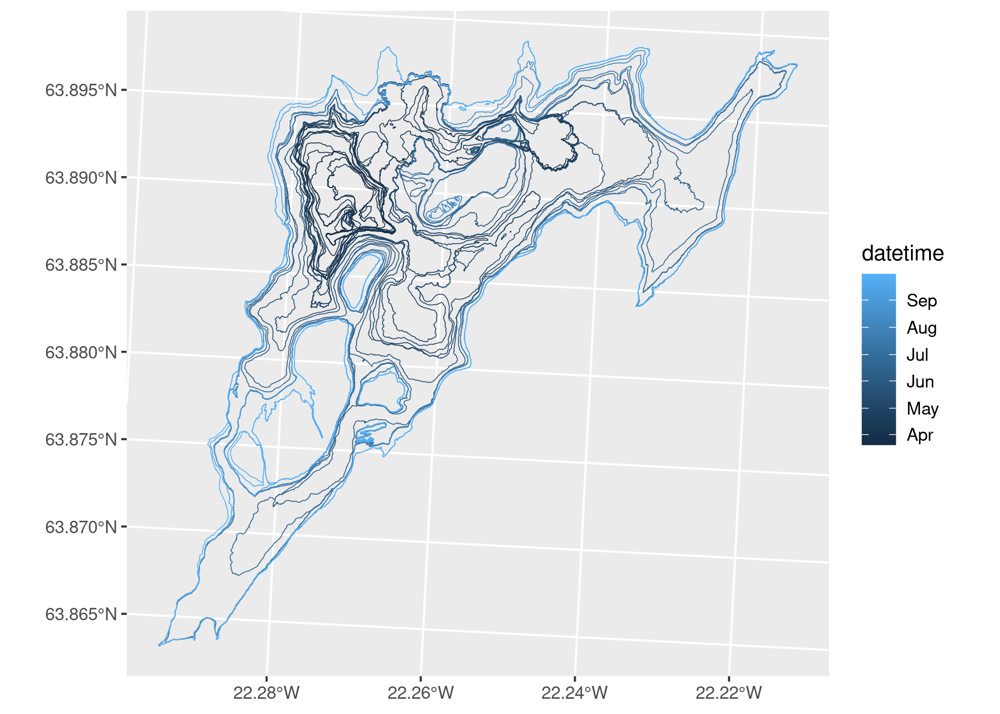
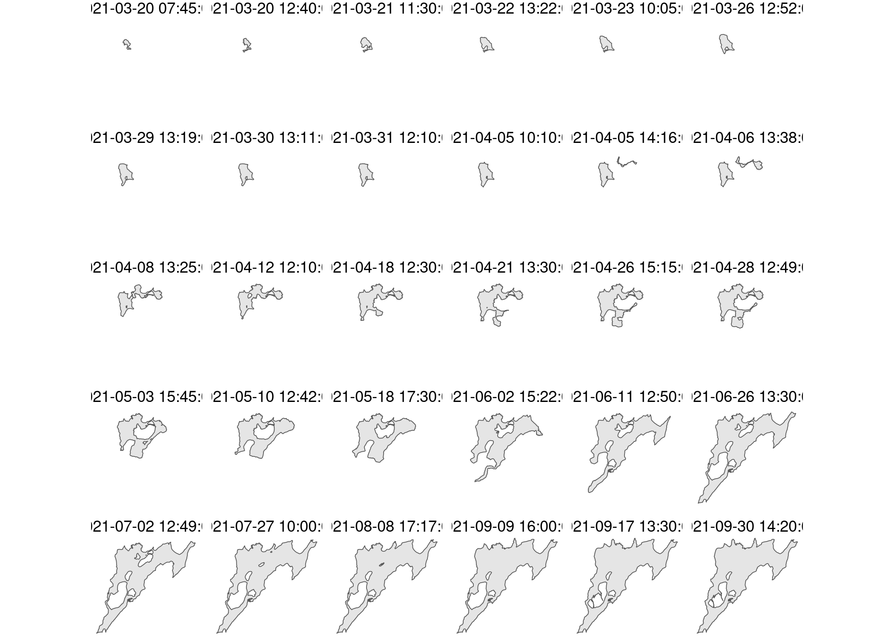
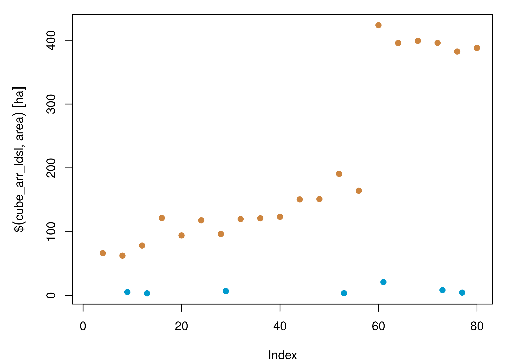
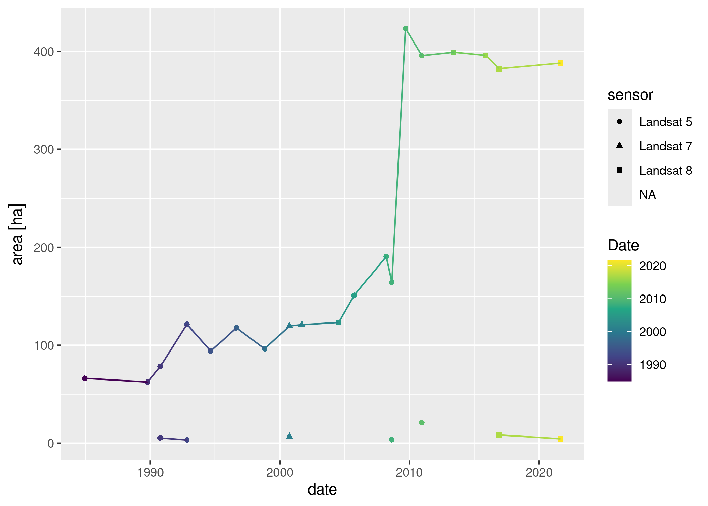
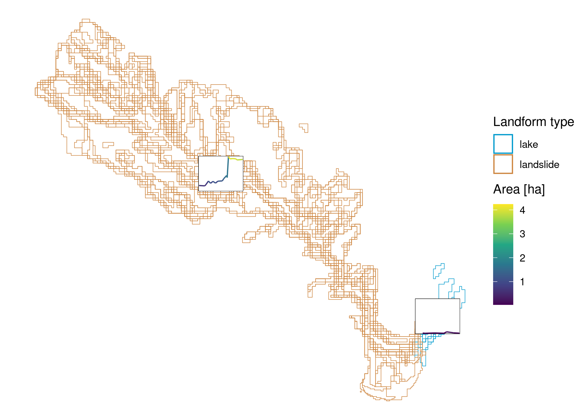

# Computational notebook


- [<span class="toc-section-number">1</span> Context](#context)
- [<span class="toc-section-number">2</span> Libraries](#libraries)
- [<span class="toc-section-number">3</span> Data and
  pre-processing](#data-and-pre-processing)
  - [<span class="toc-section-number">3.1</span> Lava flows in
    Fagradalsfjall, Iceland](#lava-flows-in-fagradalsfjall-iceland)
    - [<span class="toc-section-number">3.1.1</span> Repository
      description](#repository-description)
    - [<span class="toc-section-number">3.1.2</span> Files](#files)
    - [<span class="toc-section-number">3.1.3</span> Download and
      read](#download-and-read)
    - [<span class="toc-section-number">3.1.4</span> Explore](#explore)
    - [<span class="toc-section-number">3.1.5</span> Prepare for
      VDC](#prepare-for-vdc)
  - [<span class="toc-section-number">3.2</span> Landslide in
    Butangbunasi, Taiwan](#landslide-in-butangbunasi-taiwan)
    - [<span class="toc-section-number">3.2.1</span> Repository
      description](#repository-description-1)
    - [<span class="toc-section-number">3.2.2</span> Files](#files-1)
    - [<span class="toc-section-number">3.2.3</span> Download and
      read](#download-and-read-1)
    - [<span class="toc-section-number">3.2.4</span>
      Explore](#explore-1)
    - [<span class="toc-section-number">3.2.5</span> Prepare for
      VDC](#prepare-for-vdc-1)
- [<span class="toc-section-number">4</span> VDC
  creation](#vdc-creation)
  - [<span class="toc-section-number">4.1</span> Array
    format](#array-format)
    - [<span class="toc-section-number">4.1.1</span> Lava flow
      VDC](#lava-flow-vdc)
    - [<span class="toc-section-number">4.1.2</span> Landslide
      VDC](#landslide-vdc)
  - [<span class="toc-section-number">4.2</span> Tabular
    format](#tabular-format)
    - [<span class="toc-section-number">4.2.1</span> Lava flow
      VDC](#lava-flow-vdc-1)
    - [<span class="toc-section-number">4.2.2</span> Landslide
      VDC](#landslide-vdc-1)
- [<span class="toc-section-number">5</span> Showcase](#showcase)
  - [<span class="toc-section-number">5.1</span> Cube
    operations](#cube-operations)
    - [<span class="toc-section-number">5.1.1</span> Geometric
      measurements](#geometric-measurements)
    - [<span class="toc-section-number">5.1.2</span> Subsetting
      dimensions](#subsetting-dimensions)
    - [<span class="toc-section-number">5.1.3</span> Selecting
      attributes](#selecting-attributes)
    - [<span class="toc-section-number">5.1.4</span> Filtering
      time](#filtering-time)
    - [<span class="toc-section-number">5.1.5</span> CRS
      transformation](#crs-transformation)
    - [<span class="toc-section-number">5.1.6</span> Differences in time
      series](#differences-in-time-series)
  - [<span class="toc-section-number">5.2</span>
    Visualisation](#visualisation)
    - [<span class="toc-section-number">5.2.1</span> Maps with array
      VDCs](#maps-with-array-vdcs)
    - [<span class="toc-section-number">5.2.2</span> Multi-dimensional
      plot](#multi-dimensional-plot)
    - [<span class="toc-section-number">5.2.3</span> Time series
      plots](#time-series-plots)
    - [<span class="toc-section-number">5.2.4</span> Glyph
      maps](#glyph-maps)
- [<span class="toc-section-number">6</span> References](#references)
- [<span class="toc-section-number">7</span> R Session
  Info](#sec-session)

# Context

This is a computational notebook to accompany the short paper manuscript
“Vector data cubes for features evolving in space and time” submitted to
AGILE 2024.

In this notebook, the expanded code on how to create vector data cubes
(VDC) for shape-shifting features as described in section 3.2 (Vector
data cube implementation) is included.

Note that the stand-alone code to recreate the figures of the manuscript
can be browsed here
([manuscript-figures.qmd](code/manuscript-figures.qmd)).

These experiments are performed in R v. 4.3.2 and further details on
library versions are included at the end of the notebook.

# Libraries

The following chunk installs the needed libraries. Run only if
overwriting current installations is not an issue. Note that `cubble`
and `ggnewscale` come from the GitHub repository. `tmap` is installed
from r-universe to work with version 4.

``` r
pkgs = c(
  "dplyr","ggplot2","here","patchwork",
  "purrr","readr","stringr",
  "tidyr","tsibble","units","zen4R"
)
install.packages(pkgs)
remotes::install_github("huizezhang-sherry/cubble")
remotes::install_github("eliocamp/ggnewscale")
remotes::install_github("r-spatial/sf")
remotes::install_github("r-spatial/stars")
install.packages(
  'tmap',
  repos = c('https://r-tmap.r-universe.dev',
            'https://cloud.r-project.org')
)
```

The libraries needed to reproduce this notebook are listed below.

``` r
library(cubble) # tabular VDCs
library(dplyr) # data wrangling
library(ggplot2) # visualisation
library(ggnewscale) # add second color/fill scale in ggplot
library(here) # manage current directory
library(patchwork) # plot composer
library(purrr) # functional programming 
library(readr) # read CSV files
library(sf) # read vector files
library(stars) # array VDCs
library(stringr) # handle strings
library(tidyr) # create tidy data
library(tmap) # spatial visualisation
library(tsibble) # handle time series data
library(units) # set units
library(zen4R) # download data from zenodo
```

# Data and pre-processing

Both data sets are shared through Zenodo, therefore we will directly
fetch the necessary data from this repository using `zen4R`.

## Lava flows in Fagradalsfjall, Iceland

The lava flow outlines for the Fagradalsfjall eruption can be obtained
from Pedersen et al. (2023).

### Repository description

This is the description attached to the repository.

``` r
zenodo = get_zenodo(
  doi = "10.5281/zenodo.7866738"
)
zenodo$metadata$description
```

\[1\] “
<p>
This repository contains the data behind the work described in Pedersen
et al (in review), specifically the Digital Elevation Models (DEMs),
orthoimages and lava outlines created as part of the near-real time
monitoring of the Fagradalsfjall 2021 eruption (SW-Iceland).
</p>
<p>
The processing of the data is explained in detail in the Supplement S2
of Pedersen et al (2022).
</p>
<p>
The data derived from Pléiades surveys includes only the DEMs and the
lava outlines. The Pléiades-based orthoimages are subject to license.
Please contact the authors for further information about this.
</p>
<p>
<strong>Convention for file naming:</strong>
</p>
<p>
Data: DEM, Ortho, Outline
</p>
<p>
YYYYMMDD_HHMM: Date of acquisition
</p>
<p>
Platform used: Helicopter (HEL), Pléiades (PLE), Hasselblad A6D (A6D)
</p>
<p>
Origin of elevations in DEMs: meters above ellipsoid (zmae)
</p>
<p>
Ground Sampling Distance: 2x2m (DEM) and 30x30cm (Ortho)
</p>
<p>
Cartographic projection: isn93 (see cartographic specifications for
further details)
</p>
<p>
 
</p>
<p>
<strong>Cartographic specifications:</strong>
</p>
<p>
Cartographic projection: ISN93/Lambert 1993 (EPSG: 3057,
https://epsg.io/3057)
</p>
<p>
Horizontal and vertical reference frame: The surveys after 18 April 2021
are in ISN2016/ISH2004, updated locally around the study area in April
2021 (after pre-eruptive deformations occurred). The rest of the surveys
of late March and early April were created using several floating
reference systems (see Supplement S3 for details), since no ground
surveys were available during the first weeks of the data collection.
The surveys of 23 March 2021, 31 March 2021 were re-procesed in Gouhier
et al., 2022, using the survey done on 18 May 2021 as reference.
</p>
<p>
Origin of elevations: Ellipsoid WGS84
</p>
<p>
Raster data format: GeoTIFF
</p>
<p>
Raster compression system: ZSTD (http://facebook.github.io/zstd/)
</p>
<p>
Vector data format: GeoPackage (https://www.geopackage.org/)
</p>

”

### Files

As we see, the vector data format is GeoPackage. These are the files
contained in the repository:

``` r
zenodo$files
```

    [[1]]
    [[1]]$filename
    [1] "orthoimages_pedersen_etal2022.zip"

    [[1]]$filesize
    [1] 6135463409

    [[1]]$checksum
    [1] "56b87142a69ac115d2fe4df961edbcad"

    [[1]]$download
    [1] "https://zenodo.org/api/records/7866738/files/orthoimages_pedersen_etal2022.zip/content"


    [[2]]
    [[2]]$filename
    [1] "dems_pedersen_etal2022.zip"

    [[2]]$filesize
    [1] 378215030

    [[2]]$checksum
    [1] "82d51d5cedd1353958e24a13b097de50"

    [[2]]$download
    [1] "https://zenodo.org/api/records/7866738/files/dems_pedersen_etal2022.zip/content"


    [[3]]
    [[3]]$filename
    [1] "outlines_pedersen_etal2022_v12.zip"

    [[3]]$filesize
    [1] 2447251

    [[3]]$checksum
    [1] "fc7a74d235274b9707bc5acb296b45ea"

    [[3]]$download
    [1] "https://zenodo.org/api/records/7866738/files/outlines_pedersen_etal2022_v12.zip/content"

From an inspection on the Zenodo listing we could see that the outline
for each date is saved as a different file.

### Download and read

Hence, we will download only the outlines zipped file, unzip and create
a list of the GeoPackage files to read into memory.

``` r
dir = tempdir()
download_zenodo(
  doi = "10.5281/zenodo.7866738",
  path = dir,
  files = list(
    "outlines_pedersen_etal2022_v12.zip"
  ),
  overwrite = FALSE,
  timeout = 600
)
```

    [zen4R][INFO] ZenodoRecord - Download in sequential mode 
    [zen4R][INFO] ZenodoRecord - Will download 1 file from record '7866738' (doi: '10.5281/zenodo.7866738') - total size: 2.3 MiB 
    [zen4R][INFO] Downloading file 'outlines_pedersen_etal2022_v12.zip' - size: 2.3 MiB
    [zen4R][INFO] File downloaded at 'C:/Users/b1066081/AppData/Local/Temp/RtmpqANLci'.
    [zen4R][INFO] ZenodoRecord - Verifying file integrity... 
    [zen4R][INFO] File 'outlines_pedersen_etal2022_v12.zip': integrity verified (md5sum: fc7a74d235274b9707bc5acb296b45ea)
    [zen4R][INFO] ZenodoRecord - End of download 

``` r
# Unzip
files = list.files(here(dir), full.names = TRUE)
lapply(files, unzip, exdir = here(dir, "unzipped"))
```

    Warning in FUN(X[[i]], ...): error 1 in extracting from zip file
    Warning in FUN(X[[i]], ...): error 1 in extracting from zip file
    Warning in FUN(X[[i]], ...): error 1 in extracting from zip file
    Warning in FUN(X[[i]], ...): error 1 in extracting from zip file
    Warning in FUN(X[[i]], ...): error 1 in extracting from zip file

    [[1]]
    NULL

    [[2]]
    NULL

    [[3]]
    NULL

    [[4]]
    NULL

    [[5]]
    NULL

    [[6]]
     [1] "C:/Users/b1066081/AppData/Local/Temp/RtmpqANLci/unzipped/outlines_pedersen_etal2022_v12/Outline_20210320_1240_A6D_Pedersen_etal2022_v12.gpkg"
     [2] "C:/Users/b1066081/AppData/Local/Temp/RtmpqANLci/unzipped/outlines_pedersen_etal2022_v12/Outline_20210321_1130_HEL_Pedersen_etal2022_v12.gpkg"
     [3] "C:/Users/b1066081/AppData/Local/Temp/RtmpqANLci/unzipped/outlines_pedersen_etal2022_v12/Outline_20210331_1210_A6D_Pedersen_etal2022_v12.gpkg"
     [4] "C:/Users/b1066081/AppData/Local/Temp/RtmpqANLci/unzipped/outlines_pedersen_etal2022_v12/Outline_20210405_1010_A6D_Pedersen_etal2022_v12.gpkg"
     [5] "C:/Users/b1066081/AppData/Local/Temp/RtmpqANLci/unzipped/outlines_pedersen_etal2022_v12/Outline_20210405_1416_A6D_Pedersen_etal2022_v12.gpkg"
     [6] "C:/Users/b1066081/AppData/Local/Temp/RtmpqANLci/unzipped/outlines_pedersen_etal2022_v12/Outline_20210406_1338_A6D_Pedersen_etal2022_v12.gpkg"
     [7] "C:/Users/b1066081/AppData/Local/Temp/RtmpqANLci/unzipped/outlines_pedersen_etal2022_v12/Outline_20210408_1325_A6D_Pedersen_etal2022_v12.gpkg"
     [8] "C:/Users/b1066081/AppData/Local/Temp/RtmpqANLci/unzipped/outlines_pedersen_etal2022_v12/Outline_20210412_1210_A6D_Pedersen_etal2022_v12.gpkg"
     [9] "C:/Users/b1066081/AppData/Local/Temp/RtmpqANLci/unzipped/outlines_pedersen_etal2022_v12/Outline_20210320_0745_HEL_Pedersen_etal2022_v12.gpkg"
    [10] "C:/Users/b1066081/AppData/Local/Temp/RtmpqANLci/unzipped/outlines_pedersen_etal2022_v12/Outline_20210322_1322_PLE_Pedersen_etal2022_v12.gpkg"
    [11] "C:/Users/b1066081/AppData/Local/Temp/RtmpqANLci/unzipped/outlines_pedersen_etal2022_v12/Outline_20210323_1005_A6D_Pedersen_etal2022_v12.gpkg"
    [12] "C:/Users/b1066081/AppData/Local/Temp/RtmpqANLci/unzipped/outlines_pedersen_etal2022_v12/Outline_20210326_1252_PLE_Pedersen_etal2022_v12.gpkg"
    [13] "C:/Users/b1066081/AppData/Local/Temp/RtmpqANLci/unzipped/outlines_pedersen_etal2022_v12/Outline_20210329_1319_PLE_Pedersen_etal2022_v12.gpkg"
    [14] "C:/Users/b1066081/AppData/Local/Temp/RtmpqANLci/unzipped/outlines_pedersen_etal2022_v12/Outline_20210330_1311_PLE_Pedersen_etal2022_v12.gpkg"
    [15] "C:/Users/b1066081/AppData/Local/Temp/RtmpqANLci/unzipped/outlines_pedersen_etal2022_v12/Outline_20210418_1230_A6D_Pedersen_etal2022_v12.gpkg"
    [16] "C:/Users/b1066081/AppData/Local/Temp/RtmpqANLci/unzipped/outlines_pedersen_etal2022_v12/Outline_20210421_1330_A6D_Pedersen_etal2022_v12.gpkg"
    [17] "C:/Users/b1066081/AppData/Local/Temp/RtmpqANLci/unzipped/outlines_pedersen_etal2022_v12/Outline_20210426_1515_A6D_Pedersen_etal2022_v12.gpkg"
    [18] "C:/Users/b1066081/AppData/Local/Temp/RtmpqANLci/unzipped/outlines_pedersen_etal2022_v12/Outline_20210428_1249_PLE_Pedersen_etal2022_v12.gpkg"
    [19] "C:/Users/b1066081/AppData/Local/Temp/RtmpqANLci/unzipped/outlines_pedersen_etal2022_v12/Outline_20210503_1545_A6D_Pedersen_etal2022_v12.gpkg"
    [20] "C:/Users/b1066081/AppData/Local/Temp/RtmpqANLci/unzipped/outlines_pedersen_etal2022_v12/Outline_20210510_1242_A6D_Pedersen_etal2022_v12.gpkg"
    [21] "C:/Users/b1066081/AppData/Local/Temp/RtmpqANLci/unzipped/outlines_pedersen_etal2022_v12/Outline_20210518_1730_A6D_Pedersen_etal2022_v12.gpkg"
    [22] "C:/Users/b1066081/AppData/Local/Temp/RtmpqANLci/unzipped/outlines_pedersen_etal2022_v12/Outline_20210602_1522_A6D_Pedersen_etal2022_v12.gpkg"
    [23] "C:/Users/b1066081/AppData/Local/Temp/RtmpqANLci/unzipped/outlines_pedersen_etal2022_v12/Outline_20210611_1250_A6D_Pedersen_etal2022_v12.gpkg"
    [24] "C:/Users/b1066081/AppData/Local/Temp/RtmpqANLci/unzipped/outlines_pedersen_etal2022_v12/Outline_20210626_1330_A6D_Pedersen_etal2022_v12.gpkg"
    [25] "C:/Users/b1066081/AppData/Local/Temp/RtmpqANLci/unzipped/outlines_pedersen_etal2022_v12/Outline_20210702_1249_PLE_Pedersen_etal2022_v12.gpkg"
    [26] "C:/Users/b1066081/AppData/Local/Temp/RtmpqANLci/unzipped/outlines_pedersen_etal2022_v12/Outline_20210727_1000_A6D_Pedersen_etal2022_v12.gpkg"
    [27] "C:/Users/b1066081/AppData/Local/Temp/RtmpqANLci/unzipped/outlines_pedersen_etal2022_v12/Outline_20210808_1717_A6D_Pedersen_etal2022_v12.gpkg"
    [28] "C:/Users/b1066081/AppData/Local/Temp/RtmpqANLci/unzipped/outlines_pedersen_etal2022_v12/Outline_20210909_1600_A6D_Pedersen_etal2022_v12.gpkg"
    [29] "C:/Users/b1066081/AppData/Local/Temp/RtmpqANLci/unzipped/outlines_pedersen_etal2022_v12/Outline_20210917_1330_A6D_Pedersen_etal2022_v12.gpkg"
    [30] "C:/Users/b1066081/AppData/Local/Temp/RtmpqANLci/unzipped/outlines_pedersen_etal2022_v12/Outline_20210930_1420_A6D_Pedersen_etal2022_v12.gpkg"

``` r
# Find geopackage files
fn_gpkg = list.files(
  here(dir, "unzipped"),
  pattern = "Outline.*gpkg$",
  full.names = TRUE,
  recursive = TRUE
)
```

With this we can read in the files into R as an `sf` object, where we
combine all the files into one. The filename is kept to extract the date
information from it.

``` r
# Create function to read in each file and to extract 
# the date from the filename
read_fun = function(x){
  read_sf(x) |> 
    mutate(
      fn_gpkg = tail(str_split(x, '/')[[1]], n=1),
      datetime = as.POSIXct(
        paste(str_split(fn_gpkg, "_")[[1]][2:3], collapse = ""),
        format = "%Y%m%d%H%M"
      )
    ) |> 
    # One file does not have a crs set
    st_set_crs(3057)
}

# Call map2 to read in the files
# and bind them into one single sf object
outlines_lf = map(fn_gpkg, read_fun) |> bind_rows()
```

    Warning: st_crs<- : replacing crs does not reproject data; use st_transform for
    that

### Explore

We can look at the final object and have an initial idea of the
contents.

``` r
outlines_lf |> glimpse()
```

    Rows: 33
    Columns: 9
    $ geom     <GEOMETRY [m]> POLYGON ((339233.7 380352.7..., POLYGON ((339159.3 3…
    $ fn_gpkg  <chr> "Outline_20210320_0745_HEL_Pedersen_etal2022_v12.gpkg", "Outl…
    $ datetime <dttm> 2021-03-20 07:45:00, 2021-03-20 12:40:00, 2021-03-21 11:30:0…
    $ id       <dbl> NA, NA, NA, NA, NA, NA, NA, NA, NA, NA, NA, NA, NA, NA, NA, N…
    $ Area     <dbl> NA, NA, 139224, NA, NA, NA, NA, NA, NA, NA, NA, NA, NA, NA, N…
    $ layer    <chr> NA, NA, NA, NA, NA, NA, NA, NA, NA, NA, "aoi_20210405_aft_sit…
    $ path     <chr> NA, NA, NA, NA, NA, NA, NA, NA, NA, NA, "/run/user/1000/gvfs/…
    $ STD_ID1  <chr> NA, NA, NA, NA, NA, NA, NA, NA, NA, NA, NA, NA, NA, NA, NA, N…
    $ BLN_Flag <dbl> NA, NA, NA, NA, NA, NA, NA, NA, NA, NA, NA, NA, NA, NA, NA, N…

As seen, the columns accompanying the data are not complete and also do
not provide extra information. We will mainly focus on the geometry and
the datetime registered. We can take a short look at the polygons
included in the data:

``` r
ggplot(outlines_lf) +
  geom_sf(aes(color = datetime), fill = NA) 
```



### Prepare for VDC

The final step is to make sure we have a single geometry per timestamp.
For this, we group by datetime and summarise the geometries for each
data with a union. We add a step to make the geometry valid in case the
union operation caused any topological issues.

``` r
outlines_lf = outlines_lf |> 
  # Combine polygons from single date into multipolygons
  group_by(datetime) |> 
  summarise(geom = st_combine(geom)) |> 
  ungroup() |> 
  # Make geometry valid
  st_make_valid()
```

Now our data is ready to be coerced to a VDC.

## Landslide in Butangbunasi, Taiwan

The Butangbunasi landslide outlines can be obtained from Hölbling et al.
(2024).

### Repository description

This is the description attached to the repository.

``` r
zenodo = get_zenodo(
  doi = "10.5281/zenodo.10635102"
)
zenodo$metadata$description
```

\[1\] “
<p>
This repository contains an updated version of the data created and
described by
<a title=\"Paper\" href=\"https://doi.org/10.3390/app10020630\" target=\"_blank\" rel=\"noopener\">Hölbling
et al. (2020)</a>, specifically the landslide and landslide-dammed lake
outlines mapped using an object-based image analysis (OBIA) workflow,
summary statistics and further information regarding the landslide and
lake mapping, and a table with the typhoons and tropical storms selected
for the study of the evolution of the Butangbunasi landslide in Taiwan
from 1984 to 2018.<br>The update consists of the addition of a landslide
and lake outline for the year 2021 following the tropical storm Lupit.
</p>
<p>
Further information on the methodology and data used are explained in
Hölbling et al. (2020).
</p>
Landslide and landslide-dammed lake outlines
</h3>
<p>
<em>Convention for file naming:</em>
</p>
<p>
Butangbunasi_YYYY or Butangbunasi_YYYY_MM_DD when several mappings per
year were carried out.<br>YYYY corresponds to the year of the Landsat
satellite imagery.
</p>
<p>
<em>Cartographic specifications:</em>
</p>
<p>
Cartographic projection: WGS 84 / UTM zone 51N (\<a title="EPSG site"
href="https://epsg.io/32651" target="\_blank" rel="noopener"\>EPSG:
32651</a>)
</p>
<p>
Vector data format:
<a title=\"GeoPackage\" href=\"https://www.geopackage.org\" target=\"_blank\" rel=\"noopener\">GeoPackage</a>
</p>
OBIA statistics (Butangbunasi_OBIA_statistics.csv)
</h3>
<p>
<em>Column descriptions:</em>
</p>
<table>
<tbody>
<tr>
<td>
satellite_sensor
</td>
<td>
Satellite from which the outlines were generated
</td>
</tr>
<tr>
<td>
date
</td>
<td>
Acquisition date of the satellite imagery
</td>
</tr>
<tr>
<td>
landslide_area_ha
</td>
<td>
Total area in hectares of the landslide 
</td>
</tr>
<tr>
<td>
lake_area_ha
</td>
<td>
Total area in hectares of the landslide-dammed lake
</td>
</tr>
<tr>
<td>
file
</td>
<td>
File name corresponding to the landslide and lake mapping summary
</td>
</tr>
</tbody>
</table>
Typhoons (Butangbunasi_typhoons.csv)
</h3>
<p>
Table derived from the
<a title=\"IBTrACS\" href=\"https://www.ncei.noaa.gov/products/international-best-track-archive\" target=\"_blank\" rel=\"noopener\">International
Best Track Archive for Climate Stewardship (IBTrACS)</a> v.4
dataset. <br>Includes the location per storm closest to the Butangbunasi
landslide study area.<br>These typhoons were identified as the ones
causing a significant change in landslide area, based on visual
inspection of pre- and post-event satellite imagery.<br>Typhoon dates
were used as a marker to find and select satellite imagery for
subsequent mapping.
</p>
<p>
<em>Column descriptions:</em>
</p>
<table>
<tbody>
<tr>
<td>
SID
</td>
<td>
Storm Identifier
</td>
</tr>
<tr>
<td>
NAME
</td>
<td>
Name provided by the agency. IBTrACS ignores most names that include
digits or abbreviations
</td>
</tr>
<tr>
<td>
SEASON
</td>
<td>
Year
</td>
</tr>
<tr>
<td>
USA_SSHS
</td>
<td>
Saffir-Simpson Hurricane Scale information based on the wind speed
provided by the US agency wind speed (US agencies provide 1-minute wind
speeds)<br>    -5 = Unknown \[XX\]<br>    -4 = Post-tropical \[EX, ET,
PT\]<br>    -3 = Miscellaneous disturbances \[WV, LO, DB, DS, IN,
MD\]<br>    -2 = Subtropical \[SS, SD\]<br>    Tropical systems
classified based on wind speeds \[TD, TS, HU, TY,, TC, ST, HR\]<br>   
 -1 = Tropical depression (W\<34)<br>     0 = Tropical storm
\[34\<W\<64\]<br>     1 = Category 1 \[64\<=W\<83\]<br>     2 = Category
2 \[83\<=W\<96\]<br>     3 = Category 3 \[96\<=W\<113\]<br>     4 =
Category 4 \[113\<=W\<137\]<br>     5 = Category 5 \[W \>= 137\]
</td>
</tr>
<tr>
<td>
ISO_TIME
</td>
<td>
ISO Time provided in Universal Time Coordinates (UTC). Format is
YYYY-MM-DD HH:mm:ss
</td>
</tr>
<tr>
<td>
DIST2LAND
</td>
<td>
Distance (km) to land from the current position. The land dataset
includes all continents and any islands larger than 1400 km^2. The
distance is the nearest at the present time in any direction
</td>
</tr>
<tr>
<td>
maxSSHS
</td>
<td>
The maximum SSHS category recorded during the storm trajectory
</td>
</tr>
<tr>
<td>
dist2aoi_km
</td>
<td>
Distance (km) to the Butangbunasi landslide site
</td>
</tr>
</tbody>
</table>
<p>
 
</p>

”

### Files

Again, the vector data format is GeoPackage. These are the files
contained in the repository:

``` r
zenodo$files
```

    [[1]]
    [[1]]$filename
    [1] "Butangbunasi_typhoons.csv"

    [[1]]$filesize
    [1] 1491

    [[1]]$checksum
    [1] "c6f80649e8e0dfaf1bb5834d38a4c262"

    [[1]]$download
    [1] "https://zenodo.org/api/records/10635102/files/Butangbunasi_typhoons.csv/content"


    [[2]]
    [[2]]$filename
    [1] "outlines.zip"

    [[2]]$filesize
    [1] 146165

    [[2]]$checksum
    [1] "d0034de915b5cae20d9be02899550e9a"

    [[2]]$download
    [1] "https://zenodo.org/api/records/10635102/files/outlines.zip/content"


    [[3]]
    [[3]]$filename
    [1] "Butangbunasi_OBIA_statistics.csv"

    [[3]]$filesize
    [1] 1276

    [[3]]$checksum
    [1] "8ebe12e999df3e41f862db5dc31a57e7"

    [[3]]$download
    [1] "https://zenodo.org/api/records/10635102/files/Butangbunasi_OBIA_statistics.csv/content"

### Download and read

From exploring the repository and checking the description, we concluded
the “Butangbunasi_OBIA_statistics.csv” also contains valuable
information that can be join into the outline data frames.

``` r
# Fetch also the CSV file with additional info
dir = tempdir()
download_zenodo(
  doi = "10.5281/zenodo.10635102",
  path = dir,
  files = list(
    "outlines.zip",
    "Butangbunasi_OBIA_statistics.csv"
  ),
  overwrite = FALSE,
  timeout = 100
)
```

    [zen4R][INFO] ZenodoRecord - Download in sequential mode 
    [zen4R][INFO] ZenodoRecord - Will download 2 files from record '10635102' (doi: '10.5281/zenodo.10635102') - total size: 144 KiB 
    [zen4R][INFO] Downloading file 'outlines.zip' - size: 142.7 KiB
    [zen4R][INFO] Downloading file 'Butangbunasi_OBIA_statistics.csv' - size: 1.2 KiB
    [zen4R][INFO] Files downloaded at 'C:/Users/b1066081/AppData/Local/Temp/RtmpqANLci'.
    [zen4R][INFO] ZenodoRecord - Verifying file integrity... 
    [zen4R][INFO] File 'outlines.zip': integrity verified (md5sum: d0034de915b5cae20d9be02899550e9a)
    [zen4R][INFO] File 'Butangbunasi_OBIA_statistics.csv': integrity verified (md5sum: 8ebe12e999df3e41f862db5dc31a57e7)
    [zen4R][INFO] ZenodoRecord - End of download 

``` r
# Unzip
files = list.files(here(dir), full.names = TRUE)
lapply(files, unzip, exdir = here(dir, "unzipped"))
```

    Warning in FUN(X[[i]], ...): error 1 in extracting from zip file
    Warning in FUN(X[[i]], ...): error 1 in extracting from zip file
    Warning in FUN(X[[i]], ...): error 1 in extracting from zip file
    Warning in FUN(X[[i]], ...): error 1 in extracting from zip file
    Warning in FUN(X[[i]], ...): error 1 in extracting from zip file
    Warning in FUN(X[[i]], ...): error 1 in extracting from zip file
    Warning in FUN(X[[i]], ...): error 1 in extracting from zip file
    Warning in FUN(X[[i]], ...): error 1 in extracting from zip file
    Warning in FUN(X[[i]], ...): error 1 in extracting from zip file
    Warning in FUN(X[[i]], ...): error 1 in extracting from zip file
    Warning in FUN(X[[i]], ...): error 1 in extracting from zip file
    Warning in FUN(X[[i]], ...): error 1 in extracting from zip file
    Warning in FUN(X[[i]], ...): error 1 in extracting from zip file
    Warning in FUN(X[[i]], ...): error 1 in extracting from zip file
    Warning in FUN(X[[i]], ...): error 1 in extracting from zip file

    [[1]]
    NULL

    [[2]]
    NULL

    [[3]]
    NULL

    [[4]]
    NULL

    [[5]]
    NULL

    [[6]]
    NULL

    [[7]]
    NULL

    [[8]]
    NULL

    [[9]]
    NULL

    [[10]]
    NULL

    [[11]]
    NULL

    [[12]]
    NULL

    [[13]]
    NULL

    [[14]]
    NULL

    [[15]]
     [1] "C:/Users/b1066081/AppData/Local/Temp/RtmpqANLci/unzipped/outlines/Butangbunasi_1984.gpkg"      
     [2] "C:/Users/b1066081/AppData/Local/Temp/RtmpqANLci/unzipped/outlines/Butangbunasi_1989.gpkg"      
     [3] "C:/Users/b1066081/AppData/Local/Temp/RtmpqANLci/unzipped/outlines/Butangbunasi_1990.gpkg"      
     [4] "C:/Users/b1066081/AppData/Local/Temp/RtmpqANLci/unzipped/outlines/Butangbunasi_1992.gpkg"      
     [5] "C:/Users/b1066081/AppData/Local/Temp/RtmpqANLci/unzipped/outlines/Butangbunasi_1994.gpkg"      
     [6] "C:/Users/b1066081/AppData/Local/Temp/RtmpqANLci/unzipped/outlines/Butangbunasi_1996.gpkg"      
     [7] "C:/Users/b1066081/AppData/Local/Temp/RtmpqANLci/unzipped/outlines/Butangbunasi_1998.gpkg"      
     [8] "C:/Users/b1066081/AppData/Local/Temp/RtmpqANLci/unzipped/outlines/Butangbunasi_2000.gpkg"      
     [9] "C:/Users/b1066081/AppData/Local/Temp/RtmpqANLci/unzipped/outlines/Butangbunasi_2001.gpkg"      
    [10] "C:/Users/b1066081/AppData/Local/Temp/RtmpqANLci/unzipped/outlines/Butangbunasi_2004.gpkg"      
    [11] "C:/Users/b1066081/AppData/Local/Temp/RtmpqANLci/unzipped/outlines/Butangbunasi_2005.gpkg"      
    [12] "C:/Users/b1066081/AppData/Local/Temp/RtmpqANLci/unzipped/outlines/Butangbunasi_2005_10_03.gpkg"
    [13] "C:/Users/b1066081/AppData/Local/Temp/RtmpqANLci/unzipped/outlines/Butangbunasi_2008.gpkg"      
    [14] "C:/Users/b1066081/AppData/Local/Temp/RtmpqANLci/unzipped/outlines/Butangbunasi_2008_03_17.gpkg"
    [15] "C:/Users/b1066081/AppData/Local/Temp/RtmpqANLci/unzipped/outlines/Butangbunasi_2009.gpkg"      
    [16] "C:/Users/b1066081/AppData/Local/Temp/RtmpqANLci/unzipped/outlines/Butangbunasi_2010.gpkg"      
    [17] "C:/Users/b1066081/AppData/Local/Temp/RtmpqANLci/unzipped/outlines/Butangbunasi_2013.gpkg"      
    [18] "C:/Users/b1066081/AppData/Local/Temp/RtmpqANLci/unzipped/outlines/Butangbunasi_2015.gpkg"      
    [19] "C:/Users/b1066081/AppData/Local/Temp/RtmpqANLci/unzipped/outlines/Butangbunasi_2016.gpkg"      
    [20] "C:/Users/b1066081/AppData/Local/Temp/RtmpqANLci/unzipped/outlines/Butangbunasi_2018.gpkg"      
    [21] "C:/Users/b1066081/AppData/Local/Temp/RtmpqANLci/unzipped/outlines/Butangbunasi_2021.gpkg"      

    [[16]]
     [1] "C:/Users/b1066081/AppData/Local/Temp/RtmpqANLci/unzipped/outlines_pedersen_etal2022_v12/Outline_20210320_1240_A6D_Pedersen_etal2022_v12.gpkg"
     [2] "C:/Users/b1066081/AppData/Local/Temp/RtmpqANLci/unzipped/outlines_pedersen_etal2022_v12/Outline_20210321_1130_HEL_Pedersen_etal2022_v12.gpkg"
     [3] "C:/Users/b1066081/AppData/Local/Temp/RtmpqANLci/unzipped/outlines_pedersen_etal2022_v12/Outline_20210331_1210_A6D_Pedersen_etal2022_v12.gpkg"
     [4] "C:/Users/b1066081/AppData/Local/Temp/RtmpqANLci/unzipped/outlines_pedersen_etal2022_v12/Outline_20210405_1010_A6D_Pedersen_etal2022_v12.gpkg"
     [5] "C:/Users/b1066081/AppData/Local/Temp/RtmpqANLci/unzipped/outlines_pedersen_etal2022_v12/Outline_20210405_1416_A6D_Pedersen_etal2022_v12.gpkg"
     [6] "C:/Users/b1066081/AppData/Local/Temp/RtmpqANLci/unzipped/outlines_pedersen_etal2022_v12/Outline_20210406_1338_A6D_Pedersen_etal2022_v12.gpkg"
     [7] "C:/Users/b1066081/AppData/Local/Temp/RtmpqANLci/unzipped/outlines_pedersen_etal2022_v12/Outline_20210408_1325_A6D_Pedersen_etal2022_v12.gpkg"
     [8] "C:/Users/b1066081/AppData/Local/Temp/RtmpqANLci/unzipped/outlines_pedersen_etal2022_v12/Outline_20210412_1210_A6D_Pedersen_etal2022_v12.gpkg"
     [9] "C:/Users/b1066081/AppData/Local/Temp/RtmpqANLci/unzipped/outlines_pedersen_etal2022_v12/Outline_20210320_0745_HEL_Pedersen_etal2022_v12.gpkg"
    [10] "C:/Users/b1066081/AppData/Local/Temp/RtmpqANLci/unzipped/outlines_pedersen_etal2022_v12/Outline_20210322_1322_PLE_Pedersen_etal2022_v12.gpkg"
    [11] "C:/Users/b1066081/AppData/Local/Temp/RtmpqANLci/unzipped/outlines_pedersen_etal2022_v12/Outline_20210323_1005_A6D_Pedersen_etal2022_v12.gpkg"
    [12] "C:/Users/b1066081/AppData/Local/Temp/RtmpqANLci/unzipped/outlines_pedersen_etal2022_v12/Outline_20210326_1252_PLE_Pedersen_etal2022_v12.gpkg"
    [13] "C:/Users/b1066081/AppData/Local/Temp/RtmpqANLci/unzipped/outlines_pedersen_etal2022_v12/Outline_20210329_1319_PLE_Pedersen_etal2022_v12.gpkg"
    [14] "C:/Users/b1066081/AppData/Local/Temp/RtmpqANLci/unzipped/outlines_pedersen_etal2022_v12/Outline_20210330_1311_PLE_Pedersen_etal2022_v12.gpkg"
    [15] "C:/Users/b1066081/AppData/Local/Temp/RtmpqANLci/unzipped/outlines_pedersen_etal2022_v12/Outline_20210418_1230_A6D_Pedersen_etal2022_v12.gpkg"
    [16] "C:/Users/b1066081/AppData/Local/Temp/RtmpqANLci/unzipped/outlines_pedersen_etal2022_v12/Outline_20210421_1330_A6D_Pedersen_etal2022_v12.gpkg"
    [17] "C:/Users/b1066081/AppData/Local/Temp/RtmpqANLci/unzipped/outlines_pedersen_etal2022_v12/Outline_20210426_1515_A6D_Pedersen_etal2022_v12.gpkg"
    [18] "C:/Users/b1066081/AppData/Local/Temp/RtmpqANLci/unzipped/outlines_pedersen_etal2022_v12/Outline_20210428_1249_PLE_Pedersen_etal2022_v12.gpkg"
    [19] "C:/Users/b1066081/AppData/Local/Temp/RtmpqANLci/unzipped/outlines_pedersen_etal2022_v12/Outline_20210503_1545_A6D_Pedersen_etal2022_v12.gpkg"
    [20] "C:/Users/b1066081/AppData/Local/Temp/RtmpqANLci/unzipped/outlines_pedersen_etal2022_v12/Outline_20210510_1242_A6D_Pedersen_etal2022_v12.gpkg"
    [21] "C:/Users/b1066081/AppData/Local/Temp/RtmpqANLci/unzipped/outlines_pedersen_etal2022_v12/Outline_20210518_1730_A6D_Pedersen_etal2022_v12.gpkg"
    [22] "C:/Users/b1066081/AppData/Local/Temp/RtmpqANLci/unzipped/outlines_pedersen_etal2022_v12/Outline_20210602_1522_A6D_Pedersen_etal2022_v12.gpkg"
    [23] "C:/Users/b1066081/AppData/Local/Temp/RtmpqANLci/unzipped/outlines_pedersen_etal2022_v12/Outline_20210611_1250_A6D_Pedersen_etal2022_v12.gpkg"
    [24] "C:/Users/b1066081/AppData/Local/Temp/RtmpqANLci/unzipped/outlines_pedersen_etal2022_v12/Outline_20210626_1330_A6D_Pedersen_etal2022_v12.gpkg"
    [25] "C:/Users/b1066081/AppData/Local/Temp/RtmpqANLci/unzipped/outlines_pedersen_etal2022_v12/Outline_20210702_1249_PLE_Pedersen_etal2022_v12.gpkg"
    [26] "C:/Users/b1066081/AppData/Local/Temp/RtmpqANLci/unzipped/outlines_pedersen_etal2022_v12/Outline_20210727_1000_A6D_Pedersen_etal2022_v12.gpkg"
    [27] "C:/Users/b1066081/AppData/Local/Temp/RtmpqANLci/unzipped/outlines_pedersen_etal2022_v12/Outline_20210808_1717_A6D_Pedersen_etal2022_v12.gpkg"
    [28] "C:/Users/b1066081/AppData/Local/Temp/RtmpqANLci/unzipped/outlines_pedersen_etal2022_v12/Outline_20210909_1600_A6D_Pedersen_etal2022_v12.gpkg"
    [29] "C:/Users/b1066081/AppData/Local/Temp/RtmpqANLci/unzipped/outlines_pedersen_etal2022_v12/Outline_20210917_1330_A6D_Pedersen_etal2022_v12.gpkg"
    [30] "C:/Users/b1066081/AppData/Local/Temp/RtmpqANLci/unzipped/outlines_pedersen_etal2022_v12/Outline_20210930_1420_A6D_Pedersen_etal2022_v12.gpkg"

    [[17]]
    NULL

``` r
# Find geopackage files
mapping_ls = list.files(
  here(dir, "unzipped", "outlines"), 
  pattern = ".gpkg",
  full.names = TRUE
)
```

We can then read in the CSV file and the outline files. With a left
join, we can obtain the date and other columns from the CSV file.

``` r
# Read in CSV file
stats = read_csv(
  here(dir, "Butangbunasi_OBIA_statistics.csv")
)

# Set-up a read function that fetches filename
read_fun = function(x){
  read_sf(x) |> 
    mutate(
      fn_gpkg = tail(str_split(x, '/')[[1]], n=1),
    )
}

# Read files and combine into single sf object
# Join with CSV file
outlines_ldsl = lapply(mapping_ls, read_fun) |> 
  bind_rows() |> 
  left_join(stats, by = c("fn_gpkg" = "file"))
```

### Explore

We can look at the final object and have an initial idea of the
contents.

``` r
outlines_ldsl |> glimpse()
```

    Rows: 124
    Columns: 8
    $ Area_ha           <dbl> 0.546875, 1.000000, 10.656250, 3.687500, 18.312500, …
    $ Class             <chr> "landslide", "landslide", "landslide", "landslide", …
    $ geom              <POLYGON [m]> POLYGON ((270075 2569820, 2..., POLYGON ((27…
    $ fn_gpkg           <chr> "Butangbunasi_1984.gpkg", "Butangbunasi_1984.gpkg", …
    $ satellite_sensor  <chr> "Landsat 5", "Landsat 5", "Landsat 5", "Landsat 5", …
    $ date              <date> 1984-12-12, 1984-12-12, 1984-12-12, 1984-12-12, 198…
    $ landslide_area_ha <dbl> 66.2500, 66.2500, 66.2500, 66.2500, 66.2500, 66.2500…
    $ lake_area_ha      <dbl> NA, NA, NA, NA, NA, NA, NA, NA, NA, NA, NA, NA, NA, …

For this case, the CSV file added some extra information to the data,
such as the satellite sensor and the landslide area. We see also the
column class and lake area which suggests there is more than one class
for this dataset. Let’s look at the polygons included in the data:

``` r
ggplot(arrange(outlines_ldsl, desc(date))) +
  geom_sf(aes(color = date, fill = Class), alpha = 0.2) +
  scale_color_viridis_c(trans = "date") +
  scale_fill_manual(values = c("deepskyblue3", "peru"))
```


We see here that the data does not only contain the landslide outlines
but also the delineation of a dammed lake.

### Prepare for VDC

``` r
outlines_ldsl = outlines_ldsl |> 
  # Coerce date column to Date class
  mutate(date = as.Date(date)) |> 
  # Remove outline for 2018
  # this is a reference outline and does not follow a
  # Typhoon event according to Hoelbling et al., 2020
  filter(date != as.Date("2018-11-08")) |>
  # Group by date which in combination with summarise
  # will union all single polygons into a multipolygon
  group_by(date, Class) |> 
  # Summarise sensor and area information for landslide
  summarise(
    sensor = first(satellite_sensor),
    area_ldsl = set_units(first(landslide_area_ha), 'ha'),
    area_lake = set_units(first(lake_area_ha), 'ha')
  ) |> 
  ungroup() |> 
  # collapse the area column into a single one depending on Class
  mutate(
    area = case_when(
      Class == "landslide" ~ area_ldsl,
      Class == "lake" ~ area_lake
    )
  ) |> 
  select(-starts_with("area_")) |> 
  # Complete data for missing cases of date-Class combination
  complete(date, Class) |> 
  # rename the class column (lowercase)
  rename(class = Class) |> 
  # convert back to sf
  st_as_sf()
```

    `summarise()` has grouped output by 'date'. You can override using the
    `.groups` argument.

# VDC creation

## Array format

We will start creating an array VDC for the shape-evolving features. For
this, we create an array object containing the data, i.e., the measure,
that in this case are the changing geometries, and the dimensions of the
array that correspond to the length of unique summary geometries (in
this case 1), and of unique datetime strings.

Finally, we create a dimensions object that includes the *summary
geometry* for our shape-evolving features. This can be the union of all
the changing geometries or the centroid of those or the point from which
the lava erupts or the landslide scar, or any other point the analyst
sees adequate.

### Lava flow VDC

For the lava flow, we do not use a unique identifier (`id`) because this
is the only feature of this class under analysis. That means we are not
including a second lava flow, e.g. the one in Grindavík, in the same
cube, although we could when data is available.

``` r
# Create array
a = array(
  data = outlines_lf$geom, 
  dim = c(
    1,
    length(unique(outlines_lf$datetime))
  ),
  dimnames = list(
    geom_sum = 1,
    datetime = unique(outlines_lf$datetime)
  )
)

# Create dimensions object
# Summary geometry is the centroid of the union of all geometries
# The point parameter indicates if the value refers to a point (location)
# or to a pixel (area) value
dim_cent = st_dimensions(
  geom_sum = st_centroid(st_make_valid(st_union(outlines_lf$geom))), 
  datetime = unique(outlines_lf$datetime),
  point = c(TRUE, FALSE)
)

# Coerce to cube
(cube_arr_lf = st_as_stars(
  list(geometry = a), 
  dimensions = dim_cent)
)
```

    stars object with 2 dimensions and 1 attribute
    attribute(s):
             geometry  
     MULTIPOLYGON : 2  
     POLYGON      :28  
     epsg:3057    : 0  
     +proj=lcc ...: 0  
    dimension(s):
             from to               refsys point
    geom_sum    1  1 ISN93 / Lambert 1993  TRUE
    datetime    1 30              POSIXct FALSE
                                                  values
    geom_sum                       POINT (339860 380008)
    datetime 2021-03-20 07:45:00,...,2021-09-30 14:20:00

If we would use the union we will see under the values column of the
`geom_sum` dimension not a `POINT` geometry as above but a `POLYGON`
geometry. We illustrate this with an unsaved object, so we will keep
working with the centroid as the `geom_sum`.

``` r
dim_union = st_dimensions(
  geom_sum = st_make_valid(st_union(outlines_lf$geom)), 
  datetime = unique(outlines_lf$datetime),
  point = c(TRUE, FALSE)
)

# Coerce to cube
st_as_stars(
  list(geometry = a), 
  dimensions = dim_union)
```

    stars object with 2 dimensions and 1 attribute
    attribute(s):
             geometry  
     MULTIPOLYGON : 2  
     POLYGON      :28  
     epsg:3057    : 0  
     +proj=lcc ...: 0  
    dimension(s):
             from to               refsys point
    geom_sum    1  1 ISN93 / Lambert 1993 FALSE
    datetime    1 30              POSIXct FALSE
                                                  values
    geom_sum              POLYGON ((339772 381144, 33...
    datetime 2021-03-20 07:45:00,...,2021-09-30 14:20:00

### Landslide VDC

For the landslide example we have added also the landslide-dammed lake
outlines. The lake has been present in seven of the Landsat scenes
mapped and therefore can serve as an example on how to handle absence in
the data, as well as a second feature set in a VDC.

In this example, we add `class` as an extra dimension, which will mark
whether the shape-evolving geometry is a landslide or a lake. For this
particular case this dimension becomes redundant since there are two
classes and two summary geometries, however, when we deal with more
landslides and associated lakes, this could become useful. We will
notice data redundancy by checking the amount of geometries in the
summary of the attributes, we had initially 40 geometries and now we
have 80, with 53 empty geometries.

We will perform some extra data wrangling to create this cube. Namely,
we compute the *summary geometry* on the original `sf` object and
perform again a complete case check to fill values with `NA`s for every
combination of `date`, `class` and `geom_sum`.

Further, this dataset contains other information that can be mapped to
the attributes such as the sensor and area. We will construct separate
arrays for these and add them all to the cube.

``` r
# Add geom_sum columns to original sf data
# will be used also to create tabular VDC
outlines_ldsl_m = outlines_ldsl |> 
  # Summary geometry is the centroid of the union 
  # of all geometries per type
  group_by(class) |> 
  mutate(
    geom_sum = st_centroid(st_make_valid(st_union(geom)))
  ) |> 
  relocate(geom_sum, .after = everything()) |> 
  ungroup() |> 
  st_as_sf(sf_column_name = 'geom_sum') 

# Complete cases, saved as separate object, see tabular format
outlines_ldsl_c = outlines_ldsl_m |> 
  complete(date, class, geom_sum) |> 
  st_as_sf(sf_column_name = 'geom_sum')

# Create arrays
dims = c(
    length(unique(outlines_ldsl_c$geom_sum)),
    length(unique(outlines_ldsl_c$class)),
    length(unique(outlines_ldsl_c$date))
  )
dnms = list(
    geom_sum = unique(outlines_ldsl_c$geom_sum),
    class = unique(outlines_ldsl_c$class),
    datetime = unique(outlines_ldsl_c$date)
  )
geom = array(
  data = outlines_ldsl_c$geom, 
  dim = dims,
  dimnames = dnms
)
area = array(
  data = outlines_ldsl_c$area, 
  dim = dims,
  dimnames = dnms
)
sensor = array(
  data = outlines_ldsl_c$sensor, 
  dim = dims,
  dimnames = dnms
)

# Summarise geometries to add in dimensions object
sumgeom = outlines_ldsl_c |> 
  group_by(class) |> 
  summarise(geom_sum = first(geom_sum))

# Create dimensions object
# The point parameter indicates if the value refers to a point (location)
# or to a pixel (area) value
dim_cent = st_dimensions(
  geom_sum = sumgeom$geom_sum, 
  class = unique(outlines_ldsl_c$class),
  date = unique(outlines_ldsl_c$date)
  # point = c(TRUE, TRUE, FALSE)
)

# Coerce to cube
(cube_arr_ldsl = st_as_stars(
  list(geometry = geom, area = set_units(area, "ha"), sensor = sensor), 
  dimensions = dim_cent)
)
```

    stars object with 3 dimensions and 3 attributes
    attribute(s):
                  geometry     area [ha]         sensor          
     GEOMETRYCOLLECTION:53   Min.   :  3.328   Length:80         
     MULTIPOLYGON      :23   1st Qu.: 41.703   Class :character  
     POLYGON           : 4   Median :119.750   Mode  :character  
     epsg:32651        : 0   Mean   :151.641                     
     +proj=utm ...     : 0   3rd Qu.:177.383                     
                             Max.   :423.562                     
                             NA's   :53                          
    dimension(s):
             from to                refsys point
    geom_sum    1  2 WGS 84 / UTM zone 51N  TRUE
    class       1  2                    NA FALSE
    date        1 20                  Date FALSE
                                                     values
    geom_sum POINT (274148 2567228), POINT (274148 2567228)
    class                              lake     , landslide
    date                          1984-12-12,...,2021-08-28

## Tabular format

For the tabular format we use `cubble`. We can either coerce the `stars`
VDC into a `cubble` (as shown for the lava flow example), or we can
create a `cubble` from the original `sf` object (as shown for the
landslide example).

For this format, we need to define a `key` and `index.` The key is the
identifier of the spatial face of the cube while the index is the
identifier of the temporal face. We then use `index = time` and we
should use `key = geom_sum`. This works when creating the `cubble`
object but the algorithm to display the temporal face gets stuck as it
tries to add a WKT geometry to every entry. There is one “hack” to
handle this when coercing from a `stars` object. Internally, `cubble`
adds an `id` column to the data, so we can call `key = id` and the cube
creation in its spatial and temporal forms will work. This is the
approach we use for the lava flow VDC. For the landslide VDC we added
the column class as the key, which becomes then the identifier. Better
ways to handle this will be suggested to `cubble` in future work.

### Lava flow VDC

As mentioned above, this VDC is created from the `stars` VDC.

``` r
cube_tab_lf = as_cubble(
  cube_arr_lf, key = id, index = datetime
)
```

We can see the temporal and spatial faces of the cube. As we will see
`ts` in the spatial table is a list column where the time series is
stored as displayed in the temporal table.

``` r
cube_tab_lf |> 
  face_spatial()
```

    ℹ The cubble is already in the nested form

    # cubble:   key: id [1], index: datetime, nested form, [sf]
    # spatial:  [339859.695427319, 380008.4903805, 339859.695427319,
    #   380008.4903805], ISN93 / Lambert 1993
    # temporal: datetime [dttm], geometry [GEOMETRY [m]]
         id       x       y            geom_sum ts               
    * <int>   <dbl>   <dbl>         <POINT [m]> <list>           
    1     1 339860. 380008. (339859.7 380008.5) <tibble [30 × 2]>

``` r
cube_tab_lf |> 
  face_temporal()
```

    # cubble:   key: id [1], index: datetime, long form
    # temporal: 2021-03-20 07:45:00 -- 2021-09-30 14:20:00 [1m], has gaps!
    # spatial:  x [dbl], y [dbl], geom_sum [POINT [m]]
          id datetime                                                       geometry
       <int> <dttm>                                                    <POLYGON [m]>
     1     1 2021-03-20 07:45:00 ((339233.7 380352.7, 339227.5 380350.7, 339222.2 3…
     2     1 2021-03-20 12:40:00 ((339159.3 380472.3, 339159.3 380472.3, 339159.1 3…
     3     1 2021-03-21 11:30:00 ((339355.4 380527.9, 339368.6 380521.4, 339369 380…
     4     1 2021-03-22 13:22:00 ((339207.9 380067.1, 339203.2 380057.7, 339199.6 3…
     5     1 2021-03-23 10:05:00 ((339066.8 380389.2, 339066.1 380390.5, 339062.6 3…
     6     1 2021-03-26 12:52:00 ((339502.9 380141.2, 339495 380144.6, 339493 38014…
     7     1 2021-03-29 13:19:00 ((339566.1 380135, 339558.8 380133.6, 339558.6 380…
     8     1 2021-03-30 13:11:00 ((339506.3 380309.3, 339505 380302.6, 339504.8 380…
     9     1 2021-03-31 12:10:00 ((339031.2 380289.6, 339032 380291, 339032.2 38029…
    10     1 2021-04-05 10:10:00 ((339360.7 380154.9, 339360.2 380154.7, 339357.4 3…
    # ℹ 20 more rows

What is interesting from this tabular format is that the `tsibble`
package is used under the hood to handle the temporal aspect. Therefore,
information on time intervals is inferred from the given timestamps and
it is therefore determined if the time series has any gaps.

### Landslide VDC

For this VDC we will use the modified `sf` object for the landslide
dataset. We have included here the version without the complete cases
for the three dimensions because `cubble` throws an error for this
(there is a duplication of indices). Further investigation into why this
is the case will follow for future work.

``` r
## Create cubble
cube_tab_ldsl = as_cubble(
  outlines_ldsl_m, key = class, index = date
)
```

The `cubble` creation is now based on the object with complete cases for
every combination of `date` and `class`. This means `NA` values and
empty geometries are included. However, we could also build the `cubble`
without this `NA` values, and hence avoid data redundancy (note the
dimensions of the tibble in the list-column `ts`.

``` r
as_cubble(
  drop_na(outlines_ldsl_m), key = class, index = date
)
```

    # cubble:   key: class [2], index: date, nested form, [sf]
    # spatial:  [271664.917737363, 2567227.57526178, 274148.347513089,
    #   2568861.92906261], WGS 84 / UTM zone 51N
    # temporal: date [date], sensor [chr], area [[ha]], geom [MULTIPOLYGON [m]]
      class           x        y           geom_sum ts               
    * <chr>       <dbl>    <dbl>        <POINT [m]> <list>           
    1 landslide 271665. 2568862. (271664.9 2568862) <tibble [20 × 4]>
    2 lake      274148. 2567228. (274148.3 2567228) <tibble [7 × 4]> 

For compatibility with the array format, we will keep the first approach
as the tabular VDC. We can see the temporal and spatial faces of the
cube. Here we note how the “lake” and “landslide” become the identifiers
for the feature sets.

``` r
cube_tab_ldsl |> 
  face_spatial()
```

    ℹ The cubble is already in the nested form

    # cubble:   key: class [2], index: date, nested form, [sf]
    # spatial:  [271664.917737363, 2567227.57526178, 274148.347513089,
    #   2568861.92906261], WGS 84 / UTM zone 51N
    # temporal: date [date], sensor [chr], area [[ha]], geom [GEOMETRY [m]]
      class           x        y           geom_sum ts               
    * <chr>       <dbl>    <dbl>        <POINT [m]> <list>           
    1 lake      274148. 2567228. (274148.3 2567228) <tibble [20 × 4]>
    2 landslide 271665. 2568862. (271664.9 2568862) <tibble [20 × 4]>

``` r
cube_tab_ldsl |> 
  face_temporal()
```

    # cubble:   key: class [2], index: date, long form
    # temporal: 1984-12-12 -- 2021-08-28 [8D], has gaps!
    # spatial:  x [dbl], y [dbl], geom_sum [POINT [m]]
       class date       sensor     area                                         geom
       <chr> <date>     <chr>      [ha]                               <GEOMETRY [m]>
     1 lake  1984-12-12 <NA>      NA                        GEOMETRYCOLLECTION EMPTY
     2 lake  1989-10-23 <NA>      NA                        GEOMETRYCOLLECTION EMPTY
     3 lake  1990-10-10 Landsat 5  5.31 MULTIPOLYGON (((273887.5 2566870, 273887.5 …
     4 lake  1992-10-31 Landsat 5  3.33 POLYGON ((273950 2566870, 273925 2566870, 2…
     5 lake  1994-09-03 <NA>      NA                        GEOMETRYCOLLECTION EMPTY
     6 lake  1996-08-23 <NA>      NA                        GEOMETRYCOLLECTION EMPTY
     7 lake  1998-11-01 <NA>      NA                        GEOMETRYCOLLECTION EMPTY
     8 lake  2000-09-27 Landsat 7  6.88 MULTIPOLYGON (((273925 2566783, 273862.5 25…
     9 lake  2001-09-14 <NA>      NA                        GEOMETRYCOLLECTION EMPTY
    10 lake  2004-07-12 <NA>      NA                        GEOMETRYCOLLECTION EMPTY
    # ℹ 30 more rows

# Showcase

In this section, we will demonstrate some of the operations that are
supported now for VDCs, and some of the operations that we would like to
implement in future work.

We will use the created cubes (lava flow, landslide) interchangeably,
considering that most of the operations (given the data structure, e.g.,
extra dimensions, extra attributes) can be applied to both examples.

## Cube operations

Most of `dplyr` verbs and `sf` functions work for the array and tabular
cubes. For the tabular cubes, it is important to remember which face we
want to apply the operation to.

### Geometric measurements

``` r
cube_arr_lf |> 
  mutate(area = st_area(geometry))
```

    stars object with 2 dimensions and 2 attributes
    attribute(s):
             geometry     area [m^2]     
     MULTIPOLYGON : 2   Min.   :  54517  
     POLYGON      :28   1st Qu.: 287810  
     epsg:3057    : 0   Median : 963505  
     +proj=lcc ...: 0   Mean   :1677119  
                        3rd Qu.:3084240  
                        Max.   :4848672  
    dimension(s):
             from to               refsys point
    geom_sum    1  1 ISN93 / Lambert 1993  TRUE
    datetime    1 30              POSIXct FALSE
                                                  values
    geom_sum                       POINT (339860 380008)
    datetime 2021-03-20 07:45:00,...,2021-09-30 14:20:00

``` r
cube_tab_lf |> 
  face_temporal() |> 
  mutate(area = st_area(geometry))
```

    # cubble:   key: id [1], index: datetime, long form
    # temporal: 2021-03-20 07:45:00 -- 2021-09-30 14:20:00 [1m], has gaps!
    # spatial:  x [dbl], y [dbl], geom_sum [POINT [m]]
          id datetime                                                geometry   area
       <int> <dttm>                                             <POLYGON [m]>  [m^2]
     1     1 2021-03-20 07:45:00 ((339233.7 380352.7, 339227.5 380350.7, 339… 5.45e4
     2     1 2021-03-20 12:40:00 ((339159.3 380472.3, 339159.3 380472.3, 339… 7.41e4
     3     1 2021-03-21 11:30:00 ((339355.4 380527.9, 339368.6 380521.4, 339… 1.37e5
     4     1 2021-03-22 13:22:00 ((339207.9 380067.1, 339203.2 380057.7, 339… 1.71e5
     5     1 2021-03-23 10:05:00 ((339066.8 380389.2, 339066.1 380390.5, 339… 1.88e5
     6     1 2021-03-26 12:52:00 ((339502.9 380141.2, 339495 380144.6, 33949… 2.40e5
     7     1 2021-03-29 13:19:00 ((339566.1 380135, 339558.8 380133.6, 33955… 2.75e5
     8     1 2021-03-30 13:11:00 ((339506.3 380309.3, 339505 380302.6, 33950… 2.85e5
     9     1 2021-03-31 12:10:00 ((339031.2 380289.6, 339032 380291, 339032.… 2.95e5
    10     1 2021-04-05 10:10:00 ((339360.7 380154.9, 339360.2 380154.7, 339… 3.26e5
    # ℹ 20 more rows

### Subsetting dimensions

Subsetting refers to lookup operations via an index. A way to subset a
cube is to use the slice verb. Similar results can be achieved with `[`,
but the syntax is not so intuitive and we need to know the dimension
order.
<!-- When a dimension after slicing has a single index it is dropped by default. -->
<!-- Note how the number of geometries in the attributes changes. -->

``` r
cube_arr_lf |> 
  slice(index = 3:12, along = "datetime")
```

    stars object with 2 dimensions and 1 attribute
    attribute(s):
             geometry 
     MULTIPOLYGON :2  
     POLYGON      :8  
     epsg:3057    :0  
     +proj=lcc ...:0  
    dimension(s):
             from to               refsys point
    geom_sum    1  1 ISN93 / Lambert 1993  TRUE
    datetime    3 12              POSIXct FALSE
                                                  values
    geom_sum                       POINT (339860 380008)
    datetime 2021-03-21 11:30:00,...,2021-04-06 13:38:00

``` r
cube_arr_lf[,,3:12]
```

    stars object with 2 dimensions and 1 attribute
    attribute(s):
             geometry 
     MULTIPOLYGON :2  
     POLYGON      :8  
     epsg:3057    :0  
     +proj=lcc ...:0  
    dimension(s):
             from to               refsys point
    geom_sum    1  1 ISN93 / Lambert 1993  TRUE
    datetime    3 12              POSIXct FALSE
                                                  values
    geom_sum                       POINT (339860 380008)
    datetime 2021-03-21 11:30:00,...,2021-04-06 13:38:00

### Selecting attributes

We can select single attributes or columns. Note that for the tabular
format the `key` and `index` behave as sticky columns and always stay.

``` r
cube_arr_ldsl |> 
  select(sensor)
```

    stars object with 3 dimensions and 1 attribute
    attribute(s):
       sensor          
     Length:80         
     Class :character  
     Mode  :character  
    dimension(s):
             from to                refsys point
    geom_sum    1  2 WGS 84 / UTM zone 51N  TRUE
    class       1  2                    NA FALSE
    date        1 20                  Date FALSE
                                                     values
    geom_sum POINT (274148 2567228), POINT (274148 2567228)
    class                              lake     , landslide
    date                          1984-12-12,...,2021-08-28

``` r
cube_tab_ldsl |> 
  face_temporal() |> 
  select(sensor)
```

    ℹ Missing attribute `class` and `date`, add it back.

    # cubble:   key: class [2], index: date, long form
    # temporal: 1984-12-12 -- 2021-08-28 [8D], has gaps!
    # spatial:  x [dbl], y [dbl], geom_sum [POINT [m]]
       class date       sensor   
       <chr> <date>     <chr>    
     1 lake  1984-12-12 <NA>     
     2 lake  1989-10-23 <NA>     
     3 lake  1990-10-10 Landsat 5
     4 lake  1992-10-31 Landsat 5
     5 lake  1994-09-03 <NA>     
     6 lake  1996-08-23 <NA>     
     7 lake  1998-11-01 <NA>     
     8 lake  2000-09-27 Landsat 7
     9 lake  2001-09-14 <NA>     
    10 lake  2004-07-12 <NA>     
    # ℹ 30 more rows

### Filtering time

``` r
cube_arr_lf |> 
  filter(datetime > "2021-03-18", datetime < "2021-03-25")
```

    stars object with 2 dimensions and 1 attribute
    attribute(s):
             geometry 
     POLYGON      :5  
     epsg:3057    :0  
     +proj=lcc ...:0  
    dimension(s):
             from to               refsys point
    geom_sum    1  1 ISN93 / Lambert 1993  TRUE
    datetime    1  5              POSIXct FALSE
                                                  values
    geom_sum                       POINT (339860 380008)
    datetime 2021-03-20 07:45:00,...,2021-03-23 10:05:00

``` r
cube_tab_lf |> 
  face_temporal() |> 
  filter(datetime > "2021-03-18", datetime < "2021-03-25")
```

    # cubble:   key: id [1], index: datetime, long form
    # temporal: 2021-03-20 07:45:00 -- 2021-03-23 10:05:00 [1m], has gaps!
    # spatial:  x [dbl], y [dbl], geom_sum [POINT [m]]
         id datetime                                                        geometry
      <int> <dttm>                                                     <POLYGON [m]>
    1     1 2021-03-20 07:45:00 ((339233.7 380352.7, 339227.5 380350.7, 339222.2 38…
    2     1 2021-03-20 12:40:00 ((339159.3 380472.3, 339159.3 380472.3, 339159.1 38…
    3     1 2021-03-21 11:30:00 ((339355.4 380527.9, 339368.6 380521.4, 339369 3805…
    4     1 2021-03-22 13:22:00 ((339207.9 380067.1, 339203.2 380057.7, 339199.6 38…
    5     1 2021-03-23 10:05:00 ((339066.8 380389.2, 339066.1 380390.5, 339062.6 38…

### CRS transformation

Transforming the CRS of the VDC works for both the tabular and array
formats. However, the changing geometries preserve their original CRS,
even though the *summary_geometry* is modified for both formats.

In future work, we aim for a better integration of the *summary
geometry* and *shape-evolving geometries*, where both geometry-columns
get updated with such operations.

``` r
test_arr = cube_arr_lf |> 
  st_transform(4326)
test_arr
```

    stars object with 2 dimensions and 1 attribute
    attribute(s):
             geometry  
     MULTIPOLYGON : 2  
     POLYGON      :28  
     epsg:3057    : 0  
     +proj=lcc ...: 0  
    dimension(s):
             from to  refsys point                                      values
    geom_sum    1  1  WGS 84  TRUE                        POINT (-22.26 63.89)
    datetime    1 30 POSIXct FALSE 2021-03-20 07:45:00,...,2021-09-30 14:20:00

``` r
test_arr$geometry
```

    Geometry set for 30 features 
    Geometry type: GEOMETRY
    Dimension:     XY
    Bounding box:  xmin: 338076.7 ymin: 377493.5 xmax: 342156.5 ymax: 381359.6
    Projected CRS: ISN93 / Lambert 1993
    First 5 geometries:

    POLYGON ((339233.7 380352.7, 339227.5 380350.7,...

    POLYGON ((339159.3 380472.3, 339159.3 380472.3,...

    POLYGON ((339355.4 380527.9, 339368.6 380521.4,...

    POLYGON ((339207.9 380067.1, 339203.2 380057.7,...

    POLYGON ((339066.8 380389.2, 339066.1 380390.5,...

``` r
test_tab = cube_tab_lf |>  
  st_transform(4326)
```

    Warning: st_crs<- : replacing crs does not reproject data; use st_transform for
    that

``` r
test_tab
```

    # cubble:   key: id [1], index: datetime, nested form, [sf]
    # spatial:  [-22.2606406589017, 63.8866116284422, -22.2606406589017,
    #   63.8866116284422], ISN93 / Lambert 1993
    # temporal: datetime [dttm], geometry [GEOMETRY [m]]
         id       x       y             geom_sum ts               
      <int>   <dbl>   <dbl>          <POINT [m]> <list>           
    1     1 339860. 380008. (-22.26064 63.88661) <tibble [30 × 2]>

``` r
test_tab |> face_temporal()
```

    # cubble:   key: id [1], index: datetime, long form
    # temporal: 2021-03-20 07:45:00 -- 2021-09-30 14:20:00 [1m], has gaps!
    # spatial:  x [dbl], y [dbl], geom_sum [POINT [m]]
          id datetime                                                       geometry
       <int> <dttm>                                                    <POLYGON [m]>
     1     1 2021-03-20 07:45:00 ((339233.7 380352.7, 339227.5 380350.7, 339222.2 3…
     2     1 2021-03-20 12:40:00 ((339159.3 380472.3, 339159.3 380472.3, 339159.1 3…
     3     1 2021-03-21 11:30:00 ((339355.4 380527.9, 339368.6 380521.4, 339369 380…
     4     1 2021-03-22 13:22:00 ((339207.9 380067.1, 339203.2 380057.7, 339199.6 3…
     5     1 2021-03-23 10:05:00 ((339066.8 380389.2, 339066.1 380390.5, 339062.6 3…
     6     1 2021-03-26 12:52:00 ((339502.9 380141.2, 339495 380144.6, 339493 38014…
     7     1 2021-03-29 13:19:00 ((339566.1 380135, 339558.8 380133.6, 339558.6 380…
     8     1 2021-03-30 13:11:00 ((339506.3 380309.3, 339505 380302.6, 339504.8 380…
     9     1 2021-03-31 12:10:00 ((339031.2 380289.6, 339032 380291, 339032.2 38029…
    10     1 2021-04-05 10:10:00 ((339360.7 380154.9, 339360.2 380154.7, 339357.4 3…
    # ℹ 20 more rows

### Differences in time series

For the tabular format, we can use `tsibble` functions when coercing our
cube into a temporal tsibble. One useful function is to calculate
differences between timestamps. We use this for computing the difference
in area (per feature class for the landslide example) below.

``` r
cube_tab_lf |> 
  face_temporal() |> 
  mutate(area = set_units(st_area(geometry), "ha")) |> 
  make_temporal_tsibble() |> 
  mutate(diff = difference(area, order_by = datetime))
```

    # cubble:   key: id [1], index: datetime, long form, [tsibble]
    # temporal: 2021-03-20 07:45:00 -- 2021-09-30 14:20:00 [1m], has gaps!
    # spatial:  x [dbl], y [dbl], geom_sum [POINT [m]]
          id datetime                                           geometry  area  diff
       <int> <dttm>                                        <POLYGON [m]>  [ha]  [ha]
     1     1 2021-03-20 07:45:00 ((339233.7 380352.7, 339227.5 380350.7…  5.45 NA   
     2     1 2021-03-20 12:40:00 ((339159.3 380472.3, 339159.3 380472.3…  7.41  1.95
     3     1 2021-03-21 11:30:00 ((339355.4 380527.9, 339368.6 380521.4… 13.7   6.26
     4     1 2021-03-22 13:22:00 ((339207.9 380067.1, 339203.2 380057.7… 17.1   3.42
     5     1 2021-03-23 10:05:00 ((339066.8 380389.2, 339066.1 380390.5… 18.8   1.71
     6     1 2021-03-26 12:52:00 ((339502.9 380141.2, 339495 380144.6, … 24.0   5.23
     7     1 2021-03-29 13:19:00 ((339566.1 380135, 339558.8 380133.6, … 27.5   3.48
     8     1 2021-03-30 13:11:00 ((339506.3 380309.3, 339505 380302.6, … 28.5   1.02
     9     1 2021-03-31 12:10:00 ((339031.2 380289.6, 339032 380291, 33… 29.5   1.02
    10     1 2021-04-05 10:10:00 ((339360.7 380154.9, 339360.2 380154.7… 32.6   3.02
    # ℹ 20 more rows

``` r
cube_tab_ldsl |> 
  face_temporal() |> 
  make_temporal_tsibble() |> 
  group_by(class) |> 
  mutate(diff = difference(area, order_by = date)) |> 
  ungroup() |> 
  arrange(rev(class))
```

    # cubble:   key: class [2], index: date, long form, [tsibble]
    # temporal: 1984-12-12 -- 2021-08-28 [8D], has gaps!
    # spatial:  x [dbl], y [dbl], geom_sum [POINT [m]]
       class     date       sensor     area                              geom   diff
       <chr>     <date>     <chr>      [ha]                <MULTIPOLYGON [m]>   [ha]
     1 landslide 1984-12-12 Landsat 5  66.2 (((271637.5 2568620, 271637.5 25…  NA   
     2 landslide 1989-10-23 Landsat 5  62.4 (((273712.5 2566845, 273562.5 25…  -3.81
     3 landslide 1990-10-10 Landsat 5  78.2 (((273737.5 2566845, 273737.5 25…  15.8 
     4 landslide 1992-10-31 Landsat 5 121.  (((273462.5 2566820, 273462.5 25…  43.2 
     5 landslide 1994-09-03 Landsat 5  94.1 (((273500 2566820, 273462.5 2566… -27.4 
     6 landslide 1996-08-23 Landsat 5 118.  (((273462.5 2566820, 273462.5 25…  23.7 
     7 landslide 1998-11-01 Landsat 5  96.3 (((273775 2566820, 273712.5 2566… -21.5 
     8 landslide 2000-09-27 Landsat 7 120.  (((273500 2566783, 273500 256682…  23.4 
     9 landslide 2001-09-14 Landsat 7 121.  (((273825 2566820, 273825 256678…   1.22
    10 landslide 2004-07-12 Landsat 5 123.  (((273825 2566933, 273862.5 2566…   2.31
    # ℹ 30 more rows

Functions like spatial filtering and data aggregations would become more
relevant when we deal with a larger number of feature sets, and will be
explored for future implementations of the VDC concepts.

## Visualisation

### Maps with array VDCs

`stars` plot methods in base R are a fast way to inspect information in
data cubes. For the VDC array implementation, however, the
`plot.stars()` method does not work by default, as the inclusion of the
geometry as an attribute is not supported.

``` r
plot(cube_arr_lf)
```

    Error in classInt::classIntervals(na.omit(values), min(nbreaks - 1, n.unq), : var is not numeric

A workaround is to call the attribute directly, while if we want to
perform operations in a pipeline and then plot we would need to use a
lambda function.

``` r
oldpar = par(no.readonly = TRUE)
par(mar = c(1,1,1,1), bg = "white")
plot(cube_arr_lf$geometry)
```


``` r
par(mar = c(1,1,1,1), bg = "white")
cube_arr_lf |>
  filter(datetime > "2021-03-18", datetime < "2021-03-25") |> 
  (\(x) plot(x$geometry))()
```


Tidyverse plotting methods, i.e., `ggplot`s implementation for stars
`geom_stars()` also does not know how to handle this geometry attribute.

``` r
ggplot(cube_arr_lf) +
  geom_stars()
```

    Error in `fortify()`:
    ! `data` must be a <data.frame>, or an object coercible by `fortify()`,
      or a valid <data.frame>-like object coercible by `as.data.frame()`.
    Caused by error in `.prevalidate_data_frame_like_object()`:
    ! `colnames(data)` must return a <character> of length `ncol(data)`.

Here, going to the tabular approach is a better solution. A pre-step is
to assign the geometry to the changing geometry instead of `geom_sum`.

``` r
cube_tab_lf |> 
  face_temporal() |> 
  # rearrange df for plot order
  arrange(desc(datetime)) |> 
  # assign sf column to changing geometry
  (\(x) st_as_sf(x, sf_column_name = "geometry"))() |> 
  ggplot() +
  geom_sf()
```


The advantage of using `ggplot2` is for example the use of facets.

``` r
cube_tab_lf |> 
  face_temporal() |> 
  # rearrange df for plot order
  arrange(desc(datetime)) |> 
  # assign sf column to changing geometry
  (\(x) st_as_sf(x, sf_column_name = "geometry"))() |> 
  ggplot() +
  geom_sf() +
  facet_wrap(~datetime) +
  theme_void()
```



Other plotting packages like tmap (v4) can also be used in this manner.

``` r
cube_tab_ldsl |> 
  face_temporal() |> 
  # rearrange df for plot order
  arrange(desc(date)) |> 
  # assign sf column to changing geometry
  (\(x) st_as_sf(x, sf_column_name = "geom"))() |> 
  tm_shape() +
  tm_polygons(
    fill = "date", fill_alpha = 0.9, col = "white", lwd = 0.3,
    fill.scale = tm_scale(values = "-viridis")
  ) +
  tm_facets(columns = "class")
```


### Multi-dimensional plot

In the paper we included an example of a multi-dimensional visualisation
of the VDC data. This was achieved by adding a distortion to the
geometries to make them appear stacked over each other.

``` r
# Create shear matrix
sm = matrix(c(2.5, 1.2, 0, 1), 2, 2)

# Apply shear matrix
ldsl_shear = outlines_ldsl |>
  mutate(
    geom = geom * sm,
    # sequence along date, i.e. 1 to 20 per class
    shift_y = rep(
      1:length(unique(date)),
      each = length(unique(class))
    )
  ) |> 
  # Add lost crs
  st_set_crs(st_crs(outlines_ldsl)) 

ldsl_shift = ldsl_shear |> 
  rowwise() |> 
  # add a shift to stack outlines on top of each other
  mutate(
    geom = geom + c(0, shift_y * 4000),
    # Marker to place date labels
    y_label = st_coordinates(st_centroid(geom))[,'Y']
  ) |> 
  ungroup() |> 
  st_as_sf()

ggplot(ldsl_shift) +
  # plot landslide geometries
  geom_sf(
    data = filter(ldsl_shift, class == "landslide"),
    aes(fill = date), 
    color = "black",
    show.legend = FALSE
  ) +
  # plot lake geometries
  geom_sf(
    data = filter(ldsl_shift, class == "lake"),
    color = "red", fill = "pink",
    show.legend = FALSE
  ) +
  # Add date label, the value of x is added after visual inspection
  geom_text(
    data = filter(ldsl_shift, class == "landslide"),
    aes(label = date, y = y_label),
    x = 3751500, size = 3.5
  ) +
  scale_fill_viridis_c("Date", direction = 1, trans = "date", option = "D") +
  # Limits are expanded after visual inspection
  coord_sf(xlim = c(3745000, 3767000), ylim = c(2575500, 2647200), clip = "off") +
  theme_void()+
  theme(
    text = element_text(size = 18)
  )
```


We hope that future work allows us to address the unsupported features
of VDC maps for standard plotting methods like base R, `ggplot2` and
`tmap` and that we can add more visualisation options like the
multi-dimensional plot.

### Time series plots

As we are working with spatio-temporal data, to visualise the time
component comes as natural. We can extract information both from the
array and tabular format to do so.

``` r
par(mar = c(4,5,1,1))
plot(
  cube_arr_ldsl$area,
  col = rep(c('deepskyblue3','peru'), 10),
  pch = 19
)
```



If we want to use tidyverse methods, the tabular VDC presents a more
straightforward syntax.

``` r
cube_tab_ldsl |> 
  face_temporal() |> 
  ggplot() +
  aes(
    x = date, y = area,
    color = date,
    shape = sensor, 
    group = class
  ) +
  geom_point() + geom_line() +
  scale_color_viridis_c(
    "Date", direction = 1,
    trans = "date", option = "D"
  ) 
```

    Warning: The `scale_name` argument of `continuous_scale()` is deprecated as of ggplot2
    3.5.0.

    Warning: Removed 13 rows containing missing values or values outside the scale range
    (`geom_point()`).

    Warning: Removed 2 rows containing missing values or values outside the scale range
    (`geom_line()`).



### Glyph maps

`cubble` includes glyph maps as one of their main features. The idea is
to summarise time series data in a map format. The concept works as an
innovative way to communicate spatio-temporal variation.

Here we have used it to show the landslides and lake area time series.
The glyphs are located in the `geom_sum` coordinates. This type of
visualisation becomes handy when dealing with several feature sets in an
area and to have a fast overview of large changes per location. We
included the landslide and lake delineations as background for
reference.

``` r
cube_tab_ldsl |> 
  face_temporal() |> 
  # make the x and y coordinates explicit on the temporal table 
  # to pass onto ggplot aesthetics
  unfold(x, y) |> 
  ggplot() +
  # add delineations as background for reference
  geom_sf(
    data = st_as_sf(face_temporal(cube_tab_ldsl), sf_column_name = "geom"),
    inherit.aes = F, fill = NA,
    aes(color = class), 
    show.legend = T
  ) +
  scale_color_manual("Landform type", values = c("deepskyblue3", "peru")) +
  new_scale_color() +
  # map aesthetics for glyph maps
  aes(x_major = x, y_major = y,
      x_minor = date, 
      y_minor = unclass(area)) +
  # plot glyphs
  geom_glyph_box(
    width = 510, height = 400,
    color = "black", linewidth = 0.1
  ) +
  geom_glyph(
    width = 500,  height = 390,
    aes(color = drop_units(set_units(area, "km^2")))
  ) +
  scale_color_viridis_c(
    expression("Area [ha]"),
    direction = 1, option = "D"
  ) +
  # bring CRS back
  coord_sf(
    crs = st_crs(cube_tab_ldsl)
  ) +
  theme_void() 
```

    Warning: Removed 13 rows containing missing values or values outside the scale range
    (`geom_glyph_box()`).

    Warning: Removed 13 rows containing missing values or values outside the scale range
    (`geom_glyph()`).



``` r
par(oldpar)
```

# References

<div id="refs" class="references csl-bib-body hanging-indent"
entry-spacing="0">

<div id="ref-Hoelbling_2024_Butangbunasidata" class="csl-entry">

Hölbling, Daniel, Lorena Abad, Zahra Dabiri, Prasicek, and Anne-Laure
Argentin. 2024. “Butangbunasi Landslide and Landslide-Dammed Lake
Outlines Based on Landsat Time Series with Respect to Typhoons.” Zenodo.
<https://doi.org/10.5281/zenodo.10635102>.

</div>

<div id="ref-pedersen_2023_7866738" class="csl-entry">

Pedersen, Gro B. M., Joaquin M. C. Belart, Birgir Vilhelm Óskarsson,
Magnús Tumi Gudmundsson, Nils Gies, Thórdís Högnadóttir, Ásta Rut
Hjartardóttir, et al. 2023. “Digital Elevation Models, Orthoimages and
Lava Outlines of the 2021 Fagradalsfjall Eruption: Results from Near
Real-Time Photogrammetric Monitoring.” Zenodo.
[https://doi.org/10.5281/zenodo.7866738
](https://doi.org/10.5281/zenodo.7866738 ).

</div>

</div>

# R Session Info

``` r
sessioninfo::session_info()
```

    ─ Session info ───────────────────────────────────────────────────────────────
     setting  value
     version  R version 4.4.0 (2024-04-24 ucrt)
     os       Windows 10 x64 (build 19045)
     system   x86_64, mingw32
     ui       RTerm
     language ENG
     collate  English_Austria.utf8
     ctype    English_Austria.utf8
     tz       Europe/Vienna
     date     2024-06-12
     pandoc   3.1.11 @ C:/Program Files/RStudio/resources/app/bin/quarto/bin/tools/ (via rmarkdown)

    ─ Packages ───────────────────────────────────────────────────────────────────
     package        * version     date (UTC) lib source
     abind          * 1.4-5       2016-07-21 [1] CRAN (R 4.2.0)
     anytime          0.3.9       2020-08-27 [1] CRAN (R 4.2.3)
     assertthat       0.2.1       2019-03-21 [1] CRAN (R 4.2.3)
     atom4R           0.3-3       2022-11-18 [1] CRAN (R 4.3.2)
     base64enc        0.1-3       2015-07-28 [1] CRAN (R 4.2.0)
     bit              4.0.5       2022-11-15 [1] CRAN (R 4.2.3)
     bit64            4.0.5       2020-08-30 [1] CRAN (R 4.2.3)
     class            7.3-22      2023-05-03 [1] CRAN (R 4.3.1)
     classInt         0.4-10      2023-09-05 [1] CRAN (R 4.3.1)
     cli              3.6.2       2023-12-11 [1] CRAN (R 4.3.2)
     codetools        0.2-20      2024-03-31 [2] CRAN (R 4.4.0)
     colorspace       2.1-0       2023-01-23 [1] CRAN (R 4.2.3)
     cols4all         0.7-1       2024-03-12 [1] CRAN (R 4.4.0)
     crayon           1.5.2       2022-09-29 [1] CRAN (R 4.2.3)
     crosstalk        1.2.1       2023-11-23 [1] CRAN (R 4.3.2)
     cubble         * 0.3.0       2024-02-13 [1] Github (huizezhang-sherry/cubble@ffaf798)
     cubelyr          1.0.2       2022-11-07 [1] CRAN (R 4.2.3)
     curl             5.2.1       2024-03-01 [1] CRAN (R 4.4.0)
     data.table       1.15.4      2024-03-30 [1] CRAN (R 4.4.0)
     DBI              1.2.2       2024-02-16 [1] CRAN (R 4.3.3)
     dichromat        2.0-0.1     2022-05-02 [1] CRAN (R 4.2.0)
     digest           0.6.35      2024-03-11 [1] CRAN (R 4.4.0)
     dplyr          * 1.1.4       2023-11-17 [1] CRAN (R 4.3.2)
     e1071            1.7-14      2023-12-06 [1] CRAN (R 4.3.2)
     ellipsis         0.3.2       2021-04-29 [1] CRAN (R 4.2.3)
     evaluate         0.23        2023-11-01 [1] CRAN (R 4.3.2)
     fansi            1.0.6       2023-12-08 [1] CRAN (R 4.3.2)
     farver           2.1.1       2022-07-06 [1] CRAN (R 4.2.3)
     fastmap          1.1.1       2023-02-24 [1] CRAN (R 4.2.3)
     generics         0.1.3       2022-07-05 [1] CRAN (R 4.2.3)
     ggnewscale     * 0.4.10      2024-02-08 [1] CRAN (R 4.3.2)
     ggplot2        * 3.5.1       2024-04-23 [1] CRAN (R 4.4.0)
     glue             1.7.0       2024-01-09 [1] CRAN (R 4.3.2)
     gtable           0.3.5       2024-04-22 [1] CRAN (R 4.4.0)
     here           * 1.0.1       2020-12-13 [1] CRAN (R 4.2.3)
     hms              1.1.3       2023-03-21 [1] CRAN (R 4.3.1)
     htmltools        0.5.8.1     2024-04-04 [1] CRAN (R 4.4.0)
     htmlwidgets      1.6.4       2023-12-06 [1] CRAN (R 4.3.2)
     httr             1.4.7       2023-08-15 [1] CRAN (R 4.3.1)
     jsonlite         1.8.8       2023-12-04 [1] CRAN (R 4.3.2)
     KernSmooth       2.23-22     2023-07-10 [1] CRAN (R 4.3.1)
     keyring          1.3.2       2023-12-11 [1] CRAN (R 4.4.0)
     knitr            1.46        2024-04-06 [1] CRAN (R 4.4.0)
     labeling         0.4.3       2023-08-29 [1] CRAN (R 4.3.1)
     lattice          0.22-6      2024-03-20 [1] CRAN (R 4.4.0)
     leafem           0.2.3       2023-09-17 [1] CRAN (R 4.3.2)
     leaflegend       1.2.0       2024-01-10 [1] CRAN (R 4.4.0)
     leaflet          2.2.2       2024-03-26 [1] CRAN (R 4.4.0)
     leafsync         0.1.0       2019-03-05 [1] CRAN (R 4.2.3)
     lifecycle        1.0.4       2023-11-07 [1] CRAN (R 4.3.2)
     lubridate        1.9.3       2023-09-27 [1] CRAN (R 4.3.2)
     lwgeom           0.2-14      2024-02-21 [1] CRAN (R 4.3.3)
     magrittr         2.0.3       2022-03-30 [1] CRAN (R 4.1.3)
     microbenchmark   1.4.10      2023-04-28 [1] CRAN (R 4.3.1)
     munsell          0.5.1       2024-04-01 [1] CRAN (R 4.4.0)
     ncdf4            1.22        2023-11-28 [1] CRAN (R 4.3.2)
     patchwork      * 1.2.0       2024-01-08 [1] CRAN (R 4.3.2)
     pillar           1.9.0       2023-03-22 [1] CRAN (R 4.3.1)
     pkgconfig        2.0.3       2019-09-22 [1] CRAN (R 4.2.3)
     png              0.1-8       2022-11-29 [1] CRAN (R 4.2.2)
     proxy            0.4-27      2022-06-09 [1] CRAN (R 4.2.3)
     purrr          * 1.0.2       2023-08-10 [1] CRAN (R 4.3.1)
     R6               2.5.1       2021-08-19 [1] CRAN (R 4.2.3)
     raster           3.6-26      2023-10-14 [1] CRAN (R 4.3.2)
     RColorBrewer     1.1-3       2022-04-03 [1] CRAN (R 4.2.0)
     Rcpp             1.0.12      2024-01-09 [1] CRAN (R 4.4.0)
     rdflib           0.2.8       2023-12-19 [1] CRAN (R 4.3.2)
     readr          * 2.1.5       2024-01-10 [1] CRAN (R 4.4.0)
     redland          1.0.17-18   2024-02-24 [1] CRAN (R 4.4.0)
     rlang            1.1.3       2024-01-10 [1] CRAN (R 4.3.2)
     rmarkdown        2.26        2024-03-05 [1] CRAN (R 4.3.1)
     roxygen2         7.3.1       2024-01-22 [1] CRAN (R 4.3.3)
     rprojroot        2.0.4       2023-11-05 [1] CRAN (R 4.4.0)
     rstudioapi       0.16.0      2024-03-24 [1] CRAN (R 4.4.0)
     scales           1.3.0       2023-11-28 [1] CRAN (R 4.3.2)
     sessioninfo      1.2.2       2021-12-06 [1] CRAN (R 4.4.0)
     sf             * 1.0-17      2024-05-16 [1] Github (loreabad6/sf@8cef41b)
     sp               2.1-4       2024-04-30 [1] CRAN (R 4.4.0)
     spacesXYZ        1.3-0       2024-01-23 [1] CRAN (R 4.4.0)
     stars          * 0.6-6       2024-05-16 [1] Github (loreabad6/stars@c32babe)
     stringi          1.8.4       2024-05-06 [1] CRAN (R 4.4.0)
     stringr        * 1.5.1       2023-11-14 [1] CRAN (R 4.3.2)
     terra            1.7-71      2024-01-31 [1] CRAN (R 4.3.2)
     tibble           3.2.1       2023-03-20 [1] CRAN (R 4.3.1)
     tidyr          * 1.3.1       2024-01-24 [1] CRAN (R 4.3.2)
     tidyselect       1.2.1       2024-03-11 [1] CRAN (R 4.4.0)
     timechange       0.3.0       2024-01-18 [1] CRAN (R 4.3.2)
     tmap           * 4.0         2023-12-12 [1] Github (r-tmap/tmap@b303e4d)
     tmaptools        3.1-1       2021-01-19 [1] CRAN (R 4.2.3)
     tsibble        * 1.1.4       2024-01-29 [1] CRAN (R 4.3.2)
     tzdb             0.4.0       2023-05-12 [1] CRAN (R 4.3.1)
     units          * 0.8-5.3     2024-01-31 [1] local
     utf8             1.2.4       2023-10-22 [1] CRAN (R 4.3.2)
     vctrs            0.6.5       2023-12-01 [1] CRAN (R 4.3.2)
     viridisLite      0.4.2       2023-05-02 [1] CRAN (R 4.3.1)
     vroom            1.6.5       2023-12-05 [1] CRAN (R 4.4.0)
     widgetframe      0.3.1       2017-12-20 [1] CRAN (R 4.2.3)
     withr            3.0.0       2024-01-16 [1] CRAN (R 4.3.2)
     xfun             0.43        2024-03-25 [1] CRAN (R 4.4.0)
     XML              3.99-0.16.1 2024-01-22 [1] CRAN (R 4.3.2)
     xml2             1.3.6       2023-12-04 [1] CRAN (R 4.4.0)
     yaml             2.3.8       2023-12-11 [1] CRAN (R 4.3.2)
     zen4R          * 0.9         2023-09-20 [1] CRAN (R 4.3.2)
     zip              2.3.1       2024-01-27 [1] CRAN (R 4.4.0)

     [1] C:/Users/b1066081/AppData/Local/R/win-library/4.4
     [2] C:/Program Files/R/R-4.4.0/library

    ──────────────────────────────────────────────────────────────────────────────
